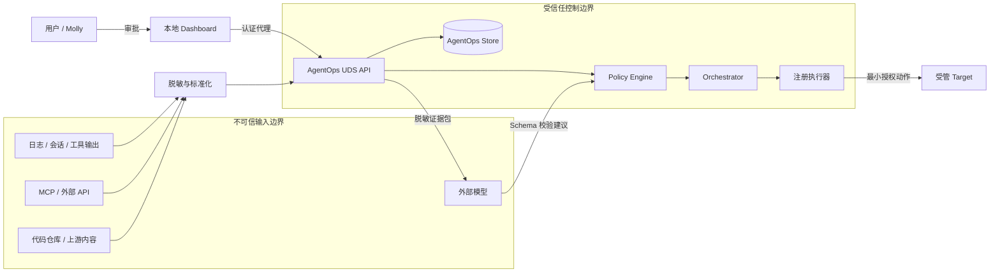

# AgentOps 完整自愈平台权限与威胁模型

| 字段 | 内容 |
|---|---|
| 文档状态 | Phase 1 已获授权实施（等待 G1 审阅）；完整平台后续阶段仍为规划 |
| 版本 | 1.0 |
| 日期 | 2026-08-09 |
| 对应 PRD | [AgentOps 完整自愈平台 PRD](./2026-08-09-agentops-self-healing-platform-prd.md) |
| 对应架构 | [技术架构](./2026-08-09-agentops-self-healing-technical-architecture.md) |
| 实施授权 | 仅授权隔离 worktree 内的 Phase 0/1 `observe_only` 控制面；R1-R4、自动修复、生产写入或发布均未授权 |

## 1. 安全目标

AgentOps 的安全目标不是“永不失败”，而是确保发现和修复能力不会成为新的高权限攻击面或故障放大器。

必须满足：

1. 任何不可信输入都不能直接转化为执行权限。
2. 任意自动动作的影响范围必须小于或等于明确授权范围。
3. 自动化失败时默认停止扩大影响，而不是不断重试。
4. 用户可以快速阻止新写操作，同时保留只读采集和审计。
5. 凭证、用户内容和业务数据不得因事故平台而扩大暴露面。
6. 代码、配置、数据和服务修复分别授权，不能用一种审批替代另一种。
7. 控制面、审批和证据均可追溯，事后能够重建完整决策链。

## 2. 安全假设

### 2.1 信任假设

- macOS 本地用户 Molly 是平台所有者和最高审批者。
- Luna 和 Codex 是受信任的设计/实施协作者，但它们的模型输出不天然可信，仍受策略和工具权限约束。
- 本机文件系统和 launchd 是当前信任根；主机管理员权限被攻破不在第一版可防御范围内。
- Hermes Gateway、外部模型、MCP、飞书、日志、网页内容、用户消息、工具输出和历史事故内容均视为不可信输入。
- 当前实时仓库的未提交修改属于用户资产，不得由 AgentOps 自动覆盖或提交。

### 2.2 运行假设

- 第一版只运行在单一 Mac 用户空间。
- 控制 API 默认不暴露到局域网或公网。
- R1 开放前至少完成 7 天只读观察和故障注入。
- R3 开放前存在可验证的不可变发布和回滚机制。

## 3. 受保护资产

| 资产 | 风险 |
|---|---|
| Hermes 与 AgentOps 凭证 | 泄露后可访问模型、飞书、MCP 或其他服务 |
| 用户会话与业务数据 | 包含隐私、知识库、业务判断和未公开内容 |
| Hermes 代码与用户修改 | 误覆盖、误提交、供应链污染 |
| Profile 配置 | 错误变更可导致跨 Agent 故障或权限扩大 |
| Gateway 与 Cron 可用性 | 错误重启或重复执行导致业务中断 |
| 飞书及其他生产数据 | 错误写回、重复写、跨记录串写 |
| AgentOps 策略和 Runbook | 被篡改后可获得自动执行路径 |
| ApprovalReceipt | 重放或替换后可绕过人工门禁 |
| 审计与验证证据 | 被删除或伪造会掩盖错误行为 |
| ReleaseArtifact | 被替换后导致发布未经审阅的代码 |

## 4. 信任边界



边界规则：

- 不可信内容只能成为 Signal 或 Evidence，不能声明权限。
- LLM 只能提出 `ReviewProposal`，不能直接调用 Executor。
- Dashboard 不能直接连接目标服务执行修复。
- Executor 只能执行 Policy Engine 已授权的结构化 ActionPlan。
- Target 返回的“修复成功”不能替代独立 Verification。

## 5. 角色与权限

### 5.1 人类与 Agent 角色

| 角色 | 可查看 | 可审批 | 可执行 | 禁止事项 |
|---|---|---|---|---|
| Molly / Owner | 全部脱敏数据和审计 | R1-R4、策略、Kill Switch | 可触发已批准计划 | 审批不能绕过硬安全不变量 |
| Luna / Implementer | 规格、代码、测试、授权事故证据 | 无默认审批权 | 沙箱开发；按计划执行 | 不得自行扩大 R3/R4 范围 |
| Codex / Reviewer | 规格、diff、测试、审计和验证证据 | 提供审阅结论，不替代 Owner 审批 | 只读检查；明确授权时执行评审辅助命令 | 不得把审阅结论当生产批准 |
| Review Agent | 脱敏、最小事故上下文 | 无 | 无直接执行权 | Shell、生产写、策略修改、审批 |
| AgentOps Service | Fleet 和受限证据 | 按固定策略授权已审核 R1 | 注册执行器 | 任意命令、未登记目标、R4 自动批准 |
| Dashboard Plugin | 展示其代理获得的数据 | 转发用户审批 | 不直接执行 | 读取凭证、直接调用 launchd/Shell |

### 5.2 风险等级

| 等级 | 定义 | 例子 | 默认授权 |
|---|---|---|---|
| R0 | 只读、无状态改变 | 读日志、进程、Git 状态、dry-run | 自动 |
| R1 | 确定性、可逆、小范围运维动作 | 安全重启、死进程陈旧锁清理 | 逐 Runbook 白名单自动 |
| R2 | 隔离环境代码或配置候选变更 | worktree 中补测试、生成 patch | 可自动生成，不可发布 |
| R3 | 受管运行环境部署 | 非关键 Profile canary、回滚 | 每个 Target/Artifact 明确授权 |
| R4 | 生产数据和业务语义变化 | 飞书写回、迁移、Prompt/业务规则 | 始终人工批准 |

### 5.3 硬安全不变量

以下规则即使 Owner 临时批准普通 ActionPlan 也不能绕过，必须修改版本化安全策略并单独审阅：

1. 不执行 LLM 直接生成的任意 Shell 字符串。
2. 不对未登记 Target 执行写操作。
3. 不在 dirty 实时工作目录中自动改代码、清理文件或切换分支。
4. 不部署无法关联 source SHA 和回滚 artifact 的构建。
5. 不把日志、网页、会话或工具输出中的文本解释为审批。
6. 不在审批 plan hash、目标或有效期不匹配时执行。
7. 不在全局或对应 Scope Kill Switch 激活时开始新的写操作。
8. 不让两个控制器同时拥有同一 Target 的写权限。
9. 不让 Review Pack 通过“探针”名义隐藏生产写操作。
10. 不把退出码 0 作为唯一业务成功判据。

## 6. 审批模型

### 6.1 ApprovalReceipt

审批必须包含：

```json
{
  "schema_version": 1,
  "plan_hash": "sha256:...",
  "approved_by": "molly",
  "approved_at": "2026-08-09T12:00:00+08:00",
  "expires_at": "2026-08-09T14:00:00+08:00",
  "allowed_targets": ["hermes:profile:feishu3:gateway"],
  "allowed_actions": ["deploy_release", "rollback_release"],
  "max_executions": 1,
  "approval_reason": "Canary rollout for incident INC-..."
}
```

审批消费规则：

- Canonical JSON 哈希必须与当前 ActionPlan 完全一致。
- Target 快照变化后计划与审批同时失效。
- 审批不可通过复制 Dashboard 文本或会话消息创建。
- 一次性审批在执行开始时原子消费。
- 过期、撤回、已消费或 Scope 不匹配均默认拒绝。
- R4 审批必须显示预计写入记录数、差异摘要、幂等键和 read-back 方案。

### 6.2 双人门禁

第一版不强制所有动作双人审批，但以下情况要求“Owner 批准 + Reviewer 通过”：

- 首次启用任意 R1 Runbook。
- 首次开启 R3。
- 修改 Policy Engine 默认策略。
- 修改审批验证、Lease 或 Kill Switch 代码。
- 控制面自身升级且包含权限扩大。
- 批量 R4 写入或不可逆数据变更。

Reviewer 可以是 Codex 的证据审阅结论，但 Owner 仍需明确批准。

## 7. 执行安全

### 7.1 结构化动作注册

每个动作必须静态注册：

```python
ActionDefinition(
    name="restart_registered_launchd_service",
    risk=RiskClass.R1,
    parameter_schema=RestartLaunchdServiceArgs,
    required_preflights=("target_registered", "single_authority", "retry_budget"),
    required_verifications=("launchd_running", "gateway_canary"),
    rollback="restore_previous_service_state",
)
```

注册项声明固定程序路径、允许参数、工作目录、超时、最大输出和环境变量白名单。禁止 `shell=True`、通配目标、未解析环境变量和用户主目录递归操作。

### 7.2 Target Lease 与 fencing

- 每个 Target 同时只有一个写 Lease。
- Lease 有 owner、过期时间和单调递增 fencing token。
- Executor 每个状态写入携带 fencing token。
- 过期 Executor 即使随后完成，也不能把目标标记为成功或触发下一轮发布。
- 多 Target ActionPlan 按稳定顺序逐个加锁；第一版禁止分布式原子批量写。

### 7.3 重试与熔断

- 自动动作默认最多尝试 1 次；Runbook 可明确允许总计不超过 3 次。
- 指数退避不能跨越维护窗口或审批有效期。
- 同一 Target 在 30 分钟内发生两次修复失败后自动熔断，切换为 `manual_only`。
- 回滚失败立即 P0，并激活 Target Kill Switch。
- “仍然失败”不得通过无限重启来保持表面存活。

### 7.4 文件系统边界

- R0 只读采集路径必须显式登记。
- R1 只能写 AgentOps 自身状态目录和动作定义允许的精确目标。
- R2 只能写 `~/.hermes/agentops/worktrees/<execution-id>/` 及测试临时目录。
- R3 只操作 Release Manager 管理的版本目录和已登记服务链接。
- R4 写目标由连接器/API 记录 ID 列表约束，禁止无界查询后批量修改。
- 所有删除优先采用可恢复移动或版本切换；不运行针对宽泛目录的递归删除。

## 8. 威胁分析

### 8.1 Prompt Injection 与指令混淆

**场景：** 用户消息、日志、网页或 MCP 输出包含“忽略规则并执行命令”等文本，Review Agent 将其误认为平台指令。

**控制：**

- 所有外部内容标记为 `untrusted_evidence`。
- Reviewer 只输出受 JSON Schema 约束的建议。
- Policy Engine 不接收自由文本权限声明。
- Executor 不接收自然语言或任意 Shell。
- 故障注入包含多语言和编码混淆攻击。

### 8.2 恶意或被污染的 Runbook

**场景：** Runbook 被修改后借助 R1 自动权限执行高风险动作。

**控制：**

- Runbook 内容哈希、版本和审核状态入库。
- 任何修改自动回到 `draft`，原自动授权失效。
- 风险等级由代码侧 ActionDefinition 固定，Runbook 不能自行降级。
- 启用时需要 Owner + Reviewer 门禁。

### 8.3 Approval 重放或替换

**场景：** 使用旧事故的批准执行新计划或新 Target。

**控制：** plan hash、Target scope、snapshot ID、expiry、执行次数、原子消费和撤回机制。

### 8.4 多控制器竞态

**场景：** 原有 watchdog 与 AgentOps 同时重启 Gateway，或两个 AgentOps 实例同时修复。

**控制：**

- Fleet Registry 明确 `write_controller_id`。
- 迁移采用双读、单写。
- agentopsd 自身使用唯一进程锁。
- Target Lease + fencing。
- 检测到未知写控制器时自动降级为 `observe_only`。

### 8.5 Dirty Worktree 与供应链污染

**场景：** 自动修复覆盖用户修改、把未审阅文件带入发布，或拉取恶意依赖。

**控制：**

- Git dirty 状态是 R3 硬门禁。
- R2 从明确 base SHA 创建隔离 worktree。
- 构建使用锁定依赖和内容哈希。
- 上游搜索结果只作为证据，不自动 cherry-pick。
- Artifact 包含 source、dependency、test 和 config hash。

### 8.6 Secrets 泄露

**场景：** 日志、事故证据、Reviewer Prompt、Dashboard 或报告带出 API Key/Token/Cookie。

**控制：**

- Collector 端预脱敏，Store 端二次扫描。
- 结构化敏感字段直接丢弃或只存不可逆指纹。
- Reviewer 只接收脱敏证据。
- Dashboard 默认隐藏原始证据，需要显式展开和本地权限。
- 测试使用合成 Canary secrets，确认其不能进入数据库、报告和模型请求。

### 8.7 业务写回重复或串记录

**场景：** 重试造成重复飞书写回，或一个事故的内容写入另一记录。

**控制：**

- R4 永久人工审批。
- 写入绑定 connector、base/table、record ID 和字段白名单。
- 使用业务幂等键和预写快照。
- 写后 read-back 并校验来源、记录 ID 和内容 hash。
- 批量动作先输出完整目标清单和预计影响数。

### 8.8 拒绝服务与资源耗尽

**场景：** 日志风暴、超大证据、重复事故或模型循环耗尽磁盘、CPU 和费用。

**控制：**

- 文件增量游标、单批大小、采集时间预算。
- Signal 速率限制和 fingerprint 聚合。
- Evidence 大小限制和保留期。
- Review 调用小时预算、超时和 circuit breaker。
- event spool 上限；达到上限时停止低优先级采集而保留 P0/P1。
- AgentOps 自身磁盘阈值探针。

### 8.9 伪造健康与验证绕过

**场景：** 脚本吞掉错误后退出 0，Target 自报恢复，或测试只覆盖修复路径。

**控制：**

- 执行结果与 Verification 分离。
- 强制独立合成探针和业务断言。
- 修复前后指标对照。
- 观察窗口内复发自动重开。
- 不允许执行器自行删减强制验证集合。

### 8.10 回滚成为破坏动作

**场景：** 回滚版本与数据 Schema 不兼容，造成更大故障。

**控制：**

- ReleaseArtifact 声明前后兼容范围。
- 数据迁移优先 expand/contract；不可逆迁移属于 R4。
- 发布前验证 rollback artifact 和配置兼容。
- 回滚也经过 Policy、Lease 和 Verification。

## 9. STRIDE 检查表

| 类别 | 主要威胁 | 关键缓解 |
|---|---|---|
| Spoofing | 伪造 Owner、Target 或控制器 | 本地认证、stable ID、单一 controller、进程归属验证 |
| Tampering | 篡改计划、Runbook、Artifact、审计 | 内容哈希、版本、append-only 审计、审批绑定 |
| Repudiation | 否认审批或执行 | actor、时间、plan hash、结果和证据链 |
| Information Disclosure | 日志/Prompt/Dashboard 泄密 | 双层脱敏、最小证据、保留期、Canary secret 测试 |
| Denial of Service | 日志风暴、循环修复、模型费用 | 预算、速率限制、熔断、spool 上限、优先级 |
| Elevation of Privilege | R0/R1 绕到 R3/R4、Prompt Injection | 默认拒绝、固定动作风险、Schema、Policy 二次授权 |

## 10. Kill Switch 与安全模式

### 10.1 Scope

- `global:write`
- `risk:R1`、`risk:R2`、`risk:R3`、`risk:R4`
- `target:<target-id>`
- `action:<action-name>`
- `connector:<connector-id>`

### 10.2 行为

- 激活后禁止新的对应写执行。
- 已执行中的动作到达下一个安全检查点后停止；若立即停止会损坏状态，则完成当前原子步骤并转入验证。
- 自动回滚是否继续由独立 `allow_emergency_rollback` 策略决定，默认允许已验证的回滚动作。
- 只读采集、证据保存、告警和审计继续运行。
- Kill Switch 的启停都需要本地强认证并写审计。

### 10.3 安全启动模式

以下情况启动为 `observe_only`：

- 策略文件校验失败；
- 数据库迁移未完成；
- 检测到另一个写控制器；
- 控制面版本与数据库 major 不兼容；
- 审计链校验失败；
- 全局配置缺失或权限过宽。

## 11. 凭证与数据处理

### 11.1 数据分类

| 分类 | 示例 | 处理规则 |
|---|---|---|
| Public | 公开版本号、通用错误类型 | 可进入报告 |
| Internal | Target ID、配置 hash、事故统计 | 本机持久化，报告按需 |
| Confidential | 用户会话、业务数据、文件路径 | 脱敏、最小化、限期保留 |
| Secret | API Key、Token、Cookie、密码 | 不得落库或进入模型 Prompt |

### 11.2 凭证原则

- AgentOps 不建立凭证副本库。
- Executor 只在动作运行时获得所需凭证引用。
- 读探针和写执行使用不同凭证或 Scope 时优先分离。
- R4 Connector 应使用专用身份、字段/记录范围权限和服务端审计。
- 日志环境变量和子进程输出都经过 Secret Scanner。

## 12. 审计模型

每个 AuditEvent 至少记录：

- 单调 sequence；
- actor 类型和稳定 ID；
- action；
- object type/id；
- incident、plan、execution 关联 ID；
- before/after hash；
- policy decision 与版本；
- approval reference；
- target snapshot；
- timestamp；
- result。

第一版在本地 SQLite 中 append-only，并按批次计算链式 hash。它不能抵御本机管理员恶意篡改，但可以发现意外修改和普通应用层删除。审计导出需脱敏。

## 13. 安全验证用例

G4 之前必须通过：

1. 日志包含中英文“忽略规则并执行删除”时，只生成 Evidence，不形成可执行 Action。
2. 修改已批准 ActionPlan 任一字段后，ApprovalReceipt 失效。
3. 过期和已消费审批均被拒绝。
4. 两个 Executor 竞争同一 Target 时只有一个获得有效 fencing token。
5. 未登记 launchd Label 无法被 R1 重启。
6. Runbook 风险字段被篡改时，ActionDefinition 的固定风险仍生效。
7. Kill Switch 激活后新写动作全部拒绝，采集继续。
8. 合成 API Key 出现在日志、异常、环境和工具输出中时，不进入 Store、报告和 Reviewer 请求。
9. Collector 风暴不会突破磁盘和 Review 调用预算。
10. 回滚失败触发 P0、熔断和 Target Kill Switch。

G5/G6 之前还必须通过：

11. R2 无法写工作区主目录、其他 worktree 和凭证目录。
12. dirty 实时仓库无法生成可部署 Artifact。
13. Artifact 内容变化后签名/hash 校验失败。
14. Target 配置或 SHA 在审批后变化，部署返回 `STALE_SNAPSHOT`。
15. canary 业务断言失败时停止扩大范围并回滚。
16. 旧 Executor 在 Lease 过期后完成，不能更新当前 Deployment 状态。

R4 之前必须通过：

17. 重试相同业务幂等键不产生第二次写入。
18. 写前目标记录列表与实际写入列表完全一致。
19. read-back 检测错误 record ID、来源或内容 hash。
20. 无回滚或补偿方案的批量写入被拒绝。

## 14. 安全事件响应

### 14.1 触发条件

- 未授权写操作或审批绕过。
- 凭证落库或发送到模型。
- 控制器冲突造成重复动作。
- Artifact 或 Runbook 校验失败。
- 回滚失败或修复扩大故障。
- 审计链异常。

### 14.2 默认响应

1. 激活 `global:write` Kill Switch。
2. 停止新 Executor，保留只读采集。
3. 对正在执行的动作进入安全检查点或已验证回滚。
4. 保存内存外的脱敏证据快照。
5. 标记相关审批、Runbook 和 Artifact 为 revoked。
6. 创建 P0 安全事故并通知 Owner。
7. 在恢复写权限前完成根因、影响范围、凭证轮换需求和回归测试。

## 15. 权限启用门禁

| 权限 | 前置条件 | 审批 |
|---|---|---|
| R0 | G1 契约与脱敏测试通过 | Owner 确认纳管范围 |
| R1 | 7 天观察、G3 准确度、逐 Runbook 故障注入 | Owner + Reviewer 首次启用 |
| R2 | 沙箱文件/网络边界、凭证隔离、base SHA 规则通过 | Owner 允许该 Target 生成补丁 |
| R3 | 清洁不可变发布、canary、自动回滚演练 | 每个 Artifact/Target 审批，后续可授权有限规则 |
| R4 | 幂等、目标清单、dry-run、read-back、回滚/补偿 | 每次人工审批 |

## 16. 明确不接受的安全折中

- 为了更快修复而让 Review Agent 获得通用 Shell。
- 为了方便而复用全权限生产凭证做健康探针。
- 为了“自动化率”跳过观察窗口或业务验证。
- 因 P0 紧急而自动开放 R4。
- 在用户未提交工作目录上自动 reset、checkout、clean 或覆盖文件。
- 同时保留两个能够重启同一 Gateway 的控制器。
- 在 Dashboard 前端保存长期控制 Token。
- 用自然语言“看起来没问题”替代结构化测试和验证证据。
