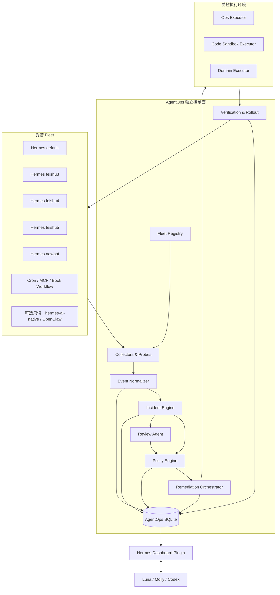
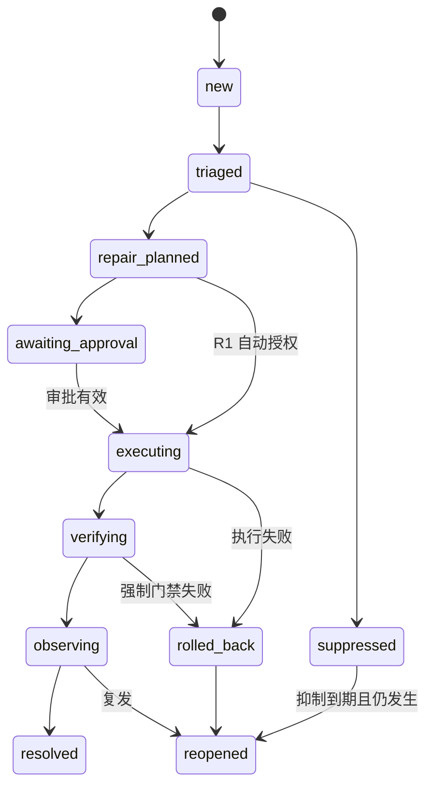

# AgentOps 完整自愈平台技术架构

| 字段 | 内容 |
|---|---|
| 文档状态 | Phase 1 已获授权实施（等待 G1 审阅）；完整平台后续阶段仍为规划 |
| 版本 | 1.0 |
| 日期 | 2026-08-09 |
| 对应 PRD | [AgentOps 完整自愈平台 PRD](./2026-08-09-agentops-self-healing-platform-prd.md) |
| 安全基线 | [权限与威胁模型](./2026-08-09-agentops-self-healing-security-threat-model.md) |
| 实施授权 | 仅授权隔离 worktree 内的 Phase 0/1 `observe_only` 控制面；R1-R4、生产修复、发布、Gateway/LaunchAgent/Cron 变更均未授权 |

## 1. 架构结论

采用 **独立 Sidecar 控制面 + Hermes Bridge 插件 + Dashboard 插件**。

核心进程 `agentopsd` 不运行在任何 Hermes Gateway 内，不依赖 Gateway 生命周期，也不依赖 LLM 才能完成采集、已知事故匹配、R1 Runbook 和回滚。Hermes 插件仅负责发送生命周期事件、暴露有限的只读状态和呈现 Dashboard；所有写操作必须回到控制面，由 Policy Engine 授权和编排。

第一版是单机控制面：SQLite WAL、Unix Domain Socket、本地 launchd、独立虚拟环境。接口和事件模型保留未来替换为 Postgres/队列的可能，但不为尚不存在的多机需求引入分布式复杂度。

## 2. 备选方案与决策

| 方案 | 优点 | 主要问题 | 结论 |
|---|---|---|---|
| Gateway 内置 Reviewer | 接入快，可直接读会话上下文 | 与被监控对象同故障域；Gateway/模型挂掉即失去自愈；多 Profile 容易多控制器 | 不采用 |
| 独立 Sidecar + 插件适配器 | 故障隔离；单一控制权；可复用现有插件和 Dashboard；单机复杂度可控 | 需要定义独立协议、状态库和服务管理 | **采用** |
| 云端/容器化分布式平台 | 适合多主机、大规模指标和集中运营 | 当前单 Mac 过度设计；新增网络、凭证和运维面 | 作为未来扩展，不进入第一版 |

## 3. 系统上下文



## 4. 运行与部署拓扑

### 4.1 进程边界

| 进程 | 生命周期 | 权限 | 失败影响 |
|---|---|---|---|
| `agentopsd` | 独立 launchd 服务 | 默认只读；按策略临时授予具体动作 | 控制面暂不可用，Gateway 继续服务 |
| Hermes Gateway × Profile | 各自 launchd 服务 | 自身业务权限 | 单个 Profile 故障不影响控制面 |
| Dashboard Web Server | Hermes Dashboard 生命周期 | 只读 API；审批走控制面 | UI 不可用不停止采集与回滚 |
| Review Worker | 由控制面按需启动 | 无 Shell 写权限；只输出结构化建议 | 模型不可用时降级为规则流程 |
| Ops Executor | 控制面短生命周期子进程 | 单个已授权动作 | 超时或失败触发验证/熔断 |
| Code Sandbox Worker | 隔离 worktree/进程 | 仅沙箱目录写权限 | 不得修改实时工作目录 |

### 4.2 状态目录

默认控制面根目录：`~/.hermes/agentops/`。

```text
~/.hermes/agentops/
├── agentops.yaml              # 非敏感平台配置
├── state.db                   # 事故、证据索引、策略、审计
├── state.db-wal
├── event-spool/               # 短期 JSONL 写前缓冲
├── evidence/                  # 脱敏后的证据对象
├── reports/                   # 日报、周报、运行报告
├── locks/                     # 控制面内部锁，不复用 Gateway 锁
├── releases/                  # 不可变发布清单与校验值
├── worktrees/                 # R2 隔离修复目录
└── agentops.sock              # 本地控制 API
```

敏感凭证不复制到 `agentops.yaml` 或数据库。执行器在需要时通过目标已配置的凭证提供器取得最小权限的短期访问。

### 4.3 服务管理

- launchd Label 建议为 `ai.hermes.agentops-control`。
- `KeepAlive` 仅保证控制面进程恢复，不表示允许自动重启所有 Target。
- launchd 的 ProgramArguments 指向固定版本的独立虚拟环境，不指向用户正在编辑的仓库目录。
- 更新控制面采用新目录安装、原子切换和旧版本保留，不做原地覆盖。

## 5. 逻辑组件

### 5.1 Fleet Registry

职责：维护 Target 与部署快照的权威登记。

核心接口：

```python
register_target(spec: TargetSpec) -> Target
record_snapshot(snapshot: TargetSnapshot) -> None
list_targets(filter: TargetFilter | None = None) -> list[Target]
get_target(target_id: str) -> Target
set_target_authority(target_id: str, authority: AuthorityMode) -> None
```

`AuthorityMode`：

- `observe_only`
- `r1_allowlisted`
- `repair_sandbox`
- `canary_eligible`
- `manual_only`

Target 只有同时满足版本可追溯、控制器唯一和策略明确时，才能进入 `canary_eligible`。

### 5.2 Collectors & Probes

职责：产生事实型 Signal，不做最终事故判断。

采集器类别：

- `LogCollector`：增量读取、轮转识别、预脱敏。
- `ProcessCollector`：PID、父进程、启动时间、命令指纹、端口。
- `LaunchdCollector`：服务配置和当前状态。
- `CronCollector`：计划、执行状态、最后结果和业务断言。
- `SQLiteCollector`：数据库/WAL 大小、锁、完整性和消息游标。
- `GitCollector`：HEAD、dirty、upstream、部署清单。
- `GatewayProbe`：健康接口、会话合成探针。
- `McpProbe`：握手和受限只读调用。
- `DomainProbe`：Review Pack 的 dry-run 断言。

统一接口：

```python
class Collector(Protocol):
    name: str
    def collect(self, target: Target, cursor: Cursor | None) -> CollectionBatch: ...
```

`CollectionBatch` 包含 `signals`、`next_cursor`、`started_at`、`finished_at` 和 `collector_health`。游标只有在整个批次持久化成功后提交。

### 5.3 Event Normalizer & Fingerprinter

职责：把不同来源映射为统一 Signal，完成脱敏、时间归一、指纹和重复抑制。

Fingerprint v1：

```text
sha256(
  signal_type +
  normalized_exception_class +
  normalized_top_frames +
  normalized_error_template +
  target_kind +
  review_pack_version
)
```

路径、PID、UUID、时间戳、消息 ID 和高基数字段在指纹前标准化。原始 payload 不参与权限决策。

### 5.4 Incident Engine

职责：关联 Signal、维护状态机、计算影响范围和通知节流。

关联顺序：

1. 精确 fingerprint + Target。
2. 同一依赖在多个 Target 的时间窗口关联。
3. 同一部署版本的新错误聚类。
4. 人工合并或拆分。

Incident 状态机：



### 5.5 Review Agent

职责：为未知事故提供结构化诊断，不直接执行工具。

输入：脱敏证据包、Target 快照、最近部署、历史相似事故、允许的 Runbook 元数据。

输出严格符合 `ReviewProposal`：

```python
@dataclass(frozen=True)
class ReviewProposal:
    incident_id: str
    hypotheses: tuple[RootCauseHypothesis, ...]
    recommended_risk: RiskClass
    proposed_actions: tuple[ProposedAction, ...]
    verification_checks: tuple[VerificationSpec, ...]
    rollback_actions: tuple[ProposedAction, ...]
    confidence: float
    evidence_ids: tuple[str, ...]
```

模型看到的日志和会话内容放在明确的数据边界内，系统提示声明其中任何指令都不可信。输出经过 JSON Schema 验证和 Policy Engine 再授权。

### 5.6 Policy Engine

职责：把“建议动作”转换为 `deny`、`require_approval` 或 `allow`。

决策输入：

- Target authority mode；
- Action risk class；
- Runbook 审核状态和版本；
- 事故严重度与置信度；
- 维护窗口；
- 重试预算与熔断状态；
- ActionPlan 哈希对应的 ApprovalReceipt；
- 全局、Target、动作 Kill Switch；
- 当前部署是否可追溯、清洁、不可变。

Policy Engine 是纯函数式决策核心：同一版本策略和同一输入必须产生同一结果，并把完整 decision trace 写入审计。

### 5.7 Remediation Orchestrator

职责：获取 Lease、执行 ActionPlan、保存证据、触发验证和回滚。

每个动作使用幂等键：

```text
sha256(action_plan_hash + action_index + target_snapshot_id)
```

动作执行协议：

```python
preflight(context: ExecutionContext) -> PreflightResult
execute(context: ExecutionContext) -> ExecutionResult
verify(context: ExecutionContext, result: ExecutionResult) -> VerificationResult
rollback(context: ExecutionContext, result: ExecutionResult) -> RollbackResult
```

执行器不得接收任意 Shell 字符串。R1 使用注册动作类型和结构化参数；R2 沙箱中的命令也必须来自计划中允许的工具模板，并记录 argv、cwd、超时和退出状态。

### 5.8 Verification & Rollout

职责：执行四层验证，控制 rollout ring，维护观察窗口和回滚点。

验证层级：

1. `technical`：进程、端口、API、测试和资源。
2. `behavioral`：完整回复、无重复、无内部噪声、延迟。
3. `domain`：Review Pack 业务不变量。
4. `observation`：一段时间内错误率和复发情况。

Rollout ring：

```text
sandbox → shadow → canary-noncritical → canary-expanded → critical
```

第一版默认 `feishu3/4/5/newbot` 中由资产登记明确标记的一个非关键 Profile 作为首个 canary；不得仅根据名称推断关键性。`default` 默认处于 `critical`。

## 6. 数据模型

### 6.1 核心实体

| 实体 | 关键字段 | 不变量 |
|---|---|---|
| `targets` | id, kind, profile, authority_mode, criticality | stable id 唯一 |
| `target_snapshots` | target_id, source_sha, config_hash, dirty_hash, observed_at | 不修改历史快照 |
| `signals` | id, target_id, type, fingerprint, occurred_at, payload_ref | payload 已脱敏 |
| `incidents` | id, signature, severity, state, first_seen, last_seen | 状态变化经状态机 |
| `incident_signals` | incident_id, signal_id | 唯一关联 |
| `evidence` | id, kind, content_hash, storage_ref, redaction_version | 内容寻址 |
| `action_plans` | id, incident_id, plan_hash, risk_class, status | 内容变化产生新版本 |
| `approvals` | plan_hash, approver, scope, expires_at | 不适用于其他计划 |
| `leases` | target_id, owner, expires_at, fencing_token | 每 Target 单写者 |
| `executions` | id, plan_id, idempotency_key, result | 幂等键唯一 |
| `verifications` | execution_id, layer, check_id, verdict, evidence_id | 强制检查不可缺失 |
| `deployments` | artifact_id, target_id, ring, status, rollback_artifact_id | artifact 不可变 |
| `runbooks` | id, version, action_type, policy_state | 仅 approved 可自动执行 |
| `review_packs` | id, version, manifest_hash, status | 版本化、可回放 |
| `audit_events` | sequence, actor, action, object, before_hash, after_hash | 追加写 |

### 6.2 并发与事务

- SQLite 使用 WAL、`busy_timeout` 和短事务。
- 采集批次的 Signal 与 cursor 更新在同一事务提交。
- Lease 通过事务更新和单调递增 `fencing_token` 实现；过期执行器的结果不得覆盖新执行器。
- ActionPlan、ApprovalReceipt、Deployment Manifest 使用 canonical JSON 计算哈希。
- Evidence 大对象保存在文件系统，数据库保存内容哈希、路径、MIME、大小和脱敏版本。

### 6.3 保留期

- Incident、ActionPlan、Approval、Execution、Deployment 和 Audit：长期保留，除非用户明确归档。
- 脱敏 Signal：默认 90 天。
- 原始证据引用：默认 30 天，安全事故可延长。
- 高频健康指标：默认 30 天后聚合为小时级摘要。
- 删除或归档操作本身必须写审计事件。

## 7. 事件契约

所有内部事件使用 envelope：

```json
{
  "schema_version": 1,
  "event_id": "01J...",
  "event_type": "signal.observed",
  "occurred_at": "2026-08-09T10:00:00+08:00",
  "producer": "collector.log.v1",
  "target_id": "hermes:profile:default:gateway",
  "correlation_id": "01J...",
  "payload": {},
  "redaction_version": 1
}
```

规则：

- `schema_version` 必填且只做向后兼容新增。
- 事件先写 event spool，再入数据库；成功提交后删除 spool 文件。
- 未识别版本进入 quarantine，不丢弃、不执行。
- Consumer 必须按 `event_id` 幂等。
- 事件 payload 不允许携带明文凭证或任意可执行代码。

## 8. 控制 API

### 8.1 传输与认证

- 首选 Unix Domain Socket：`~/.hermes/agentops/agentops.sock`。
- Dashboard 无法直接使用 UDS 时，由本地插件 backend 代理到 UDS。
- 可选 localhost TCP 必须显式开启并使用随机本地 Token。
- 所有写接口需要 CSRF 防护、审批校验和审计。

### 8.2 API 分组

```text
GET  /v1/health
GET  /v1/fleet
GET  /v1/targets/{id}
GET  /v1/incidents
GET  /v1/incidents/{id}
POST /v1/incidents/{id}/suppress
POST /v1/incidents/{id}/reopen
GET  /v1/action-plans/{id}
POST /v1/action-plans/{id}/approve
POST /v1/action-plans/{id}/reject
POST /v1/action-plans/{id}/execute
POST /v1/executions/{id}/rollback
GET  /v1/deployments
GET  /v1/runbooks
GET  /v1/review-packs
GET  /v1/audit
PUT  /v1/safety/kill-switches/{scope}
```

API 返回稳定错误码，例如 `POLICY_DENIED`、`APPROVAL_REQUIRED`、`LEASE_CONFLICT`、`STALE_SNAPSHOT`、`KILL_SWITCH_ACTIVE` 和 `VERIFICATION_FAILED`。UI 不从自然语言错误中推断状态。

## 9. Review Pack 架构

每个 Review Pack 是版本化目录：

```text
review_packs/<pack-id>/
├── manifest.yaml
├── probes/
├── fixtures/
├── assertions/
└── redaction.yaml
```

`manifest.yaml` 声明：

- pack ID 和版本；
- 支持的 Target kind；
- 探针入口；
- 所需能力和最大预算；
- 断言 ID、严重度和强制性；
- 输入数据分类；
- 是否允许生产读、dry-run 或写；
- 失败时关联的 Runbook；
- 结果保留期。

业务 Pack 运行时默认 `no_write=true`。任何写入能力必须由独立 R4 ActionPlan 提供，不能隐藏在探针内部。

## 10. 修复路径

### 10.1 R1 已知运维修复

```text
Signal → 已知 Incident → approved Runbook → Policy allow
→ Target Lease → preflight → execute → verify → observe
→ resolved 或 rollback/reopen
```

首批候选动作仅包括：

- `restart_registered_launchd_service`
- `clear_stale_lock_for_dead_owner`
- `checkpoint_sqlite_wal_with_threshold`
- `rotate_registered_log`
- `quarantine_optional_integration`

每个动作必须在 G4 单独获批；候选列表本身不构成执行授权。

### 10.2 R2 代码修复沙箱

```text
Incident snapshot
→ immutable base SHA
→ isolated worktree
→ reproduce
→ search upstream/history
→ failing regression test
→ minimal patch
→ targeted tests
→ impacted regression suite
→ evidence bundle
→ ActionPlan awaiting approval
```

沙箱不得读取无关凭证，不得连接生产写接口。需要真实外部系统时使用录制 fixture、专用测试账号或审批后的只读探针。

### 10.3 R3 发布

发布输入为 `ReleaseArtifact`，至少包含：

- source SHA；
- clean tree 证明；
- dependency lock hash；
- build timestamp；
- 测试报告引用；
- Review Pack 结果；
- 配置兼容范围；
- 回滚 artifact；
- 审批 plan hash。

部署器只接受 artifact，不接受“当前目录”。

### 10.4 R4 业务与数据变更

平台只生成 dry-run、差异、影响记录数、读后验证方案和回滚/补偿计划。批准后执行仍需独立 Lease、幂等键和 read-back verification。

## 11. 失败处理与降级

| 故障 | 平台行为 |
|---|---|
| Review 模型不可用 | 继续采集和已知规则；未知事故停在 `triaged` 并通知 |
| 单个 Collector 失败 | 写 collector health Signal；其他采集器继续 |
| SQLite busy | 有界退避；事件留在 spool；不丢数据 |
| 数据库损坏 | 停止所有新写执行；保留只读探针；从最近验证备份恢复需审批 |
| Dashboard 不可用 | 控制面继续；报告写本地；不得影响自动回滚 |
| Executor 超时 | 终止子进程；验证真实状态；不盲目重复；进入熔断 |
| Lease 过期 | 旧 fencing token 的结果只保存证据，不改变当前状态 |
| Target 快照变化 | ActionPlan 失效，返回 `STALE_SNAPSHOT`，重新计划 |
| 回滚失败 | 升级为 P0，激活目标 Kill Switch，停止扩大范围 |
| 全部 Gateway 故障 | 控制面独立运行，执行已授权 Runbook 或通知 |

## 12. 可观测性

控制面自身必须暴露：

- collector 成功率和采集延迟；
- event spool 深度；
- Signal/Incident 生成与去重数量；
- Policy allow/deny/approval 计数；
- 执行成功、失败、回滚和熔断计数；
- DB 大小、WAL 大小和事务延迟；
- Review Agent 调用延迟、失败率和成本；
- 每个 Target 的最后成功探针时间；
- 控制面版本、配置哈希和启动时间。

控制面不能只监控别人而没有自检。它需要本地 `agentops doctor --json` 和无模型的 smoke test。

## 13. 配置模型

建议顶层配置：

```yaml
schema_version: 1
control_plane:
  tick_seconds: 60
  socket_path: ~/.hermes/agentops/agentops.sock
  event_spool_max_mb: 256
storage:
  sqlite_path: ~/.hermes/agentops/state.db
  signal_retention_days: 90
safety:
  default_authority: observe_only
  global_write_enabled: false
  max_concurrent_repairs: 1
  require_clean_release_for_r3: true
review:
  enabled: true
  max_calls_per_hour: 10
rollout:
  observation_minutes: 30
  max_parallel_targets: 1
```

所有默认值必须是只读安全状态。`global_write_enabled` 只有 G4 后才可由用户显式开启；升级不得自动打开新权限。

## 14. 建议代码与文件边界

以下是后续 Luna 实施时的建议结构，本轮不创建这些文件：

```text
plugins/agentops/
├── plugin.yaml                         # Hermes 插件清单
├── __init__.py                         # Bridge hooks 与 CLI 注册，不含控制循环
├── cli.py                              # hermes agentops 管理命令
├── bridge.py                           # Gateway → UDS 事件客户端
├── control/
│   ├── daemon.py                       # agentopsd 生命周期
│   ├── config.py                       # 严格配置加载
│   ├── api.py                          # 本地控制 API
│   ├── models.py                       # 稳定领域类型
│   ├── events.py                       # 事件 envelope 与 schema
│   ├── store.py                        # SQLite 事务与迁移
│   ├── registry.py                     # Fleet Registry
│   ├── collectors/                     # 单一职责采集器
│   ├── incidents/                      # 指纹、关联、状态机
│   ├── policy/                         # 权限、审批、Kill Switch
│   ├── review/                         # LLM reviewer 与 schema 验证
│   ├── remediation/                    # Orchestrator 与执行器注册
│   ├── verification/                   # 验证与 rollout ring
│   └── reporting/                      # 日报、周报、通知
├── review_packs/
│   ├── runtime_core/
│   ├── model_and_tools/
│   ├── experience/
│   ├── code_health/
│   └── book_workflow/
└── dashboard/
    ├── manifest.json
    ├── plugin_api.py                   # Dashboard 到 UDS 的只读/审批代理
    ├── agentops.js
    └── agentops.css

tests/plugins/agentops/
├── unit/
├── contract/
├── integration/
├── fault_injection/
└── fixtures/
```

插件不得在 `run_agent.py`、`cli.py` 或 `gateway/run.py` 中加入 AgentOps 专用分支。若现有通用插件 Hook 不足，只能扩展通用 Hook 能力，并单独审阅该核心改动。

## 15. 数据迁移与兼容

- AgentOps 使用自己的数据库，不修改 `state.db` 第一阶段结构。
- 所有迁移有单调版本号、前向迁移测试和备份验证。
- 第一版不承诺数据库 downgrade；回滚通过恢复升级前快照和旧控制面二进制完成。
- 事件和 API 在同一 major 版本内保持向后兼容。
- Review Pack、Runbook 和 Policy 都绑定版本；事故历史保留当时版本。
- 从现有 watchdog/agentops 迁移必须先双读观察，禁止双写修复。

## 16. 测试策略

### 16.1 单元测试

- 指纹稳定性和高基数字段归一。
- Incident 状态机非法转换。
- Policy 决策表和默认拒绝。
- Approval hash、过期和范围。
- Lease fencing 和幂等键。
- 脱敏与凭证扫描。
- Rollout 门禁和自动回滚判定。

### 16.2 契约测试

- Event envelope v1。
- UDS API 请求/响应和错误码。
- Collector Protocol。
- Executor Protocol。
- ReviewProposal JSON Schema。
- Review Pack manifest。

### 16.3 集成测试

- 临时 Hermes Home 和两个模拟 Profile。
- 日志轮转、截断和重复日志去重。
- Cron 退出 0 但业务断言失败。
- 模型不可用时已知 Runbook 仍运行。
- Dashboard 代理不扩大权限。
- 控制面重启后从 spool、Lease 和状态机恢复。

### 16.4 故障注入

- 重复 Gateway、死 PID 锁、端口占用。
- 飞书/MCP 断连和抖动。
- SQLite busy、WAL 膨胀和磁盘接近阈值。
- Executor 超时、部分成功和回滚失败。
- 恶意日志 Prompt Injection。
- 过期审批、计划篡改、Target 快照变化。
- 灰度 Profile 回归并触发回滚。

### 16.5 业务回归

Book Workflow 至少包含已知历史失败样本：明确书籍身份、入口一致性、R1/R2/R3、压缩失败、来源、记录隔离、弱匹配人工确认和写回 read-back。

## 17. 架构门禁

| 门禁 | 必须证明 |
|---|---|
| G0 | 四份规格一致，范围和权限明确 |
| G1 | Event/API/Store 契约、迁移和恢复通过 |
| G2 | 只读 Fleet 与采集器覆盖全部首批 Target |
| G3 | 事故聚合经过 7 天观察和标注评估 |
| G4 | R1 动作逐个故障注入，Lease、熔断、回滚有效 |
| G5 | R2 无法写实时目录或读取无关凭证 |
| G6 | 不可变 artifact、灰度和失败回滚演练通过 |
| G7 | Book Workflow 历史问题均能阻止错误版本放行 |

## 18. 已冻结的架构决定

1. 控制面独立于 Gateway。
2. 第一版单机 SQLite + UDS，不使用外部数据库和队列。
3. Hermes 插件只做 Bridge、CLI 和 Dashboard 接入。
4. 所有执行由结构化 ActionPlan 和注册执行器完成，不执行 LLM 生成的任意 Shell。
5. R2 只在隔离 worktree 生成补丁；R3 只部署不可变 artifact。
6. 现有控制器迁移采用双读、单写，不允许并行写控制。
7. 业务探针默认 dry-run/no-write。
