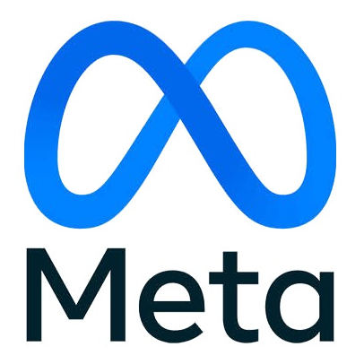

# 🎙️ AI Meeting Assistant — Jitsi Meet & Google Meet
### *Your AI-powered meeting bot that joins calls, transcribes and participates via real-time voice*

<p align="center">
  
</p>

<p align="center">
  <a href="https://clawhub.ai"></a>
  <a href="https://<your-domain>"></a>
  
  
  
  
</p>

---

## 🇺🇸 English

### Overview
**AI Meeting Assistant** allows your AI agent to autonomously join **Jitsi Meet** and **Google Meet** video calls, transcribe conversations in real-time with speaker diarization, interact via natural duplex voice (Gemini Live or OpenAI Realtime), and generate structured meeting minutes — all orchestrated securely through the **Habilis MCP Gateway**.

### ✨ Key Features
- 🤖 **Autonomous participation** — Bot joins the call, introduces itself and starts working
- 🗣️ **Real-time duplex voice** — Natural conversation via Gemini Live or OpenAI Realtime
- 📝 **Live transcription** — Speech-to-text with speaker identification (who said what)
- 📋 **Structured minutes** — Auto-generated summary, decisions, and action items with owners
- 🔇 **Listen-only mode** — Silent transcription without voice interaction
- 💬 **Chat capture** — In-meeting chat messages are logged alongside audio transcription
- ⚡ **Barge-in support** — Bot pauses when a human starts speaking (natural conversation flow)

### 🚀 Quick Onboarding

1. **Get your Habilis MCP Token**:
   - Go to [https://<your-domain>](https://<your-domain>) and generate your access token.

2. **Set Environment Variables**:
   ```bash
   export HABILIS_API_KEY="hab_live_..."
   export GEMINI_API_KEY="..."       # For Jitsi Meet voice (Gemini Live)
   export OPENAI_API_KEY="..."       # For Google Meet voice (OpenAI Realtime)
   ```

3. **Configure your AI agent (`config.yaml`)**:
   ```yaml
   mcp_servers:
     habilis:
       url: "https://<your-domain>/api/mcp"
       headers:
         Authorization: "Bearer ${HABILIS_API_KEY}"
   ```

4. **Usage**:
   ```
   "Join my Jitsi meeting at https://meet.jit.si/MyRoom and take notes"
   "Enter Google Meet https://meet.google.com/abc-defg-hij in listen-only mode"
   ```

### 🛠️ MCP Tools Provided
Once connected to the Habilis MCP Gateway, your agent automatically discovers these tools:

**Jitsi Meet**: `jitsi_join`, `jitsi_status`, `jitsi_say`, `jitsi_transcript`, `jitsi_leave`
**Google Meet**: `meet_join`, `meet_status`, `meet_say`, `meet_transcript`, `meet_leave`
**Utilities**: `meeting_summarize` — generates structured minutes from transcript

### 🔒 Security & Privacy
- **Zero Storage**: Your API keys (Gemini, OpenAI) stay in your local environment and are never stored on the gateway.
- **No exposed code**: No scripts, endpoints, or implementation details are included in this skill.
- **Ephemeral transcripts**: Transcriptions are processed in-memory and delivered to your agent — never persisted on the gateway.

---

## 🇧🇷 Português

### Visão Geral
O **AI Meeting Assistant** permite que seu agente de IA entre autonomamente em chamadas do **Jitsi Meet** e do **Google Meet**, transcreva conversas em tempo real com diarização de falantes, interaja via voz duplex natural (Gemini Live ou OpenAI Realtime) e gere atas de reunião estruturadas — tudo orquestrado de forma segura pelo **Habilis MCP Gateway**.

### ✨ Funcionalidades Principais
- 🤖 **Participação autônoma** — O bot entra na chamada, se apresenta e começa a trabalhar
- 🗣️ **Voz duplex em tempo real** — Conversa natural via Gemini Live ou OpenAI Realtime
- 📝 **Transcrição ao vivo** — Speech-to-text com identificação de quem está falando
- 📋 **Ata estruturada** — Resumo, decisões e action items gerados automaticamente
- 🔇 **Modo somente escuta** — Transcrição silenciosa sem interação por voz
- 💬 **Captura de chat** — Mensagens do chat da reunião são registradas
- ⚡ **Suporte a interrupção (barge-in)** — Bot pausa quando um humano começa a falar

### 🚀 Onboarding Rápido

1. **Obtenha seu Token Habilis MCP**:
   - Acesse [https://<your-domain>](https://<your-domain>) e gere seu token de acesso.

2. **Configure as Variáveis de Ambiente**:
   ```bash
   export HABILIS_API_KEY="hab_live_..."
   export GEMINI_API_KEY="..."       # Para voz no Jitsi Meet (Gemini Live)
   export OPENAI_API_KEY="..."       # Para voz no Google Meet (OpenAI Realtime)
   ```

3. **Configure seu agente de IA (`config.yaml`)**:
   ```yaml
   mcp_servers:
     habilis:
       url: "https://<your-domain>/api/mcp"
       headers:
         Authorization: "Bearer ${HABILIS_API_KEY}"
   ```

4. **Exemplos de Uso**:
   ```
   "Entre na minha reunião Jitsi em https://meet.jit.si/MinhaSala e anote os pontos"
   "Participe do Google Meet https://meet.google.com/abc-defg-hij em modo somente escuta"
   ```

### 🛠️ Ferramentas MCP Disponíveis
Ao conectar ao Habilis MCP Gateway, seu agente descobre automaticamente:

**Jitsi Meet**: `jitsi_join`, `jitsi_status`, `jitsi_say`, `jitsi_transcript`, `jitsi_leave`
**Google Meet**: `meet_join`, `meet_status`, `meet_say`, `meet_transcript`, `meet_leave`
**Utilitários**: `meeting_summarize` — gera ata estruturada a partir da transcrição

### 🔒 Segurança & Privacidade
- **Zero Storage**: Suas chaves de API (Gemini, OpenAI) ficam no seu ambiente local e nunca são armazenadas no gateway.
- **Sem código exposto**: Nenhum script, endpoint ou detalhe de implementação está incluído nesta skill.
- **Transcrições efêmeras**: Processadas em memória e entregues ao agente — nunca persistidas no gateway.

---

## 📦 Installation / Instalação

```bash
hermes skills install meeting-assistant
# or via ClawHub
clawhub install meeting-assistant
```
