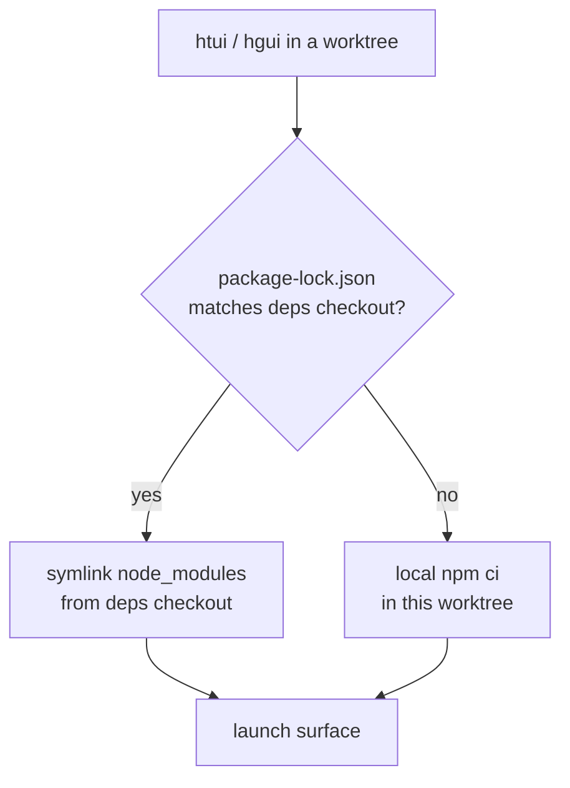

# Worktree에서 TUI 및 데스크톱 사용

Python 코어는 어떤 [git worktree](../user-guide/git-worktrees.md)에서도 잘 실행됩니다. `cd`로 들어가서 `hermes`를 실행하면 됩니다. 하지만 두 TypeScript 표면은 그렇지 않습니다. `ui-tui/`와 `apps/desktop/`은 각각 준비된 `node_modules`가 필요하며, worktree마다 새로 `npm ci`를 실행하면 느리고 체크아웃한 각 브랜치에 기가바이트 단위의 파일이 중복됩니다.

`htui`와 `hgui`는 이 간극을 메우는 두 셸 도우미입니다. 각각 **현재 worktree에서** 해당 표면을 실행하면서 하나의 표준 체크아웃에서 `node_modules`를 빌려옵니다. 따라서 임시 브랜치에 드는 비용은 설치가 아니라 심볼릭 링크 하나입니다.

이들은 개발자 편의를 위한 것이며, 제공되는 명령은 아닙니다. `~/.zshrc`에 추가하고 경로는 원하는 대로 조정하세요.

## 의존성 공유 모델

한 체크아웃이 **의존성 체크아웃**입니다. 실제로 `npm install`을 실행하는 유일한 곳입니다. 다른 모든 worktree는 이 체크아웃에 링크하며, lockfile이 달라질 때만 로컬에 다시 설치합니다(의존성을 추가하는 브랜치가 오래된 패키지를 조용히 사용해서는 안 됩니다).



표준 체크아웃을 지정하는 환경 변수는 두 개입니다.

| 변수 | 의미 |
|----------|---------|
| `HERMES_MAIN_CHECKOUT` | 의존성 체크아웃입니다. `node_modules`가 실제로 존재하고 백엔드를 실행할 때 해당 체크아웃의 `.venv/bin/python`을 사용하는 곳입니다. |
| `HERMES_GUI_DEPS_CHECKOUT` | 데스크톱 의존성(`apps/desktop/node_modules`)이 있는 곳입니다. 기본값은 `HERMES_MAIN_CHECKOUT`이며, 데스크톱 의존성을 별도로 보관하는 경우에만 재정의하세요. |

둘 다 Hermes 자체는 읽지 않으며, 이 도우미 전용입니다. Hermes가 실제로 읽는 변수는 [환경 변수](../reference/environment-variables.md)에 설명되어 있습니다.

## `htui` — worktree에서 TUI 실행

Ink TUI에는 이미 개발 경로가 있습니다. `hermes --tui --dev`는 미리 빌드된 번들 대신 `tsx`를 통해 TypeScript 소스를 실행합니다. `htui`는 여기에 현재 worktree의 `ui-tui/`를 사용하도록 지정하는 기능을 더한 한 줄짜리 래퍼입니다.

```bash
htui() {
  local root
  root="$(_hermes_root)" || { echo "htui: not in a Hermes checkout" >&2; return 1; }
  ( cd "$root" && PYTHONPATH="$root" \
      "$HERMES_MAIN_CHECKOUT/.venv/bin/python" -m hermes_cli.main --tui --dev "$@" )
}
```

`--dev`는 소스에서 컴파일하므로 루트 lockfile이 일치하면 `HERMES_MAIN_CHECKOUT`의 `ui-tui/node_modules`를 링크하고, 그렇지 않으면 로컬에 설치합니다([`_hermes_root` / linking helpers](#shared-helpers) 참조).

:::warning `--dev`와 `HERMES_TUI_DIR`은 함께 사용할 수 없습니다
`HERMES_TUI_DIR`은 미리 빌드된 번들(Nix, 시스템 패키지)을 가리키며, 핫 리로드할 소스가 없습니다. 셸에서 설정되어 있으면 `hermes --tui --dev`가 오류와 함께 종료됩니다. `htui` 전에 `unset HERMES_TUI_DIR`을 실행하세요.
:::

## `hgui` — worktree에서 데스크톱 앱 실행

데스크톱 앱은 더 무겁습니다. 저장소 루트와 `apps/desktop/` 양쪽에 `node_modules`가 필요하고, 포트 `5174`로 고정된 Vite 개발 서버와 Python 백엔드도 필요합니다. `hgui`는 이 모든 것을 현재 worktree에 맞춰 연결합니다.

```bash
hgui() {
  local root deps desktop
  root="$(_hermes_root)" || { echo "hgui: not in a Hermes checkout" >&2; return 1; }
  deps="${HERMES_GUI_DEPS_CHECKOUT:-$HERMES_MAIN_CHECKOUT}"
  desktop="$root/apps/desktop"

  # Borrow deps when locks match; otherwise install locally in the worktree.
  if cmp -s "$root/package-lock.json" "$deps/package-lock.json"; then
    _hermes_link_deps "$desktop" "$deps/apps/desktop"
    _hermes_link_deps "$root" "$deps"
  else
    ( cd "$root" && npm ci ) || return 1
  fi

  # Vite is fixed at 5174 — evict a stale session from another hgui.
  lsof -t -i:5174 >/dev/null 2>&1 && killport 5174

  # Electron often survives Ctrl+C without reaping its ephemeral backends.
  trap '_hermes_gui_cleanup "$root"' INT TERM EXIT

  ( cd "$desktop"
    export PATH="$root/node_modules/.bin:$PATH"
    HERMES_DESKTOP_HERMES_ROOT="$root" \
    HERMES_DESKTOP_PYTHON="$HERMES_MAIN_CHECKOUT/.venv/bin/python" \
    HERMES_DESKTOP_IGNORE_EXISTING=1 \
    HERMES_DESKTOP_CWD="$root" \
    npm run dev )
}
```

이 도우미가 설정하는 데스크톱 환경 변수는 모두 실제 백엔드 확인 방식입니다.

| 변수 | `hgui`에서의 역할 |
|----------|----------------|
| `HERMES_DESKTOP_HERMES_ROOT` | 패키징되었거나 `PATH`에 있는 `hermes`가 아니라 **이 worktree**에서 백엔드를 실행합니다. |
| `HERMES_DESKTOP_PYTHON` | Python을 다시 확인하는 대신 의존성 체크아웃의 venv를 재사용합니다. |
| `HERMES_DESKTOP_IGNORE_EXISTING` | `PATH`에 있는 `hermes`를 무시하여 worktree를 가리지 못하게 합니다. |
| `HERMES_DESKTOP_CWD` | worktree를 루트로 하는 데스크톱 채팅을 엽니다. |

`hgui`가 단순한 `npm run dev`와 달리 처리하는 함정은 두 가지입니다.

- **포트 `5174`는 고정입니다.** 두 번째 `hgui`는 첫 번째의 Vite 서버와 충돌하므로, 도우미가 먼저 오래된 프로세스를 종료합니다.
- **고아 자식 프로세스.** Electron은 `concurrently`를 거치는 `Ctrl+C` 이후에도 임시 `dashboard --port 0` 백엔드나 Vite 프로세스를 회수하지 않고 살아남는 경우가 많습니다. `EXIT`/`INT`/`TERM` 트랩은 Electron 셸, `:5174` 리스너, 그리고 생성된 `--port 0` 대시보드를 종료하는 정리를 실행합니다.

## 공용 도우미

두 함수는 바깥 체크아웃을 확인하고 같은 방식으로 의존성을 링크합니다.

```bash
# The enclosing worktree, verified as a real Hermes checkout.
_hermes_root() {
  local root
  root="$(git rev-parse --show-toplevel 2>/dev/null)" || return 1
  [[ -f "$root/hermes_cli/main.py" && -d "$root/ui-tui" ]] && print -r "$root"
}

# Symlink node_modules from the deps checkout — never over an existing tree.
_hermes_link_deps() {
  local target="${1%/}" source="${2%/}"
  [[ -d "$source/node_modules" ]] || return 1
  [[ -e "$target/node_modules" ]] || ln -s "$source/node_modules" "$target/node_modules"
}

# Reap ephemeral backends Electron leaves behind on exit.
_hermes_gui_cleanup() {
  local root="$1"
  [[ -n "$root" ]] && pkill -TERM -f "${root}/apps/desktop/node_modules/electron" 2>/dev/null
  lsof -t -i:5174 >/dev/null 2>&1 && killport 5174
  pgrep -f 'hermes_cli\.main.*dashboard.*--port 0' 2>/dev/null | xargs -r kill -TERM 2>/dev/null
}
```

`killport`는 직접 만든 작은 도우미입니다(`lsof -ti:$1 | xargs kill`). 원하는 명령으로 바꿔도 됩니다.

:::info lockfile이 일치할 때만 링크하는 이유
서로 다른 `node_modules`에 대한 심볼릭 링크는 설치하지 않은 것보다 나쁩니다. worktree가 자체 lockfile에 선언되지 않은 패키지를 사용해 빌드하게 되기 때문입니다. `package-lock.json`을 바이트 단위로 비교하는 것은 저렴하고 정확한 보호 장치입니다. 같은 lock이면 빌려도 안전하고, 다르면 로컬에서 `npm ci`를 실행합니다. Vite는 `server.fs.allow`를 적용하기 전에 심볼릭 링크를 realpath로 변환하므로 `apps/desktop/vite.config.ts`는 실제 `node_modules` 위치를 허용 목록에 넣습니다.
:::

## 함께 보기

- [Git Worktrees](../user-guide/git-worktrees.md) — 이 도우미가 기반으로 삼는 격리 모델
- [TUI](../user-guide/tui.md) — `hermes --tui --dev`와 `HERMES_TUI_DIR` 사전 빌드 경로
- [데스크톱 앱](../user-guide/desktop.md) — 소스에서 빌드하기와 백엔드 확인 순서
- [`apps/desktop/README.md`](https://github.com/NousResearch/hermes-agent/blob/main/apps/desktop/README.md) — 개발 서버, 샌드박스 스크립트, 패키징
- [환경 변수](../reference/environment-variables.md) — Hermes가 읽는 모든 `HERMES_*` 변수
