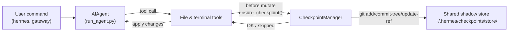

# 체크포인트와 `/rollback`

Hermes Agent는 **파괴적 작업** 전에 프로젝트를 자동으로 스냅샷하고, 단일 명령으로 복원할 수 있습니다. 체크포인트는 v2부터 **옵트인**입니다. 대부분의 사용자는 `/rollback`을 전혀 사용하지 않으며, shadow-store 저장소는 시간이 지나면서 상당한 공간을 차지할 수 있으므로 기본값은 꺼져 있습니다.

`--checkpoints`로 세션별 체크포인트를 활성화하세요.

```bash
hermes chat --checkpoints
```

또는 `~/.hermes/config.yaml`에서 전역으로 활성화하세요.

```yaml
checkpoints:
  enabled: true
```

이 안전망은 내부 **Checkpoint Manager**가 제공합니다. 이 관리자는 `~/.hermes/checkpoints/store/` 아래에 하나의 공유 shadow git 저장소를 유지하며, 실제 프로젝트의 `.git`은 절대 건드리지 않습니다. 에이전트가 작업하는 모든 프로젝트는 같은 저장소를 공유하므로, git의 콘텐츠 주소 지정 객체 DB가 프로젝트와 턴 간에 중복을 제거합니다.

## 체크포인트를 생성하는 작업

다음 작업 전에 체크포인트가 자동으로 생성됩니다.

- **파일 도구** — `write_file` 및 `patch`
- **파괴적 터미널 명령** — `rm`, `rmdir`, `cp`, `install`, `mv`, `sed -i`, `truncate`, `dd`, `shred`, 출력 리디렉션(`>`), `git reset`/`clean`/`checkout`

에이전트는 턴마다 디렉터리별로 체크포인트를 **최대 하나만** 생성하므로, 장시간 실행되는 세션에서도 스냅샷이 과도하게 쌓이지 않습니다.

## 빠른 참조

세션 내 슬래시 명령:

| 명령 | 설명 |
|---------|-------------|
| `/rollback` | 변경 통계와 함께 모든 체크포인트 나열 |
| `/rollback <N>` | 체크포인트 N으로 복원 (마지막 채팅 턴도 되돌림) |
| `/rollback diff <N>` | 체크포인트 N과 현재 상태 사이의 diff 미리 보기 |
| `/rollback <N> <file>` | 체크포인트 N에서 단일 파일 복원 |

세션 외부에서 저장소를 검사하고 관리하는 CLI:

| 명령 | 설명 |
|---------|-------------|
| `hermes checkpoints` | 전체 크기, 프로젝트 수, 프로젝트별 분석 표시 |
| `hermes checkpoints status` | 인수 없는 `checkpoints`와 동일 |
| `hermes checkpoints list` | `status`의 별칭 |
| `hermes checkpoints prune` | 전체 정리 강제 실행: 고아/오래된 항목 삭제, GC, 크기 제한 적용 |
| `hermes checkpoints clear` | 체크포인트 기반 전체 삭제 (먼저 확인) |
| `hermes checkpoints clear-legacy` | v1 마이그레이션에서 생성된 `legacy-*` 아카이브만 삭제 |

## 체크포인트 작동 방식

높은 수준에서의 작동 방식은 다음과 같습니다.

- Hermes는 도구가 작업 트리의 **파일을 수정**하려는 시점을 감지합니다.
- 대화 턴마다 디렉터리별로 한 번씩 다음 작업을 수행합니다.
  - 파일에 적합한 프로젝트 루트를 확인합니다.
  - `~/.hermes/checkpoints/store/`의 **단일 공유 shadow store**를 초기화하거나 재사용합니다.
  - 프로젝트별 인덱스에 스테이징하고, 트리를 만든 다음, 프로젝트별 ref(`refs/hermes/<project-hash>`)에 커밋합니다.
- 이 프로젝트별 ref가 체크포인트 기록을 구성하며, `/rollback`으로 이를 검사하고 복원할 수 있습니다.



## 구성

`~/.hermes/config.yaml`에서 구성합니다.

```yaml
checkpoints:
  enabled: false              # master switch (default: false — opt-in)
  max_snapshots: 20           # max checkpoints per project (enforced via ref rewrite + gc)
  max_total_size_mb: 500      # hard cap on total store size; oldest commits dropped
  max_file_size_mb: 10        # skip any single file larger than this

  # Auto-maintenance (on by default): sweep ~/.hermes/checkpoints/ at startup
  # and delete project entries whose last_touch is older than retention_days.
  # Runs at most once per min_interval_hours, tracked via a .last_prune
  # marker. This sweep never deletes "orphan" entries (working directory not
  # found) — a missing workdir at startup is ambiguous (deleted project vs.
  # an unmounted external volume / network share / VPN not yet up), so
  # orphan cleanup is only ever done via the explicit
  # `hermes checkpoints prune` command below, with a confirmation prompt.
  auto_prune: true
  retention_days: 7
  min_interval_hours: 24
```

모든 기능을 비활성화하려면 다음과 같이 설정합니다.

```yaml
checkpoints:
  enabled: false
  auto_prune: false
```

`enabled: false`이면 Checkpoint Manager는 아무 작업도 하지 않으며 git 작업을 시도하지 않습니다. `auto_prune: false`이면 수동으로 `hermes checkpoints prune`을 실행할 때까지 저장소가 계속 커집니다.

## 체크포인트 나열

CLI 세션에서:

```
/rollback
```

Hermes는 변경 통계를 보여주는 형식화된 목록으로 응답합니다.

```text
📸 Checkpoints for /path/to/project:

  1. 4270a8c  2026-03-16 04:36  before patch  (1 file, +1/-0)
  2. eaf4c1f  2026-03-16 04:35  before write_file
  3. b3f9d2e  2026-03-16 04:34  before terminal: sed -i s/old/new/ config.py  (1 file, +1/-1)

  /rollback <N>             restore to checkpoint N
  /rollback diff <N>        preview changes since checkpoint N
  /rollback <N> <file>      restore a single file from checkpoint N
```

## 셸에서 저장소 검사

```bash
hermes checkpoints
```

출력 예시:

```text
Checkpoint base: /home/you/.hermes/checkpoints
Total size:      142.3 MB
  store/         138.1 MB
  legacy-*       4.2 MB
Projects:        12

  WORKDIR                                                       COMMITS    LAST TOUCH  STATE
  /home/you/code/hermes-agent                                        20       2h ago  live
  /home/you/code/experiments/rl-runner                                8       1d ago  live
  /home/you/code/old-prototype                                        3       9d ago  orphan
  ...

Legacy archives (1):
  legacy-20260506-050616                           4.2 MB

Clear with: hermes checkpoints clear-legacy
```

전체 정리를 강제로 실행합니다(24시간 멱등성 마커 무시).

```bash
hermes checkpoints prune --retention-days 3 --max-size-mb 200
```

## `/rollback diff`로 변경 사항 미리 보기

복원을 확정하기 전에 체크포인트 이후 무엇이 변경되었는지 미리 확인합니다.

```
/rollback diff 1
```

git diff 통계 요약에 이어 실제 diff가 표시됩니다.

## `/rollback`으로 복원

```
/rollback 1
```

내부적으로 Hermes는 다음을 수행합니다.

1. 대상 커밋이 shadow store에 존재하는지 확인합니다.
2. 나중에 "되돌리기를 되돌릴" 수 있도록 현재 상태의 **pre-rollback 스냅샷**을 생성합니다.
3. 작업 디렉터리의 추적 파일을 복원합니다.
4. **마지막 대화 턴을 되돌려** 에이전트의 컨텍스트가 복원된 파일 시스템 상태와 일치하도록 합니다.

## 단일 파일 복원

디렉터리의 나머지 부분에는 영향을 주지 않고 체크포인트에서 파일 하나만 복원합니다.

```
/rollback 1 src/broken_file.py
```

## 안전성 및 성능 보호 장치

- **Git 사용 가능 여부** — `git`을 `PATH`에서 찾을 수 없으면 체크포인트가 투명하게 비활성화됩니다.
- **디렉터리 범위** — Hermes는 지나치게 넓은 디렉터리(루트 `/`, 홈 `$HOME`)를 건너뜁니다.
- **저장소 크기** — 파일이 50,000개를 초과하는 디렉터리는 건너뜁니다.
- **파일별 크기 제한** — `max_file_size_mb`(기본값 10MB)보다 큰 파일은 스냅샷에서 제외됩니다. 데이터 세트, 모델 가중치 또는 생성된 미디어를 실수로 포함하는 일을 방지합니다.
- **전체 저장소 크기 제한** — 저장소가 `max_total_size_mb`(기본값 500MB)를 초과하면 제한 이하가 될 때까지 프로젝트별 가장 오래된 커밋을 라운드 로빈 방식으로 삭제합니다.
- **실제 정리** — 이후 `git gc --prune=now`를 실행하고 프로젝트별 ref를 다시 작성하여 `max_snapshots`를 적용하므로, 느슨한 객체가 쌓이지 않습니다.
- **변경 없는 스냅샷** — 마지막 스냅샷 이후 변경 사항이 없으면 체크포인트를 건너뜁니다.
- **치명적이지 않은 오류** — Checkpoint Manager 내부의 모든 오류는 debug 수준으로 기록되며, 도구는 계속 실행됩니다.

## 체크포인트 저장 위치

```text
~/.hermes/checkpoints/
  ├── store/                 # single shared bare git repo
  │   ├── HEAD, objects/     # git internals (shared across projects)
  │   ├── refs/hermes/<hash> # per-project branch tip
  │   ├── indexes/<hash>     # per-project git index
  │   ├── projects/<hash>.json  # workdir + created_at + last_touch
  │   └── info/exclude
  ├── .last_prune            # auto-prune idempotency marker
  └── legacy-<ts>/           # archived pre-v2 per-project shadow repos
```

각 `<hash>`는 작업 디렉터리의 절대 경로에서 파생됩니다. 일반적으로 이를 수동으로 건드릴 필요는 없습니다. 대신 `hermes checkpoints status` / `prune` / `clear`를 사용하세요.

### v1에서 마이그레이션

v2로 다시 작성되기 전에는 각 작업 디렉터리가 `~/.hermes/checkpoints/<hash>/` 바로 아래에 자체적인 완전한 shadow git 저장소를 가졌습니다. 이 구조에서는 프로젝트 간 객체를 중복 제거할 수 없었고, 문서화된 pruner가 아무 작업도 하지 않아 저장소가 제한 없이 커졌습니다.

첫 번째 v2 실행 시 v2 이전의 shadow 저장소는 `~/.hermes/checkpoints/legacy-<timestamp>/`로 이동되므로, 새로운 단일 저장소 구조가 깨끗한 상태로 시작됩니다. 이전 `/rollback` 기록은 legacy 아카이브를 `git`으로 직접 검사하면 여전히 접근할 수 있습니다. 더 이상 필요하지 않다고 확신하면 다음을 실행하여 공간을 회수하세요.

```bash
hermes checkpoints clear-legacy
```

legacy 아카이브도 `retention_days` 이후 `auto_prune`에 의해 정리됩니다.

## 모범 사례

- **필요할 때만 체크포인트 활성화** — `hermes chat --checkpoints` 또는 프로필별 `enabled: true`.
- **복원 전에 `/rollback diff` 사용** — 변경될 내용을 미리 확인하여 올바른 체크포인트를 선택합니다.
- 에이전트가 수행한 변경 사항만 되돌리려면 `git reset` 대신 **`/rollback` 사용**.
- 체크포인트를 정기적으로 사용한다면 가끔 **`hermes checkpoints status` 확인** — 활성 프로젝트와 저장소가 사용하는 공간을 보여줍니다.
- **최대의 안전성을 위해 Git worktree와 함께 사용** — 각 Hermes 세션을 별도의 worktree/branch에서 유지하고, 체크포인트를 추가 보호 계층으로 사용합니다.

같은 저장소에서 여러 에이전트를 병렬로 실행하는 방법은 [Git worktree 가이드](./git-worktrees.md)를 참조하세요.
