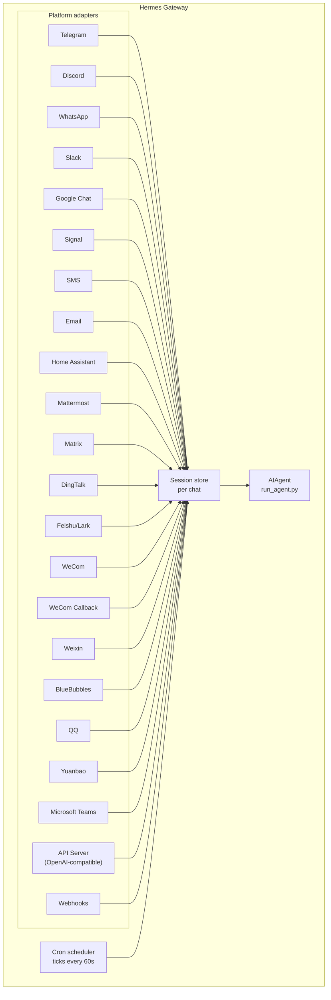

# 메시징 게이트웨이

Telegram, Discord, Slack, WhatsApp, Signal, SMS, Email, Home Assistant, Mattermost, Matrix, DingTalk, Feishu/Lark, WeCom, Weixin, BlueBubbles(iMessage), QQ, Yuanbao, Microsoft Teams, LINE, ntfy, Raft 또는 브라우저에서 Hermes와 대화할 수 있습니다. 게이트웨이는 설정된 모든 플랫폼에 연결되고, 세션을 처리하며, cron 작업을 실행하고, 음성 메시지를 전달하는 단일 백그라운드 프로세스입니다.

CLI 마이크 모드, 메시징의 음성 답변, Discord 음성 채널 대화를 포함한 전체 음성 기능은 [음성 모드](/user-guide/features/voice-mode) 및 [Hermes에서 음성 모드 사용하기](/guides/use-voice-mode-with-hermes)를 참조하세요.

:::tip
봇에는 모델 제공자와 도구 제공자(TTS, web)가 모두 필요합니다. [Nous Portal](/integrations/nous-portal) 구독을 이용하면 이 모든 기능이 하나로 제공됩니다.
:::

## 플랫폼 비교

| 플랫폼 | 음성 | 이미지 | 파일 | 스레드 | 리액션 | 입력 중 표시 | 스트리밍 |
|----------|:-----:|:------:|:-----:|:-------:|:---------:|:------:|:---------:|
| Telegram | ✅ | ✅ | ✅ | ✅ | — | ✅ | ✅ |
| Discord | ✅ | ✅ | ✅ | ✅ | ✅ | ✅ | ✅ |
| Slack | ✅ | ✅ | ✅ | ✅ | ✅ | ✅ | ✅ |
| Google Chat | — | ✅ | ✅ | ✅ | — | ✅ | — |
| WhatsApp | — | ✅ | ✅ | — | — | ✅ | ✅ |
| WhatsApp Cloud API | ✅ | ✅ | ✅ | — | — | ✅ | — |
| Signal | — | ✅ | ✅ | — | — | ✅ | — |
| SMS | — | — | — | — | — | — | — |
| Email | — | ✅ | ✅ | ✅ | — | — | — |
| Home Assistant | — | — | — | — | — | — | — |
| Mattermost | ✅ | ✅ | ✅ | ✅ | — | ✅ | ✅ |
| Matrix | ✅ | ✅ | ✅ | ✅ | ✅ | ✅ | ✅ |
| DingTalk | — | ✅ | ✅ | — | ✅ | — | ✅ |
| Feishu/Lark | ✅ | ✅ | ✅ | ✅ | ✅ | ✅ | ✅ |
| WeCom | ✅ | ✅ | ✅ | — | — | — | — |
| WeCom Callback | — | — | — | — | — | — | — |
| Weixin | ✅ | ✅ | ✅ | — | — | ✅ | — |
| BlueBubbles | — | ✅ | ✅ | — | ✅ | ✅ | — |
| Photon (iMessage) | ✅ | ✅ | ✅ | — | ✅ | ✅ | — |
| QQ | ✅ | ✅ | ✅ | — | — | ✅ | — |
| Yuanbao | ✅ | ✅ | ✅ | — | — | ✅ | ✅ |
| Microsoft Teams | — | ✅ | — | ✅ | — | ✅ | — |
| LINE | — | ✅ | ✅ | — | — | ✅ | — |
| ntfy | — | — | — | — | — | — | — |
| Raft | — | — | — | — | — | — | — |
| IRC | — | — | — | — | — | — | — |
| Buzz | — | ✅ | — | ✅ | — | — | — |
| SimpleX | ✅ | ✅ | ✅ | — | — | ✅ | — |

**음성** = TTS 음성 답변 및/또는 음성 메시지 전사. **이미지** = 이미지 송수신. **파일** = 파일 첨부 송수신. **스레드** = 스레드형 대화. **리액션** = 메시지의 이모지 리액션. **입력 중 표시** = 처리 중 입력 표시. **스트리밍** = 편집을 통한 점진적 메시지 업데이트.

:::note Hermes Relay
[Hermes Relay](/user-guide/messaging/relay)(실험적 기능)는 채팅 플랫폼 자체가 아닙니다. Discord, Telegram, Slack, WhatsApp 같은 플랫폼을 플랫폼 인증 정보를 관리하는 외부 커넥터를 통해 연결하는 커넥터 시스템입니다. 기능(미디어, 네이티브 승인/확인 프롬프트, 리액션, 스레드, 입력 중 표시, 스트리밍)은 위 표에 고정되어 있지 않고 핸드셰이크 시 커넥터별로 협상됩니다.
:::

## 아키텍처



각 플랫폼 어댑터는 메시지를 받아 채팅별 세션 저장소를 통해 라우팅하고, 처리를 위해 AIAgent로 전달합니다. 게이트웨이는 cron 스케줄러도 실행하며, 60초마다 확인하여 기한이 된 작업을 실행합니다.

## 의도적 무응답 토큰

그룹 채팅, 훅, 자동화 흐름에서 Hermes는 명시적인 무응답 토큰을 지원합니다. 에이전트의 최종 응답이 지원되는 토큰 중 하나와 정확히 일치하면 게이트웨이는 외부 전송을 억제하고 채팅에 아무것도 보내지 않습니다.

지원되는 토큰:

- `[SILENT]`
- `SILENT`
- `NO_REPLY`
- `NO REPLY`

공백과 대소문자는 정규화되지만, 최종 응답 전체가 토큰이어야 합니다. "변경 사항이 없으면 `[SILENT]`를 사용하세요" 같은 문장은 정상적으로 전달됩니다.

무응답은 전달에 관한 결정일 뿐입니다. Hermes는 세션 기록에 에이전트의 무응답 턴을 유지하므로 대화는 계속 정상적으로 번갈아 진행됩니다.

```text
user: side-channel chatter
assistant: [SILENT]   # stored, not delivered
user: next message
```

실패한 턴은 여전히 오류로 표시됩니다. 텍스트가 무응답 토큰처럼 보인다는 이유만으로 Hermes가 실패를 숨기지는 않습니다.

## 빠른 설정

메시징 플랫폼을 설정하는 가장 쉬운 방법은 대화형 마법사를 이용하는 것입니다.

```bash
hermes gateway setup        # Interactive setup for all messaging platforms
```

이 마법사는 각 플랫폼을 화살표 키로 선택하여 설정하도록 안내하고, 이미 설정된 플랫폼을 보여 주며, 완료 후 게이트웨이를 시작하거나 재시작할지 묻습니다.

## 게이트웨이 명령

```bash
hermes gateway              # Run in foreground
hermes gateway setup        # Configure messaging platforms interactively
hermes gateway install      # Install as a user service (Linux) / launchd service (macOS)
sudo hermes gateway install --system   # Linux only: install a boot-time system service
hermes gateway start        # Start the default service
hermes gateway stop         # Stop the default service
hermes gateway status       # Check default service status
hermes gateway status --system         # Linux only: inspect the system service explicitly
```

### 선택 사항: Linux 이벤트 루프 감시자

systemd가 관리하는 게이트웨이는 Python의 `asyncio` 이벤트 루프가 스케줄링 시간을 받지 못할 때 프로세스를 복구하도록 설정할 수 있습니다. 이 기능은 플랫폼별 활성 상태 작업도 실행되지 못하게 하는 전체 프로세스 정지를 포괄합니다.

```yaml title="~/.hermes/config.yaml"
gateway:
  systemd_watchdog_seconds: 120
```

이 설정을 변경한 후 서비스 단위를 다시 생성하세요.

```bash
hermes gateway install --force
```

양수 값을 지정하면 생성된 단위가 `Type=notify`, `NotifyAccess=main`, 해당 `WatchdogSec`를 사용합니다. Hermes는 이벤트 루프가 제때 진행 중일 때만 하트비트를 보냅니다. 하트비트가 멈추면 systemd가 프로세스를 재시작합니다. 기본값 `0`은 기존 `Type=simple` 동작을 유지합니다. 이 설정은 Linux/systemd 전용이며, 일반적인 플랫폼 네트워크 연결 끊김을 이벤트 루프 실패로 처리하지 않습니다.

## 채팅 명령(메시징 내부)

| 명령 | 설명 |
|---------|-------------|
| `/new` 또는 `/reset` | 새 대화 시작 |
| `/model [provider:model]` | 모델 표시 또는 변경(`provider:model` 구문 지원) |
| `/personality [name]` | 성격 설정(`none`으로 초기화) |
| `/retry` | 마지막 메시지 재시도 |
| `/undo` | 마지막 교환 삭제 |
| `/status` | 세션 정보 표시 |
| `/whoami` | 이 범위에서 슬래시 명령에 대한 접근 권한 표시(관리자 / 사용자 / 제한 없음) |
| `/stop` | 실행 중인 에이전트 중지 |
| `/approve` | 대기 중인 위험한 명령 승인 |
| `/deny` | 대기 중인 위험한 명령 거부 |
| `/sethome` | 이 채팅을 홈 채널로 설정 |
| `/compress` | 대화 컨텍스트 수동 압축 |
| `/title [name]` | 세션 제목 설정 또는 표시 |
| `/resume [name]` | 이전에 이름을 지정한 세션 재개 |
| `/sessions [all] [search <query>]` | 이전 세션 나열; `search <query>`는 제목 또는 id로 필터링 |
| `/usage` | 이 세션의 토큰 사용량 표시(`/usage reset [--force]`는 저장된 Codex 한도 초기화를 사용) |
| `/insights [days]` | 사용량 인사이트 및 분석 표시 |
| `/reasoning [level\|show\|hide]` | 추론 수준 변경 또는 추론 표시 전환 |
| `/voice [on\|off\|tts\|join\|leave\|status]` | 메시징 음성 답변 및 Discord 음성 채널 동작 제어 |
| `/rollback [number]` | 파일시스템 체크포인트 나열 또는 복원 |
| `/background <prompt>` | 별도의 백그라운드 세션에서 프롬프트 실행 |
| `/reload-mcp` | 설정에서 MCP 서버 다시 로드 |
| `/update` | Hermes Agent를 최신 버전으로 업데이트 |
| `/help` | 사용 가능한 명령 표시 |
| `/<skill-name>` | 설치된 스킬 호출 |

## 세션 관리

### 세션 지속성

세션은 초기화될 때까지 메시지 간에 유지됩니다. 에이전트는 대화 컨텍스트를 기억합니다.

### 지난 세션 찾기(`/sessions`)

`/sessions`는 현재 채팅의 이전 세션을 나열하고, `/sessions <name>`은 세션 하나를 재개합니다(`/resume`의 축약형). 목록이 길어지면 `/sessions search <query>`(`find` 별칭)가 제목 또는 세션 ID가 일치하는 항목을 필터링하며, 최근 활성화 순으로 정렬합니다. 출처가 다른 세션을 나열하는 `/sessions all`은 관리자 전용입니다. 일반 사용자는 자신의 채팅 출처에 해당하는 세션만 볼 수 있습니다.

### 지속적인 `/model` 재정의

게이트웨이 채팅에서 `/model`을 전환하면 해당 세션에 적용되며 이제 게이트웨이를 재시작해도 유지됩니다. 모델/제공자 선택은 세션 저장소에 저장되고 재시작 후 처음 사용할 때 다시 복원됩니다(자격 증명은 로드 시 다시 확인되며 디스크에 기록되지 않습니다). `/new`(또는 `/reset`)는 재정의를 지우고, `/model <name> --global`은 이를 `config.yaml`에 기록합니다. `/model <name> --once`는 한 번의 턴에만 적용됩니다.

### 전달 신뢰성

최종 에이전트 응답은 각 플랫폼 전송 전후로 내구성 있는 전달 원장(`state.db`)에 기록됩니다. 게이트웨이가 응답을 생성한 후 플랫폼이 수신을 확인하기 전에 충돌하거나 재시작하면, 다음 부팅 시 전체 턴을 다시 실행하지 않고 저장된 응답을 재전송합니다.

정확한 의미는 최소 한 번 전달입니다.

- 전송이 **시작되지 않은** 응답은 그대로 재전송됩니다.
- 게이트웨이 종료 시 **전송 중이던** 응답(플랫폼이 받았을 수도 있고 아닐 수도 있음)은 눈에 보이는 "♻️ Recovered reply — … may be a duplicate" 접두사와 함께 재전송됩니다. 모호한 상태는 조용히 재전송하지 않고 표시합니다.
- 재전송은 제한됩니다. 3회 시도, 24시간의 최신성 제한을 넘기면 행을 포기합니다. 전달된 행은 7일 후 정리됩니다.

`config.yaml`에서 `gateway.delivery_ledger: false`로 비활성화하면 기존 동작(충돌 시 전송 중 응답을 잃음)으로 돌아갑니다.

### 초기화 정책

**기본적으로 세션은 자동 초기화되지 않습니다.** 수동으로 `/reset`을 실행하거나 컨텍스트 압축이 시작될 때까지 컨텍스트가 유지됩니다. 자동 초기화를 원한다면 `~/.hermes/config.yaml`의 `session_reset` 섹션에서 선택적으로 활성화하세요.

```yaml
session_reset:
  mode: idle        # "idle", "daily", "both", or "none" (default)
  idle_minutes: 1440  # for idle/both: minutes of inactivity before reset
  at_hour: 4          # for daily/both: hour of day (0-23, local time)
```

| 모드 | 설명 |
|------|-------------|
| `none` | 자동 초기화 안 함(기본값) |
| `daily` | 매일 특정 시각에 초기화 |
| `idle` | 일정 시간 활동이 없으면 초기화 |
| `both` | 먼저 발생하는 조건에 따라 실행 |

`terminal(background=true)`로 시작한 실행 중인 백그라운드 프로세스는 일반적으로 세션이 초기화되지 않도록 보호하여 출력이 사라지지 않게 합니다. 미리보기 서버처럼 잊힌 프로세스가 세션을 영원히 열린 상태로 고정하지 않도록 `bg_process_max_age_hours`(기본값 **24**)보다 오래된 백그라운드 프로세스는 더 이상 초기화를 막지 않습니다. 프로세스를 **종료하는 것은 아니며**, 초기화 보호에서만 무시합니다. `0`으로 설정하면 제한을 비활성화하여(실행 중인 프로세스가 초기화를 막는 기존 동작) 모든 프로세스가 초기화를 막게 됩니다. 며칠간 실행되는 정당한 작업의 생존 상태로 대화를 계속 열어 두려면 값을 높이세요.

플랫폼별 재정의는 `~/.hermes/gateway.json`에서 설정하세요.

```json
{
  "reset_by_platform": {
    "telegram": { "mode": "idle", "idle_minutes": 240 },
    "discord": { "mode": "idle", "idle_minutes": 60 }
  }
}
```

## 채널별 모델 및 시스템 프롬프트 재정의

하나의 게이트웨이에서 서로 다른 채널에 서로 다른 모델과 페르소나를 사용할 수 있습니다. 예를 들어 `#daily`에는 저렴하고 빠른 모델을, `#dev`에는 전문 프롬프트를 사용하는 최상급 모델을 배정할 수 있습니다. `~/.hermes/gateway-config.yaml`에서 플랫폼 아래에 `channel_overrides`를 설정하세요.

```yaml
platforms:
  discord:
    enabled: true
    channel_overrides:
      "123456789012345678":        # channel/thread id
        model: anthropic/claude-sonnet-4.6
        provider: anthropic
        system_prompt: "You are the #dev channel code-review specialist."
      "987654321098765432":
        model: openai/gpt-5-mini
```

세부 사항:

- 세 키 모두 선택 사항입니다. `model`만, `system_prompt`만, 또는 조합으로 설정할 수 있습니다. 설정하지 않은 필드는 전역 기본값으로 대체됩니다.
- 조회 순서는 정확한 채널/스레드 ID가 먼저이고, 그다음 **상위** 채널/포럼 ID입니다. 따라서 Discord 스레드는 상위 채널의 재정의를 자동으로 상속합니다.
- 모델의 해석 우선순위는 세션 `/model` 재정의 → `channel_overrides` → 전역 설정입니다. 채팅에서 `/model`을 실행한 사용자의 설정이 채널 기본값보다 우선합니다.
- `system_prompt` 재정의는 해당 채널의 전역 게이트웨이 프롬프트를 대체합니다(일시적이며 기록에 저장하지 않고 턴마다 주입합니다).

## 보안

**기본적으로 게이트웨이는 허용 목록에 없거나 DM으로 페어링되지 않은 모든 사용자를 거부합니다.** 이는 터미널 접근 권한이 있는 봇을 위한 안전한 기본값입니다.

```bash
# Restrict to specific users (recommended):
TELEGRAM_ALLOWED_USERS=123456789,987654321
DISCORD_ALLOWED_USERS=123456789012345678
SIGNAL_ALLOWED_USERS=+155****4567,+155****6543
SMS_ALLOWED_USERS=+155****4567,+155****6543
EMAIL_ALLOWED_USERS=trusted@example.com,colleague@work.com
MATTERMOST_ALLOWED_USERS=3uo8dkh1p7g1mfk49ear5fzs5c
MATRIX_ALLOWED_USERS=@alice:matrix.org
DINGTALK_ALLOWED_USERS=user-id-1
FEISHU_ALLOWED_USERS=ou_xxxxxxxx,ou_yyyyyyyy
WECOM_ALLOWED_USERS=user-id-1,user-id-2
WECOM_CALLBACK_ALLOWED_USERS=user-id-1,user-id-2
TEAMS_ALLOWED_USERS=aad-object-id-1,aad-object-id-2

# Or allow
GATEWAY_ALLOWED_USERS=123456789,987654321

# Or explicitly allow all users (NOT recommended for bots with terminal access):
GATEWAY_ALLOW_ALL_USERS=true
```

### DM 페어링(허용 목록의 대안)

사용자 ID를 직접 설정하는 대신, 알 수 없는 사용자가 봇에 DM을 보내면 일회용 페어링 코드를 받습니다. Email은 예외입니다. 이메일 페어링을 명시적으로 활성화하지 않으면 알 수 없는 발신자의 이메일은 무시됩니다.

```bash
# The user sees: "Pairing code: XKGH5N7P"
# You approve them with:
hermes pairing approve telegram XKGH5N7P

# Other pairing commands:
hermes pairing list          # View pending + approved users
hermes pairing revoke telegram 123456789  # Remove access
```

페어링 코드는 1시간 후 만료되고, 요청 횟수가 제한되며, 암호학적으로 안전한 난수를 사용합니다.

### 관리자와 일반 사용자

허용 목록은 "이 사람이 봇에 도달할 수 있는가?"에 답합니다. **관리자/사용자 구분**은 "접근한 뒤 무엇을 할 수 있는가?"에 답합니다.

허용된 사용자는 범위(DM 대 그룹/채널)별로 다음 두 등급 중 하나에 속합니다.

- **관리자** — 전체 접근 권한. 등록된 모든 슬래시 명령(기본 제공 및 플러그인)을 실행하고 모든 제한 기능을 사용할 수 있습니다.
- **일반 사용자** — 제한된 접근 권한. 에이전트와 정상적으로 대화할 수 있지만, 명시적으로 활성화한 슬래시 명령만 실행할 수 있습니다. 항상 허용되는 최소 명령은 `/help` 및 `/whoami`입니다.

등급은 플랫폼 및 범위별로 설정합니다. DM 관리자 상태가 그룹/채널 관리자 상태를 의미하지는 않습니다. 각 범위는 자체 관리자 목록을 가집니다.

**현재 등급이 제한하는 것:** 슬래시 명령입니다. 이 구분은 활성 명령 레지스트리를 통해 적용되므로 기능별 연결 없이 기본 제공 명령과 플러그인 등록 명령을 모두 포함합니다. 일반 채팅에는 영향을 주지 않으므로 관리자가 아닌 사용자도 에이전트와 대화할 수 있습니다.

**향후 제한될 수 있는 것:** 앞으로 더 많은 기능 표면(도구 접근, 모델 전환, 비용이 큰 작업)이 추가되면 동일한 관리자/사용자 구분을 사용하게 됩니다. 지금 구분을 설정하면 앞으로 제한이 추가되어도 관리자를 다시 모델링할 필요가 없습니다.

#### 설정

```yaml
gateway:
  platforms:
    discord:
      extra:
        allow_from: ["111", "222", "333"]
        allow_admin_from: ["111"]                    # admins → all slash commands
        user_allowed_commands: [status, model]       # what non-admins may run
        # Optional: separate group/channel scope
        group_allow_admin_from: ["111"]
        group_user_allowed_commands: [status]
```

**하위 호환성:** 어떤 범위에도 `allow_admin_from`이 설정되지 않으면 해당 범위에서 등급 구분이 비활성화되고, 허용된 모든 사용자가 전체 접근 권한을 가집니다. 기존 설치는 변경 없이 계속 작동하며, 구분이 필요할 때 선택적으로 활성화하면 됩니다.

#### 접근 권한 확인

어느 플랫폼에서든 `/whoami`를 사용하면 현재 범위, 자신의 등급(관리자 / 사용자 / 제한 없음), 실행할 수 있는 슬래시 명령을 확인할 수 있습니다. 플랫폼별 예시는 [Telegram](/user-guide/messaging/telegram#slash-command-access-control) 및 [Discord](/user-guide/messaging/discord#slash-command-access-control) 페이지를 참조하세요.

## 에이전트 방향 전환

에이전트가 작업 중일 때 메시지를 보내 현재 턴을 수정할 수 있습니다.

- **모델 생성이 컨텍스트와 함께 다시 시작됩니다** — 이미 표시된 추론과 사용자에게 보인 부분 텍스트는 일반적인 assistant 체크포인트로 유지됩니다.
- **완료된 작업은 계속 사용할 수 있습니다** — 이전 도구 호출과 결과가 턴에 남습니다.
- **실행 중인 도구는 안전하게 완료됩니다** — 도구를 종료하는 대신 다음 도구 결과 경계에서 수정 사항이 적용됩니다.
- **`/stop`은 강제 중지로 유지됩니다** — 활성 턴과 포그라운드 작업을 취소하려면 사용하세요.

### 대기열 vs 인터럽트 vs 조정(사용 중 입력 모드)

기본적으로 바쁜 에이전트에게 메시지를 보내면 활성 턴이 방향 전환됩니다. 두 가지 다른 모드도 사용할 수 있습니다.

- `queue` — 후속 메시지가 대기하며 현재 작업이 끝난 다음 턴으로 실행됩니다.
- `steer` — 후속 메시지가 `/steer`를 통해 현재 실행에 주입되고, 다음 도구 호출 후 에이전트에 도달합니다. 아직 시작되지 않았다면 `queue` 동작으로 대체됩니다.

```yaml
display:
  busy_input_mode: steer   # or queue, or interrupt (default)
  busy_ack_enabled: true   # set to false to suppress the ⚡/⏳/⏩ chat reply entirely
```

어느 플랫폼에서든 바쁜 에이전트에게 처음 메시지를 보내면 Hermes는 설정 항목을 설명하는 한 줄 알림(`"💡 First-time tip — …"`)을 busy-ack에 추가합니다. 이 알림은 설치마다 한 번만 표시되며 `onboarding.seen.busy_input_prompt` 아래의 플래그가 이를 기록합니다. 팁을 다시 보려면 해당 키를 삭제하세요.

바쁜 상태 확인 메시지가 시끄럽다면 `display.busy_ack_enabled: false`로 설정하세요. 입력 처리 방식은 바뀌지 않고 확인 메시지만 숨겨집니다.

## 확인 질문(다중 선택)

에이전트가 `clarify` 도구로 질문하면 게이트웨이는 선택지를 번호가 매겨진 프롬프트로 표시합니다(지원하는 플랫폼에서는 네이티브 버튼). 확인 질문은 다중 선택도 지원합니다. 즉, 에이전트가 여러 옵션을 동시에 선택하도록 할 수 있습니다.

- **메시징 플랫폼** — 프롬프트에 "Multiple selections allowed"가 표시됩니다. 숫자를 쉼표나 공백으로 구분해 답하거나(예: `1, 3`), 옵션 텍스트 또는 자유 형식 답변을 입력할 수 있습니다.
- **기본 CLI / TUI** — 다중 선택이 체크박스로 표시됩니다. **Space**로 옵션을 전환하고 **Enter**로 선택을 제출합니다.

단일 선택 프롬프트는 이전과 동일하게 번호, 버튼, 텍스트 중 하나를 고르거나 "Other" 경로를 통해 직접 답변을 입력합니다.

## 도구 진행 알림

`~/.hermes/config.yaml`에서 표시되는 도구 활동의 양을 제어하세요.

```yaml
display:
  tool_progress: all    # off | new | all | verbose | log
  tool_progress_command: false  # set to true to enable /verbose in messaging
  # How progress is grouped on platforms that support message editing:
  #   accumulate (default) — edit one bubble in place as tools run
  #   separate             — send one message per tool (pre-v0.9 style; noisier)
  # Only applies where tool_progress is already enabled.
  tool_progress_grouping: accumulate   # accumulate | separate
```

### `log` 모드 — 채팅 메시지 대신 감사 파일

`display.tool_progress: log`를 설정하면 채팅에 진행 버블이 전혀 표시되지 않습니다. 대신 각 도구 호출이 `~/.hermes/logs/tool_calls.log`에 한 줄로 추가됩니다. 이 파일은 5MB × 3개 백업으로 순환하는 감사 파일이며 일반 로그와 동일한 비밀 정보 제거 포맷터를 사용하므로 인증 정보가 디스크에 기록되지 않습니다. 채팅을 방해하지 않고 전체 도구 호출 기록이 필요할 때 사용하세요.

### 설정 가능한 상태 문구

오래 실행되는 게이트웨이 상태 줄("아직 작업 중…" 유형의 하트비트)은 문구 카탈로그에서 가져옵니다. `HERMES_HOME` 아래 프로필 간에 이동 가능한 파일로 직접 추가할 수 있습니다.

- `~/.hermes/status_phrases.yaml` 또는 `~/.hermes/status_phrases/`의 모든 `*.yaml` 파일(관례적인 경로이며 자동 로드), 또는
- 상대 경로를 설정에 지정:

```yaml
display:
  status_phrases:
    path: status_phrases/whatsapp.yaml  # relative to HERMES_HOME
    mode: append                        # append (default) or replace
```

문구 파일은 표면(`status`, `generic`)을 문자열 목록에 매핑합니다(표면별 최대 80개 문구, 각 160자). 절대 경로와 `..` 탈출은 설정을 프로필 간에 이동 가능하게 유지하기 위해 무시됩니다. 설정한 문구만 사용되며, 원시 도구 인수·명령·추론 텍스트는 상태 문구에 삽입되지 않습니다.

### 모델 컨텍스트의 메시지 타임스탬프

기본적으로 꺼져 있습니다. 활성화하면 Hermes는 모델 컨텍스트에서 각 **사용자** 메시지 앞에 사람이 읽을 수 있는 타임스탬프(예: `[Tue 2026-04-28 13:40:53 CEST]`)를 추가합니다. 이를 통해 에이전트가 메시지 전송 시각을 알 수 있어 시간 추론(“오늘 아침에 요청하셨습니다…”, 긴 공백 감지)에 유용합니다. **assistant 메시지나 시스템 프롬프트에는 추가되지 않습니다.**

```yaml
gateway:
  message_timestamps:
    enabled: false   # set true to show send-times to the model
```

저장된 기록은 항상 깨끗하게 유지됩니다. 이 전환과 관계없이 타임스탬프는 메시지 메타데이터로 저장되므로 나중에 활성화해도 과거 메시지의 전송 시각이 표시되고, 재생 시 접두사가 중복으로 누적되지 않습니다.

활성화하면 봇은 작업 중 상태 메시지를 보냅니다.

```text
💻 `ls -la`...
🔍 web_search...
📄 web_extract...
🐍 execute_code...
```

## 백그라운드 세션

별도의 백그라운드 세션에서 프롬프트를 실행하면 기본 채팅을 계속 사용할 수 있습니다.

```
/background Check all servers in the cluster and report any that are down
```

Hermes는 즉시 다음과 같이 확인합니다.

```
🔄 Background task started: "Check all servers in the cluster..."
   Task ID: bg_143022_a1b2c3
```

### 작동 방식

각 `/background` 프롬프트는 비동기적으로 실행되는 **별도의 에이전트 인스턴스**를 생성합니다.

- **격리된 세션** — 백그라운드 에이전트는 자체 세션과 대화 기록을 가지며 현재 채팅 컨텍스트를 알지 못합니다. 제공한 프롬프트만 받습니다.
- **동일한 설정** — 현재 게이트웨이 설정에서 모델, 제공자, 도구 세트, 추론 설정, 제공자 라우팅을 상속합니다.
- **논블로킹** — 작업 중에도 기본 채팅은 완전히 상호작용할 수 있습니다. 메시지를 보내고, 다른 명령을 실행하거나, 추가 백그라운드 작업을 시작할 수 있습니다.
- **결과 전달** — 작업이 끝나면 명령을 실행한 **동일한 채팅 또는 채널**로 결과가 전송되며, `"✅ Background task complete"`가 앞에 붙습니다. 실패하면 `"❌ Background task failed"`와 오류가 표시됩니다.

### 백그라운드 프로세스 알림

백그라운드 세션에서 실행 중인 에이전트가 `terminal(background=true)`로 장시간 실행되는 프로세스(서버, 빌드 등)를 시작하면 게이트웨이가 상태 업데이트를 채팅으로 보낼 수 있습니다. `~/.hermes/config.yaml`의 `display.background_process_notifications`로 제어하세요.

```yaml
display:
  background_process_notifications: concise    # concise | all | result | error | off
```

| 모드 | 수신 내용 |
|------|-------------|
| `concise` | 완료 시 한 줄 상태 메시지; 실패하면 짧은 출력 끝부분 추가(기본값) |
| `all` | 실행 중 출력 업데이트와 최종 원시 출력 메시지 |
| `result` | 종료 코드와 관계없이 최종 원시 출력 완료 메시지만 |
| `error` | 종료 코드가 0이 아닐 때만 최종 원시 출력 메시지 |
| `off` | 프로세스 감시자 메시지를 전혀 표시하지 않음 |

환경 변수로도 설정할 수 있습니다.

```bash
HERMES_BACKGROUND_NOTIFICATIONS=result
```

### 사용 사례

- **서버 모니터링** — "/background 클러스터의 모든 서버 상태를 확인하고 중단된 서버를 알려줘"
- **장시간 빌드** — 기본 채팅을 계속 사용하면서 "/background 스테이징 환경을 빌드하고 배포해줘"
- **조사 작업** — "/background 경쟁사 가격을 조사하고 표로 요약해줘"
- **파일 작업** — "/background ~/Downloads의 사진을 날짜별 폴더로 정리해줘"

:::tip
메시징 플랫폼의 백그라운드 작업은 실행 후 잊어도 됩니다. 작업이 끝나면 결과가 같은 채팅으로 자동 도착합니다.
:::

## 서비스 관리

### Linux(systemd)

```bash
hermes gateway install               # Install as user service
hermes gateway start                 # Start the service
hermes gateway stop                  # Stop the service
hermes gateway status                # Check status
journalctl --user -u hermes-gateway -f  # View logs

# Enable lingering (keeps running after logout)
sudo loginctl enable-linger $USER

# Or install a boot-time system service that still runs as your user
sudo hermes gateway install --system
sudo hermes gateway start --system
sudo hermes gateway status --system
journalctl -u hermes-gateway -f
```

노트북과 개발 장비에서는 사용자 서비스를 사용하세요. systemd linger에 의존하지 않고 부팅 시 다시 시작해야 하는 VPS 또는 헤드리스 호스트에서는 시스템 서비스를 사용하세요.

:::danger 사용자 지정 `ExecStopPost` 종료 드롭인을 추가하지 마세요
Hermes가 설치하는 단위는 이미 `KillMode=mixed` + `KillSignal=SIGTERM`으로 게이트웨이를 정상 종료하며, 업데이트와 `/restart`가 올바르게 다시 생성되도록 `Restart=always`와 `RestartForceExitStatus`를 사용합니다. `ExecStopPost=/bin/kill -9 $MAINPID` 같은 systemd 드롭인을 **추가하지 마세요**. `ExecStopPost`는 정상 재시작을 포함한 **모든** 중지 시 실행되므로, 안정화되기 전에 새로 생성된 인스턴스에 `SIGKILL`을 보내고 `Restart=always`가 즉시 다시 생성합니다. 그 결과 무한 재시작 루프가 발생하며 Telegram에서는 재시작 메시지가 쏟아집니다. 이런 드롭인을 추가했다면 제거하세요: `systemctl --user edit hermes-gateway`(시스템 서비스라면 `sudo systemctl edit hermes-gateway`)를 실행하고 `ExecStopPost` 줄을 삭제한 뒤 `systemctl --user daemon-reload`를 실행합니다.
:::

:::tip 헤드리스 VM: 사용자 서비스 + linger로 root 프롬프트 방지
시스템 서비스는 자동 게이트웨이 재시작을 포함해 모든 재시작에 root 권한이 필요합니다. `hermes update`가 비root 사용자로 실행되면 비밀번호 없는 `sudo systemctl`을 시도합니다. 사용할 수 없으면 재시작을 건너뛰고 수동 `sudo systemctl restart hermes-gateway` 명령을 출력합니다(대화형 비밀번호 프롬프트에서 멈추지 않습니다).

로그인하지 않는 헤드리스 VM에서는 linger를 활성화한 **사용자** 서비스가 root 개입 없이 동일한 부팅 시 시작 동작을 제공합니다.

```bash
hermes gateway install          # user service
sudo loginctl enable-linger $USER   # one-time: start at boot, survive logout
```

그 후에는 `hermes update`가 권한 없이 게이트웨이를 재시작할 수 있습니다. 시스템 서비스를 계속 사용하려면 `sudo hermes update`로 업데이트를 실행하거나, 예를 들어 `sudo visudo -f /etc/sudoers.d/hermes-gateway`에서 서비스 계정에 systemctl용 비밀번호 없는 sudo를 부여하세요.

```
hermes ALL=(root) NOPASSWD: /usr/bin/systemctl --no-ask-password reset-failed hermes-gateway*, /usr/bin/systemctl --no-ask-password start hermes-gateway*, /usr/bin/systemctl --no-ask-password restart hermes-gateway*
```
:::

정말 필요한 경우가 아니라면 사용자와 시스템 게이트웨이 단위를 동시에 설치하지 마세요. 두 단위가 모두 감지되면 시작/중지/상태 동작이 모호해지므로 Hermes가 경고합니다.

:::info 여러 설치
같은 컴퓨터에서 여러 Hermes 설치를 실행하면(서로 다른 `HERMES_HOME` 디렉터리), 각각 고유한 systemd 서비스 이름을 가집니다. 기본 `~/.hermes`는 `hermes-gateway`를 사용하고, 다른 설치는 `hermes-gateway-<hash>`를 사용합니다. `hermes gateway` 명령은 현재 `HERMES_HOME`에 맞는 서비스를 자동으로 대상으로 지정합니다.
:::

### macOS(launchd)

```bash
hermes gateway install               # Install as launchd agent
hermes gateway start                 # Start the service
hermes gateway stop                  # Stop the service
hermes gateway status                # Check status
tail -f ~/.hermes/logs/gateway.log   # View logs
```

생성된 plist는 `~/Library/LaunchAgents/ai.hermes.gateway.plist`에 있습니다. 다음 세 환경 변수가 포함됩니다.

- **PATH** — 설치 시점의 전체 셸 PATH이며 venv `bin/` 및 `node_modules/.bin`이 앞에 추가됩니다. 이를 통해 WhatsApp 브리지 같은 게이트웨이 하위 프로세스에서 사용자가 설치한 도구(Node.js, ffmpeg 등)를 사용할 수 있습니다.
- **VIRTUAL_ENV** — Python 가상 환경을 가리키므로 도구가 패키지를 올바르게 확인할 수 있습니다.
- **HERMES_HOME** — 게이트웨이가 사용할 Hermes 설치 범위를 지정합니다.

:::tip 설치 후 PATH 변경
launchd plist는 정적입니다. 게이트웨이를 설정한 뒤 새 도구(예: nvm으로 새 Node.js 버전 또는 Homebrew로 ffmpeg)를 설치했다면 `hermes gateway install`을 다시 실행하여 최신 PATH를 캡처하세요. 게이트웨이는 오래된 plist를 감지하고 자동으로 다시 로드합니다.
:::

:::info 여러 설치
Linux systemd 서비스와 마찬가지로 각 `HERMES_HOME` 디렉터리는 자체 launchd 레이블을 가집니다. 기본 `~/.hermes`는 `ai.hermes.gateway`를 사용하고, 다른 설치는 `ai.hermes.gateway-<suffix>`를 사용합니다.
:::

## 플랫폼별 도구 세트

각 플랫폼에는 자체 도구 세트가 있습니다.

| 플랫폼 | 도구 세트 | 기능 |
|----------|---------|--------------|
| CLI | `hermes-cli` | 전체 접근 |
| Telegram | `hermes-telegram` | 터미널을 포함한 전체 도구 |
| Discord | `hermes-discord` | 터미널을 포함한 전체 도구 |
| WhatsApp | `hermes-whatsapp` | 터미널을 포함한 전체 도구 |
| WhatsApp Cloud API | `hermes-whatsapp` | 터미널을 포함한 전체 도구(Baileys 브리지와 도구 세트 공유) |
| Slack | `hermes-slack` | 터미널을 포함한 전체 도구 |
| Google Chat | `hermes-google_chat` | 터미널을 포함한 전체 도구 |
| Signal | `hermes-signal` | 터미널을 포함한 전체 도구 |
| SMS | `hermes-sms` | 터미널을 포함한 전체 도구 |
| Email | `hermes-email` | 터미널을 포함한 전체 도구 |
| Home Assistant | `hermes-homeassistant` | 전체 도구 + HA 장치 제어(ha_list_entities, ha_get_state, ha_call_service, ha_list_services) |
| Mattermost | `hermes-mattermost` | 터미널을 포함한 전체 도구 |
| Matrix | `hermes-matrix` | 터미널을 포함한 전체 도구 |
| DingTalk | `hermes-dingtalk` | 터미널을 포함한 전체 도구 |
| Feishu/Lark | `hermes-feishu` | 터미널을 포함한 전체 도구 |
| WeCom | `hermes-wecom` | 터미널을 포함한 전체 도구 |
| WeCom Callback | `hermes-wecom-callback` | 터미널을 포함한 전체 도구 |
| Weixin | `hermes-weixin` | 터미널을 포함한 전체 도구 |
| BlueBubbles | `hermes-bluebubbles` | 터미널을 포함한 전체 도구 |
| QQBot | `hermes-qqbot` | 터미널을 포함한 전체 도구 |
| Yuanbao | `hermes-yuanbao` | 터미널을 포함한 전체 도구 |
| Microsoft Teams | `hermes-teams` | 터미널을 포함한 전체 도구 |
| API Server | `hermes-api-server` | 전체 도구(`clarify`, `text_to_speech` 제외 — 프로그래밍 방식 접근에는 대화형 사용자가 없음) |
| Webhooks | `hermes-webhook` | 터미널을 포함한 전체 도구 |
| Raft | `hermes-raft` | 깨우기 전용 채널; 에이전트가 메시지 입출력에 Raft CLI 사용 |

## 다중 플랫폼 게이트웨이 운영

게이트웨이는 일반적으로 여러 어댑터를 동시에 실행합니다(Telegram + Discord + Slack 등). 아래 섹션에서는 모든 플랫폼에 걸친 2일 차 운영을 다룹니다.

### `/platform` 명령

게이트웨이가 실행 중이면 연결된 CLI 세션이나 채팅에서 `/platform` 슬래시 명령을 사용하여 전체 게이트웨이를 재시작하지 않고 개별 어댑터를 확인하고 제어할 수 있습니다.

```
/platform list                  # show all adapters and their state
/platform pause <name>          # stop dispatching new messages to one adapter
/platform resume <name>         # re-enable a paused adapter
```

`/platform list`는 각 어댑터가 `running`, `paused`(수동), `paused-by-breaker`(아래 참조) 중 어떤 상태인지 보여 줍니다. 일시 중지는 어댑터를 로드한 채 백그라운드 루프를 계속 실행합니다. 수신 메시지는 버려지지만 연결 자체는 열린 상태이므로 재개가 즉시 이루어집니다.

더 넓은 상태 요약 명령은 [`/platforms`](../../reference/slash-commands.md#info)도 참조하세요.

### 자동 회로 차단기

각 어댑터는 회로 차단기로 감싸져 있습니다. 반복되는 재시도 가능 실패(네트워크 순간 장애, 속도 제한 응답, 업스트림 5xx 응답, 웹소켓 연결 해제)가 발생하면 차단기가 작동합니다. 어댑터가 자동으로 일시 중지되고, 다른 활성 플랫폼이 설정되어 있으면 해당 플랫폼의 홈 채널로 운영자 알림이 전송되며, 구조화된 로그 줄이 기록됩니다.

차단기는 자동으로 재개되지 않습니다. `/platform resume <name>`을 수동으로 실행할 때까지 열린 상태로 유지됩니다. 이는 의도된 동작입니다. 플랫폼에 지속적인 장애가 있을 때 게이트웨이가 재연결을 반복하며 부하를 일으키는 것을 방지합니다.

### 플랫폼이 일시 중지되었을 때 확인할 곳

어댑터가 일시 중지되면 다음을 확인하세요.

1. **게이트웨이 로그**(`~/.hermes/logs/gateway.log` 또는 systemd/launchd 단위 로그). 플랫폼 이름과 `circuit breaker`, `paused`, `disabled`를 검색하세요. 작동 이벤트에는 실패 횟수와 마지막 오류가 포함됩니다.
2. **`/platform list`** 출력 — 현재 상태와 마지막 사유를 보여 줍니다.
3. **제공자의 상태 페이지**(Telegram bot API 상태, Discord 상태 등). 차단기는 플랫폼이 비정상이어서 작동했으므로 복구될 때까지 재개하지 마세요.

업스트림이 정상화되면 `/platform resume <name>`으로 차단기를 해제하고 어댑터를 다시 활성화합니다.

### 재시작 알림

게이트웨이가 재시작되거나 진행 중인 세션과 함께 종료되면 각 플랫폼의 홈 채널에 한 번만 "에이전트가 돌아왔습니다" 또는 "에이전트가 중단되었습니다" 메시지를 보낼 수 있습니다. 이는 `gateway-config.yaml`의 `gateway_restart_notification` 플래그로 플랫폼별 제어하며 기본값은 `true`입니다.

```yaml
gateway:
  platforms:
    telegram:
      home_chat_id: "123456789"
      gateway_restart_notification: false   # opt out for this platform
    discord:
      home_chat_id: "987654321"
      # gateway_restart_notification omitted → defaults to true
```

시끄럽거나 우선순위가 낮은 플랫폼에서는 끄고 기본 채팅에서는 켜 두세요. 알림은 진행 중인 세션 수와 관계없이 재시작마다 한 번 전송됩니다.

### 입력 중 표시

에이전트가 메시지를 처리하는 동안 게이트웨이는 이를 지원하는 플랫폼에 실시간 입력 상태를 표시합니다. Telegram/Discord/Signal에서는 "입력 중…" 버블로, Slack에서는 "생각 중…" assistant 상태로 표시됩니다. 이는 `gateway-config.yaml`의 `typing_indicator` 플래그로 플랫폼별 제어하며 기본값은 `true`입니다.

```yaml
gateway:
  platforms:
    slack:
      typing_indicator: false   # don't show "is thinking…" on Slack
    telegram:
      # typing_indicator omitted → defaults to true
```

표시가 필요 없는 플랫폼에서는 `typing_indicator: false`로 설정하세요. 일부 사용자는 Slack의 "생각 중…" 상태가 시끄럽다고 느낍니다(또한 Slack Assistant API를 사용하므로 표시되는 동안 작성 상자가 잠시 비활성화됩니다). 이 값을 끄면 표시만 억제되고 메시지 전달과 나머지 동작은 변하지 않습니다. 이 플래그는 일반적이므로 모든 플랫폼에서 동일한 키를 사용할 수 있습니다.

### 게이트웨이 재시작 후 세션 재개

게이트웨이가 도구 호출 또는 생성 중 종료되면 영향을 받은 세션은 `restart_interrupted`로 표시됩니다. 다음 시작 시 게이트웨이는 각 세션의 자동 재개를 예약합니다. 사용자는 채팅에서 짧은 안내("재시작 후 아무 메시지나 보내 주시면 중단한 곳에서 재개해 보겠습니다.")를 받고, 답장하면 마지막으로 커밋된 턴에서 세션이 이어집니다.

이 동작은 기본적으로 켜져 있으며 게이트웨이 시작 시 다음과 같이 기록됩니다.

```
Scheduled auto-resume for N restart-interrupted session(s)
```

설정은 필요하지 않습니다. 안내를 원하지 않으면 플랫폼에서 `gateway_restart_notification: false`로 설정하세요.

### 모바일 친화적 진행 기본값

Telegram은 대개 모바일 받은 편지함이므로 기본값이 해당 화면에 맞춰져 있습니다.

- **`tool_progress`** 기본값은 **`off`** — 도구별 이동 경로가 채팅을 채우지 않습니다.
- **`busy_ack_detail`** 기본값은 **`off`** — 바쁜 상태 확인과 장시간 하트비트가 간결하게 유지됩니다(`iteration 21/60` 디버그 세부 정보 없음).
- **`interim_assistant_messages`**는 **on** — 실제 턴 중 assistant 설명(모델이 곧 수행할 작업을 그대로 말하는 내용)은 잡음이 아니라 신호입니다.
- **`long_running_notifications`**는 **on** — 몇 분마다 편집되는 "⏳ Working — N min" 버블 하나가 업데이트되어 30분 동안 `typing…`만 바라보지 않아도 됩니다.

플랫폼별로 유지되는 기본값을 끄거나 자세한 진행을 다시 활성화할 수 있습니다.

```yaml
display:
  platforms:
    telegram:
      # Re-enable the tool-progress stream
      tool_progress: new
      # Show "iteration N/M, running: tool" in heartbeats and busy acks
      busy_ack_detail: true
      # Or quiet them entirely
      interim_assistant_messages: false
      long_running_notifications: false
```

### 진행 버블 정리(선택적 활성화)

도구 진행 메시지, "아직 작업 중…" 하트비트, 상태 콜백 버블은 최종 응답이 도착한 뒤 자동 삭제할 수 있습니다. `display.platforms.<platform>.cleanup_progress`로 플랫폼별 활성화하세요.

```yaml
display:
  platforms:
    telegram:
      cleanup_progress: true
    discord:
      cleanup_progress: true
```

기본값은 `false`입니다. 어댑터가 `delete_message`를 구현한 플랫폼(Telegram 및 Discord 현재)만 이 설정을 적용합니다. 실패한 실행에서는 버블을 단서로 남기기 위해 정리를 건너뜁니다.

## 다음 단계

- [Telegram 설정](telegram.md)
- [Discord 설정](discord.md)
- [Slack 설정](slack.md)
- [Google Chat 설정](google_chat.md)
- [WhatsApp 설정](whatsapp.md)
- [WhatsApp Business Cloud API 설정](whatsapp-cloud.md)
- [Signal 설정](signal.md)
- [SMS 설정(Twilio)](sms.md)
- [Email 설정](email.md)
- [Home Assistant 통합](homeassistant.md)
- [Mattermost 설정](mattermost.md)
- [Matrix 설정](matrix.md)
- [DingTalk 설정](dingtalk.md)
- [Feishu/Lark 설정](feishu.md)
- [WeCom 설정](wecom.md)
- [WeCom Callback 설정](wecom-callback.md)
- [Weixin 설정(WeChat)](weixin.md)
- [BlueBubbles 설정(iMessage)](bluebubbles.md)
- [Photon 설정(iMessage)](photon.md)
- [QQBot 설정](qqbot.md)
- [Yuanbao 설정](yuanbao.md)
- [Microsoft Teams 설정](teams.md)
- [Teams Meetings 파이프라인](teams-meetings.md)
- [Microsoft Graph Webhook 리스너](msgraph-webhook.md)
- [LINE 설정](line.md)
- [ntfy 설정](ntfy.md)
- [SimpleX Chat 설정](simplex.md)
- [Open WebUI + API Server](open-webui.md)
- [Raft 설정](raft.md)
- [IRC 설정](irc.md)
- [Buzz 설정](buzz.md)
- [A2A(에이전트 간) 설정](a2a.md)
- [Webhooks](webhooks.md)
