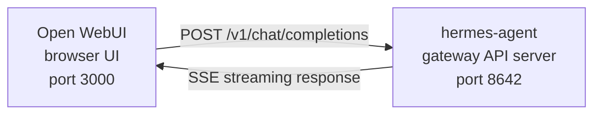

# Open WebUI 통합

[Open WebUI](https://github.com/open-webui/open-webui)(126k★)는 AI를 위한 가장 인기 있는 셀프 호스팅 채팅 인터페이스입니다. Hermes Agent에 내장된 API 서버를 사용하면 대화 관리, 사용자 계정, 현대적인 채팅 인터페이스를 갖춘 세련된 웹 프런트엔드로 Open WebUI를 사용할 수 있습니다.

## 아키텍처



Open WebUI는 OpenAI에 연결할 때와 동일한 방식으로 Hermes Agent의 API 서버에 연결합니다. Hermes는 전체 도구 세트(터미널, 파일 작업, 웹 검색, 메모리, 스킬)로 요청을 처리하고 최종 응답을 반환합니다.

:::important 런타임 위치
API 서버는 **순수 LLM 프록시가 아니라 Hermes 에이전트 런타임**입니다. 각 요청마다 Hermes는 API 서버 호스트에서 서버 측 `AIAgent`를 생성합니다. 도구 호출은 해당 API 서버가 실행 중인 곳에서 수행됩니다.

예를 들어 노트북에서 원격 머신의 Hermes API 서버를 Open WebUI 또는 다른 OpenAI 호환 클라이언트로 가리키는 경우, `pwd`, 파일 도구, 브라우저 도구, 로컬 MCP 도구 및 기타 작업공간 도구는 노트북이 아니라 원격 API 서버 호스트에서 실행됩니다.
:::

Open WebUI는 서버 간 방식으로 Hermes와 통신하므로 이 통합에는 `API_SERVER_CORS_ORIGINS`가 필요하지 않습니다.

## 빠른 설정

### 1. API 서버 활성화

```bash
hermes config set API_SERVER_ENABLED true
hermes config set API_SERVER_KEY your-secret-key
```

`hermes config set`은 플래그를 `config.yaml`로, 시크릿을 `~/.hermes/.env`로 자동 라우팅합니다. 게이트웨이가 이미 실행 중이라면 변경 사항을 적용하도록 재시작합니다.

```bash
hermes gateway stop && hermes gateway
```

### 2. Hermes Agent 게이트웨이 시작

```bash
hermes gateway
```

다음과 같은 내용이 표시되어야 합니다.

```
[API Server] API server listening on http://127.0.0.1:8642
```

### 3. API 서버 연결 가능 여부 확인

```bash
curl -s http://127.0.0.1:8642/health
# {"status": "ok", ...}

curl -s -H "Authorization: Bearer your-secret-key" http://127.0.0.1:8642/v1/models
# {"object":"list","data":[{"id":"hermes-agent", ...}]}
```

`/health`가 실패하면 게이트웨이가 `API_SERVER_ENABLED=true`를 반영하지 않은 것이므로 재시작합니다. `/v1/models`가 `401`을 반환하면 `Authorization` 헤더가 `API_SERVER_KEY`와 일치하지 않는 것입니다.

### 4. Open WebUI 시작

```bash
docker run -d -p 3000:8080 \
  -e OPENAI_API_BASE_URL=http://host.docker.internal:8642/v1 \
  -e OPENAI_API_KEY=your-secret-key \
  -e ENABLE_OLLAMA_API=false \
  --add-host=host.docker.internal:host-gateway \
  -v open-webui:/app/backend/data \
  --name open-webui \
  --restart always \
  ghcr.io/open-webui/open-webui:main
```

`ENABLE_OLLAMA_API=false`는 기본 Ollama 백엔드를 숨깁니다. 그렇지 않으면 빈 Ollama 백엔드가 모델 선택기에 표시되어 불필요하게 복잡해집니다. Ollama를 함께 실행하고 있다면 이 설정을 생략합니다.

첫 실행에는 15~30초가 걸립니다. Open WebUI는 처음 시작할 때 문장 변환기 임베딩 모델(약 150MB)을 다운로드합니다. UI를 열기 전에 `docker logs open-webui`의 출력이 안정될 때까지 기다립니다.

### 5. UI 열기

**http://localhost:3000** 주소로 이동합니다. 관리자 계정을 생성합니다(첫 번째 사용자가 관리자가 됩니다). 모델 드롭다운에 프로필 이름으로 된 에이전트가 표시되어야 하며, 기본 프로필인 경우 **hermes-agent**로 표시됩니다. 이제 채팅을 시작할 수 있습니다!

## Docker Compose 설정

더 지속적인 설정을 원한다면 `docker-compose.yml`을 생성합니다.

```yaml
services:
  open-webui:
    image: ghcr.io/open-webui/open-webui:main
    ports:
      - "3000:8080"
    volumes:
      - open-webui:/app/backend/data
    environment:
      - OPENAI_API_BASE_URL=http://host.docker.internal:8642/v1
      - OPENAI_API_KEY=your-secret-key
      - ENABLE_OLLAMA_API=false
    extra_hosts:
      - "host.docker.internal:host-gateway"
    restart: always

volumes:
  open-webui:
```

그런 다음 다음을 실행합니다.

```bash
docker compose up -d
```

## 관리자 UI를 통한 설정

환경 변수 대신 UI에서 연결을 설정하려면 다음을 수행합니다.

1. **http://localhost:3000** 주소에서 Open WebUI에 로그인합니다.
2. **프로필 아바타** → **Admin Settings**를 클릭합니다.
3. **Connections**로 이동합니다.
4. **OpenAI API**에서 **렌치 아이콘**(Manage)을 클릭합니다.
5. **+ Add New Connection**을 클릭합니다.
6. 다음을 입력합니다.
   - **URL**: `http://host.docker.internal:8642/v1`
   - **API Key**: Hermes의 `API_SERVER_KEY`와 정확히 같은 값
7. 연결을 확인하려면 **체크 표시**를 클릭합니다.
8. **Save**를 클릭합니다.

이제 모델 드롭다운에 에이전트 모델이 표시되어야 합니다(프로필 이름으로 표시되며, 기본 프로필인 경우 **hermes-agent**로 표시됩니다).

:::warning
환경 변수는 Open WebUI의 **첫 실행** 시에만 적용됩니다. 그 이후에는 연결 설정이 내부 데이터베이스에 저장됩니다. 나중에 변경하려면 관리자 UI를 사용하거나 Docker 볼륨을 삭제하고 새로 시작합니다.
:::

## API 유형: Chat Completions와 Responses

Open WebUI는 백엔드에 연결할 때 두 가지 API 모드를 지원합니다.

| 모드 | 형식 | 사용 시점 |
|------|--------|-------------|
| **Chat Completions** (기본값) | `/v1/chat/completions` | 권장합니다. 별도 설정 없이 바로 작동합니다. |
| **Responses** (실험적) | `/v1/responses` | `previous_response_id`를 통한 서버 측 대화 상태가 필요할 때 사용합니다. |

### Chat Completions 사용(권장)

이것이 기본값이며 추가 설정이 필요하지 않습니다. Open WebUI는 표준 OpenAI 형식의 요청을 보내고 Hermes Agent는 그에 맞게 응답합니다. 각 요청에는 전체 대화 기록이 포함됩니다.

### Responses API 사용

Responses API 모드를 사용하려면 다음을 수행합니다.

1. **Admin Settings** → **Connections** → **OpenAI** → **Manage**로 이동합니다.
2. hermes-agent 연결을 편집합니다.
3. **API Type**을 "Chat Completions"에서 **"Responses (Experimental)"**로 변경합니다.
4. 저장합니다.

Responses API를 사용하면 Open WebUI는 Responses 형식(`input` 배열 + `instructions`)으로 요청을 보내며, Hermes Agent는 `previous_response_id`를 통해 턴 간 전체 도구 호출 기록을 보존할 수 있습니다. `stream: true`인 경우 Hermes는 사양에 맞는 `function_call` 및 `function_call_output` 항목도 스트리밍하므로, Responses 이벤트를 렌더링하는 클라이언트에서 사용자 지정 구조화 도구 호출 UI를 구현할 수 있습니다.

:::note
현재 Open WebUI는 Responses 모드에서도 클라이언트 측에서 대화 기록을 관리합니다. 즉, `previous_response_id`를 사용하는 대신 각 요청에 전체 메시지 기록을 보냅니다. 현재 Responses 모드의 주요 장점은 구조화된 이벤트 스트림입니다. 텍스트 델타, `function_call`, `function_call_output` 항목이 Chat Completions 청크가 아니라 OpenAI Responses SSE 이벤트로 도착합니다.
:::

## 작동 방식

Open WebUI에서 메시지를 보내면 다음과 같이 처리됩니다.

1. Open WebUI가 메시지와 대화 기록을 담은 `POST /v1/chat/completions` 요청을 보냅니다.
2. Hermes Agent가 API 서버의 프로필, 모델/제공자 설정, 메모리, 스킬, 구성된 API 서버 도구 세트를 사용하여 서버 측 `AIAgent` 인스턴스를 생성합니다.
3. 에이전트가 요청을 처리합니다. 이 과정에서 API 서버 호스트에서 도구(터미널, 파일 작업, 웹 검색 등)를 호출할 수 있습니다.
4. 도구가 실행되는 동안 **인라인 진행 메시지가 UI로 스트리밍**되므로 에이전트가 무엇을 하는지 확인할 수 있습니다(예: `` `💻 ls -la` ``, `` `🔍 Python 3.12 release` ``).
5. 에이전트의 최종 텍스트 응답이 Open WebUI로 스트리밍됩니다.
6. Open WebUI가 채팅 인터페이스에 응답을 표시합니다.

에이전트는 해당 API 서버 Hermes 인스턴스와 동일한 도구 및 기능에 접근할 수 있습니다. API 서버가 원격이라면 도구도 원격에서 실행됩니다.

현재 **로컬** 작업공간에서 도구를 실행해야 한다면 Hermes를 로컬에서 실행하고 순수 LLM 제공자 또는 순수 OpenAI 호환 모델 프록시(예: vLLM, LiteLLM, Ollama, llama.cpp, OpenAI, OpenRouter 등)를 가리키도록 설정합니다. "원격 두뇌, 로컬 손"을 위한 향후 분리 런타임 모드는 [#18715](https://github.com/NousResearch/hermes-agent/issues/18715)에서 추적 중이며, 현재 API 서버의 동작은 아닙니다.

:::tip 도구 진행 상황
스트리밍이 활성화되어 있으면(기본값) 도구가 실행되는 동안 짧은 인라인 표시가 나타납니다. 도구 이모지와 주요 인수가 응답 스트림에 표시된 후 에이전트의 최종 답변이 나오므로, 내부에서 어떤 일이 일어나는지 확인할 수 있습니다.
:::

## 설정 레퍼런스

### Hermes Agent(API 서버)

| 변수 | 기본값 | 설명 |
|----------|---------|-------------|
| `API_SERVER_ENABLED` | `false` | API 서버 활성화 |
| `API_SERVER_PORT` | `8642` | HTTP 서버 포트 |
| `API_SERVER_HOST` | `127.0.0.1` | 바인드 주소 |
| `API_SERVER_KEY` | _(required)_ | 인증용 Bearer 토큰. `OPENAI_API_KEY`와 일치해야 합니다. |

### Open WebUI

| 변수 | 설명 |
|----------|-------------|
| `OPENAI_API_BASE_URL` | Hermes Agent의 API URL(`/v1` 포함) |
| `OPENAI_API_KEY` | 비어 있지 않아야 합니다. `API_SERVER_KEY`와 일치해야 합니다. |

## 문제 해결

### 드롭다운에 모델이 표시되지 않음

- **URL에 `/v1` 접미사가 있는지 확인합니다**: `http://host.docker.internal:8642/v1` (`:8642`만 입력하지 않음)
- **게이트웨이가 실행 중인지 확인합니다**: `curl http://localhost:8642/health`는 `{"status": "ok"}`를 반환해야 합니다.
- **모델 목록을 확인합니다**: `curl -H "Authorization: Bearer your-secret-key" http://localhost:8642/v1/models`는 `hermes-agent`가 포함된 목록을 반환해야 합니다.
- **Docker 네트워킹**: Docker 내부에서 `localhost`는 호스트가 아니라 컨테이너를 의미합니다. `host.docker.internal` 또는 `--network=host`를 사용합니다.
- **빈 Ollama 백엔드가 선택기를 가림**: `ENABLE_OLLAMA_API=false`를 생략했다면 Open WebUI가 Hermes 모델 위에 빈 Ollama 섹션을 표시합니다. `-e ENABLE_OLLAMA_API=false`로 컨테이너를 재시작하거나 **Admin Settings → Connections**에서 Ollama를 비활성화합니다.

### 연결 테스트는 통과하지만 모델이 로드되지 않음

이는 거의 항상 `/v1` 접미사가 누락된 경우입니다. Open WebUI의 연결 테스트는 기본적인 연결 가능 여부만 확인하며 모델 목록이 작동하는지는 검증하지 않습니다.

### 응답이 오래 걸림

Hermes Agent가 최종 응답을 생성하기 전에 여러 도구 호출(파일 읽기, 명령 실행, 웹 검색 등)을 수행하고 있을 수 있습니다. 복잡한 질의에서는 정상적인 동작입니다. 에이전트가 작업을 마치면 응답이 한 번에 표시됩니다.

### "Invalid API key" 오류

Open WebUI의 `OPENAI_API_KEY`가 Hermes Agent의 `API_SERVER_KEY`와 일치하는지 확인합니다.

:::warning
Open WebUI는 첫 실행 후 자체 데이터베이스에 OpenAI 호환 연결 설정을 저장합니다. 관리자 UI에서 잘못된 키를 실수로 저장했다면 환경 변수만 수정해서는 충분하지 않습니다. **Admin Settings → Connections**에서 저장된 연결을 수정하거나 삭제하거나, Open WebUI 데이터 디렉터리/데이터베이스를 초기화합니다.
:::

## 프로필을 사용하는 다중 사용자 설정

사용자별로 각자의 설정, 메모리, 스킬을 갖는 별도의 Hermes 인스턴스를 실행하려면 [프로필](/user-guide/profiles)을 사용합니다. 각 프로필은 서로 다른 포트에서 자체 API 서버를 실행하고 Open WebUI에서 프로필 이름을 모델로 자동 표시합니다.

### 1. 프로필 생성 및 API 서버 설정

`API_SERVER_*`는 YAML 설정 키가 아닌 env vars이므로 각 프로필의 `.env`에 작성합니다. 기본 플랫폼 범위를 벗어난 포트를 선택합니다(`8644`는 webhook 어댑터, `8645`는 wecom-callback, `8646`은 msgraph-webhook이므로), 예를 들어 `8650+`를 사용합니다.

```bash
hermes profile create alice
cat >> ~/.hermes/profiles/alice/.env <<EOF
API_SERVER_ENABLED=true
API_SERVER_PORT=8650
API_SERVER_KEY=alice-secret
EOF

hermes profile create bob
cat >> ~/.hermes/profiles/bob/.env <<EOF
API_SERVER_ENABLED=true
API_SERVER_PORT=8651
API_SERVER_KEY=bob-secret
EOF
```

### 2. 각 게이트웨이 시작

```bash
hermes -p alice gateway &
hermes -p bob gateway &
```

### 3. Open WebUI에 연결 추가

**Admin Settings** → **Connections** → **OpenAI API** → **Manage**에서 프로필마다 연결을 하나씩 추가합니다.

| 연결 | URL | API Key |
|-----------|-----|---------|
| Alice | `http://host.docker.internal:8650/v1` | `alice-secret` |
| Bob | `http://host.docker.internal:8651/v1` | `bob-secret` |

모델 드롭다운에 `alice`와 `bob`이 서로 다른 모델로 표시됩니다. 관리자 패널에서 Open WebUI 사용자에게 모델을 할당하여 사용자마다 격리된 Hermes 에이전트를 제공할 수 있습니다.

:::tip 사용자 지정 모델 이름
모델 이름은 기본적으로 프로필 이름입니다. 이를 변경하려면 프로필의 `.env`에 `API_SERVER_MODEL_NAME`을 설정합니다.
```bash
hermes -p alice config set API_SERVER_MODEL_NAME "Alice's Agent"
```
:::

## Linux Docker(Docker Desktop 없음)

Docker Desktop이 없는 Linux에서는 기본적으로 `host.docker.internal`이 확인되지 않습니다. 다음과 같은 방법을 사용할 수 있습니다.

```bash
# Option 1: Add host mapping
docker run --add-host=host.docker.internal:host-gateway ...

# Option 2: Use host networking
docker run --network=host -e OPENAI_API_BASE_URL=http://localhost:8642/v1 ...

# Option 3: Use Docker bridge IP
docker run -e OPENAI_API_BASE_URL=http://172.17.0.1:8642/v1 ...
```
