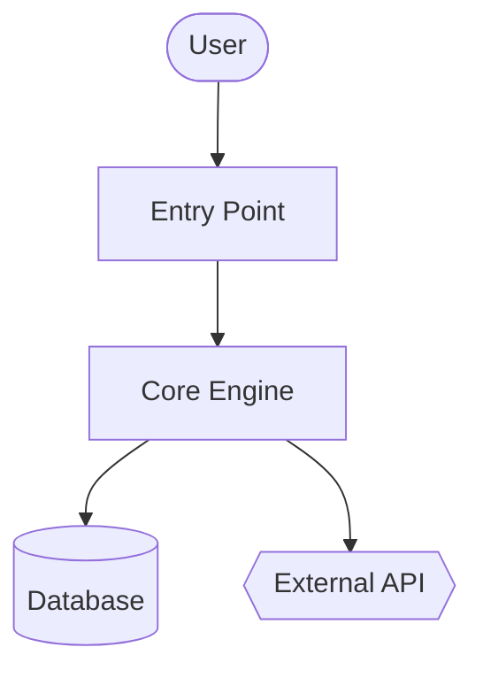
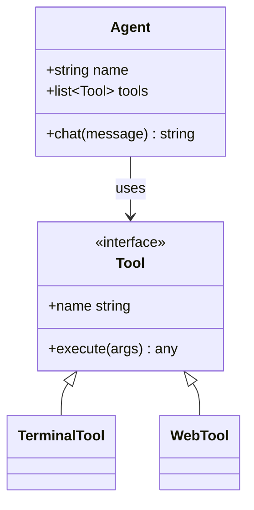
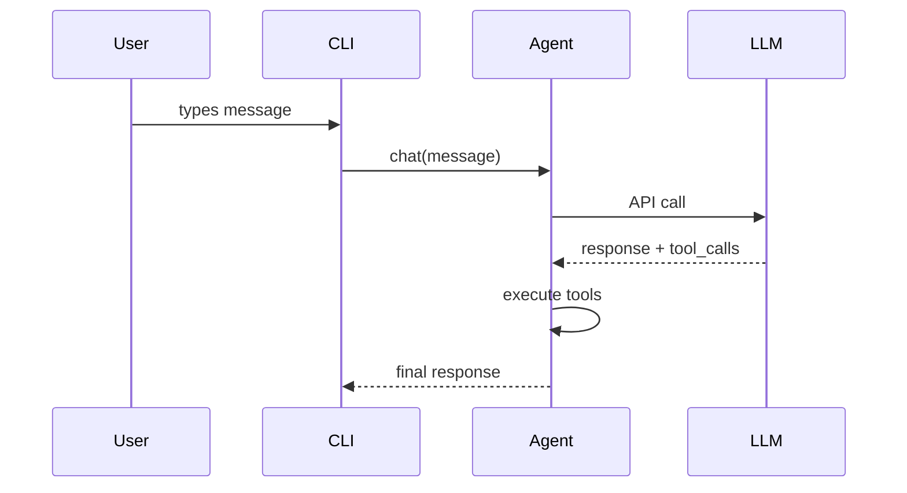

{/* This page is auto-generated from the skill's SKILL.md by website/scripts/generate-skill-docs.py. Edit the source SKILL.md, not this page. */}

# 코드 위키

모든 코드베이스를 위한 위키 문서 + Mermaid 다이어그램을 생성합니다.

## 스킬 메타데이터

| | |
|---|---|
| 출처 | 선택 사항 — `hermes skills install official/software-development/code-wiki`로 설치 |
| 경로 | `optional-skills/software-development/code-wiki` |
| 버전 | `0.1.0` |
| 작성자 | Teknium (teknium1), Hermes Agent |
| 라이선스 | MIT |
| 플랫폼 | linux, macos, windows |
| 태그 | `Documentation`, `Mermaid`, `Architecture`, `Diagrams`, `Wiki`, `Code-Analysis` |
| 관련 스킬 | [`codebase-inspection`](/docs/user-guide/skills/bundled/github/github-codebase-inspection), [`github-repo-management`](/docs/user-guide/skills/bundled/github/github-github-repo-management) |

## 참조: 전체 SKILL.md

:::info
다음은 이 스킬이 활성화될 때 Hermes가 로드하는 전체 스킬 정의입니다. 스킬이 활성화되면 에이전트가 보게 되는 지침입니다.
:::

# 코드 위키 스킬

모든 코드베이스를 위한 전체 위키를 생성합니다 — 개요, 아키텍처, 모듈별 심층 분석, Mermaid 클래스 및 시퀀스 다이어그램을 포함합니다. Google CodeWiki에서 영감을 받았지만 로컬 저장소, 비공개 저장소, 모든 언어에서 작동합니다. 기존 Hermes 도구(`terminal`, `read_file`, `search_files`, `write_file`)만 사용하며 Docker, 외부 서비스, 추가 종속성은 사용하지 않습니다.

이 스킬은 **참조 문서**(무엇/어떻게)를 생성합니다. 전략적 서술(왜 — 이는 다른 스킬의 영역입니다)은 생성하지 않습니다.

## 사용 시점

- 사용자가 "이 코드베이스를 문서화해 줘", "위키를 생성해 줘", "아키텍처 다이어그램을 만들어 줘"라고 말할 때
- 익숙하지 않은 저장소를 온보딩하면서 구조화된 참조 자료를 원할 때
- 사용자가 GitHub URL을 제시하고 문서화를 요청할 때
- GitHub에서 렌더링되는 안정적인 산출물(markdown + Mermaid)이 필요할 때

다음에는 사용하지 마세요:

- 단일 파일 또는 단일 함수 문서화 — 바로 답변하세요
- 특정 엔드포인트 하나의 API 참조 — `read_file`을 사용하고 인라인으로 답변하세요
- 전략적인 "왜 이것이 존재하는가" 서술 — 다른 스킬, 다른 목적입니다
- 사용자가 이 세션에서 활발히 개발 중인 코드베이스 — 질문이 생길 때 바로 답변하세요

## 사전 요구 사항

- 필요한 환경 변수 없음.
- 저장소 SHA 추적 및 원격 클론을 위해 PATH에 `git` 필요.
- 선택 사항: 언어 분석 통계를 위한 `pygount`(`codebase-inspection` 스킬 참조).

## 실행 방법

대상 저장소의 루트에서 `terminal` 도구를 통해 호출한 다음 `read_file` / `search_files` / `write_file`을 사용하여 위키를 생성합니다. 기본 출력 위치는 `~/.hermes/wikis/<repo-name>/`입니다. 사용자가 명시적으로 요청한 경우에만 저장소 안(`docs/wiki/`)에 작성하세요.

## 빠른 참조

| 단계 | 작업 |
|---|---|
| 1 | 대상 확인 — 로컬 cwd, 지정된 경로 또는 임시 디렉터리에 `git clone --depth 50 <url>` |
| 2 | 구조 스캔 — `ls`, `find -maxdepth 3`, 매니페스트 파일, README |
| 3 | 문서화할 모듈 8–10개 선택 |
| 4 | `README.md` 작성(개요 + 모듈 맵) |
| 5 | Mermaid 플로차트가 포함된 `architecture.md` 작성 |
| 6 | `modules/`에 모듈별 문서 작성 |
| 7 | `diagrams/class-diagram.md` 작성(Mermaid classDiagram) |
| 8 | `diagrams/sequences.md` 작성(Mermaid sequenceDiagram, 워크플로 2–4개) |
| 9 | `getting-started.md` 작성 |
| 10 | 해당하는 경우 `api.md` 작성, 아니면 건너뜀 |
| 11 | `.codewiki-state.json` 작성 |
| 12 | 사용자에게 경로 보고 |

## 절차

### 1. 대상 확인

GitHub URL의 경우:

```bash
WIKI_TMP=$(mktemp -d)
git clone --depth 50 <url> "$WIKI_TMP/repo"
cd "$WIKI_TMP/repo"
REPO_SHA=$(git rev-parse HEAD)
REPO_NAME=$(basename <url> .git)
```

로컬 경로(또는 지정되지 않은 경우 cwd)의 경우:

```bash
cd <path>
REPO_SHA=$(git rev-parse HEAD 2>/dev/null || echo "uncommitted")
REPO_NAME=$(basename "$PWD")
```

그런 다음 출력 디렉터리를 설정합니다:

```bash
OUTPUT_DIR="$HOME/.hermes/wikis/$REPO_NAME"
mkdir -p "$OUTPUT_DIR/modules" "$OUTPUT_DIR/diagrams"
```

### 2. 저장소 구조 스캔

셸 작업에는 `terminal` 도구를, 매니페스트에는 `read_file`을 사용합니다:

```bash
# Shallow tree first
ls -la

# Deeper tree, noise filtered
find . -type d \
  -not -path '*/\.*' \
  -not -path '*/node_modules*' \
  -not -path '*/venv*' \
  -not -path '*/__pycache__*' \
  -not -path '*/dist*' \
  -not -path '*/build*' \
  -not -path '*/target*' \
  -maxdepth 3 | sort

# Language breakdown (skip if pygount unavailable)
pygount --format=summary \
  --folders-to-skip=".git,node_modules,venv,.venv,__pycache__,.cache,dist,build,target" \
  . 2>/dev/null || true
```

그런 다음 `search_files target='files'`를 사용하여 추측하지 말고 관련 매니페스트(`package.json`, `pyproject.toml`, `setup.py`, `Cargo.toml`, `go.mod`, `pom.xml`, `build.gradle`)와 프로젝트 README를 찾은 뒤 `read_file`로 읽습니다.

### 3. 문서화할 모듈 선택

첫 번째 단계에서는 8–10개 모듈로 제한합니다. 언어별 휴리스틱:

- Python: 최상위 패키지(`__init__.py`가 있는 디렉터리)와 하위 시스템 디렉터리
- JS/TS: `src/<subdir>`, 최상위 워크스페이스 디렉터리
- Rust: 워크스페이스의 각 크레이트 또는 최상위 `src/<module>` 디렉터리
- Go: 각 최상위 패키지 디렉터리
- 혼합/익숙하지 않은 경우: 소스 코드가 포함된 최상위 디렉터리(설정 및 테스트 제외)

매우 큰 저장소에서는 다음 우선순위를 적용합니다:
1. import된 횟수(많은 모듈에서 import되는 모듈이 핵심)
2. LOC(큰 모듈일수록 별도 문서가 필요할 가능성이 큼)
3. README / 최상위 문서의 언급

큰 저장소에서 모듈별 문서를 생성하기 전에 모듈 목록을 사용자에게 제시하세요 — 사용자가 방향을 조정할 기회를 줍니다.

### 4. `README.md` 작성

실제 프로젝트 README와 진입점 파일 상위 2–3개를 `read_file`로 읽은 다음 작성합니다:

````markdown
# <Project Name>

<One paragraph: what it is and what it's for. Self-contained — don't assume the
reader has the source README.>

## Key Concepts

- **<Concept 1>** — <one line>
- **<Concept 2>** — <one line>

## Entry Points

- [`path/to/main.py`](https://github.com/NousResearch/hermes-agent/blob/main/optional-skills/software-development/code-wiki/<link>) — <what runs when you start it>
- [`path/to/cli.py`](https://github.com/NousResearch/hermes-agent/blob/main/optional-skills/software-development/code-wiki/<link>) — <CLI surface>

## High-Level Architecture

<2-3 sentences. Detail goes in architecture.md.>

See [architecture.md](https://github.com/NousResearch/hermes-agent/blob/main/optional-skills/software-development/code-wiki/architecture.md).

## Module Map

| Module | Purpose |
|---|---|
| [`<module>`](https://github.com/NousResearch/hermes-agent/blob/main/optional-skills/software-development/code-wiki/modules/<module>.md) | <one-line purpose> |

## Getting Started

See [getting-started.md](https://github.com/NousResearch/hermes-agent/blob/main/optional-skills/software-development/code-wiki/getting-started.md).
````

로컬 모드의 링크 대상에는 상대 경로를 사용합니다. 클론한 저장소에는 링크가 향후 커밋에서도 유지되도록 `https://github.com/<owner>/<repo>/blob/<sha>/<path>`를 사용합니다.

### 5. `architecture.md` 작성

````markdown
# Architecture

<2-3 paragraphs: shape of the system. What talks to what. Where data enters,
where it exits, where state lives.>

## Components

- **<Component>** — <1-2 sentences>. See [`modules/<module>.md`](https://github.com/NousResearch/hermes-agent/blob/main/optional-skills/software-development/code-wiki/modules/<module>.md).

## System Diagram



## Data Flow

1. **<Step>** — [`<file>`](https://github.com/NousResearch/hermes-agent/blob/main/optional-skills/software-development/code-wiki/<link>)
2. **<Step>** — [`<file>`](https://github.com/NousResearch/hermes-agent/blob/main/optional-skills/software-development/code-wiki/<link>)

## Key Design Decisions

- <Anything load-bearing the reader should know>
````

**Mermaid 도형 의미:**
- `[]` = 컴포넌트
- `[()]` = 데이터베이스 / 저장소
- `{{}}` = 외부 서비스
- `(())` = 진입점 또는 종단점
- `-->` = 동기 호출, `-.->` = 비동기/이벤트

다이어그램 하나당 약 20개 노드로 제한합니다. 더 크면 하위 다이어그램으로 나눕니다.

### 6. `modules/`에 모듈별 문서 작성

선택한 각 모듈에 대해 `ls`로 레이아웃을 확인하고, 가장 중요한 파일 3–5개를 식별한 다음(크기, `core.py` / `main.py` / `__init__.py`라는 이름인지, import 횟수 기준) 해당 파일을 `read_file`로 읽습니다(필요한 부분만 읽으려면 `offset` / `limit`을 사용하고, 특정 심볼에는 `search_files`를 우선 사용하세요).

````markdown
# Module: `<module>`

<1-2 sentence purpose.>

## Responsibilities

- <bullet>
- <bullet>

## Key Files

- [`<module>/<file>`](https://github.com/NousResearch/hermes-agent/blob/main/optional-skills/software-development/code-wiki/<link>) — <what it does>

## Public API

<Functions/classes/constants other code uses. Group related items. Show
signatures, not full implementations.>

## Internal Structure

<How the module is organized internally. State management.>

## Dependencies

- **Used by:** <other modules>
- **Uses:** <other modules + external libs>

## Notable Patterns / Gotchas

- <Anything non-obvious>
````

### 7. `diagrams/class-diagram.md` 작성

가장 중요한 클래스/타입 5–10개를 선택합니다. 해당 항목을 `read_file`로 읽은 다음 작성합니다:

````markdown
# Class Diagram

## Core Types



## Notes

<Anything the diagram can't express — lifecycle, threading, etc.>
````

클래스가 없는 언어(Go, C, Rust)의 경우 구조체 관계에 다이어그램을 사용하거나 `class-diagram.md`를 건너뛰고 `architecture.md`의 서술에서 설명합니다. 억지로 맞추지 마세요.

### 8. `diagrams/sequences.md` 작성

가장 중요한 워크플로 2–4개를 선택합니다. 코드에서 각 호출 경로를 추적한 다음 다음을 작성합니다:

````markdown
# Sequence Diagrams

## Workflow: <Name>

<1 sentence describing what this does and when it runs.>



### Walkthrough

1. **User input** — [`cli.py:HermesCLI.run_session`](https://github.com/NousResearch/hermes-agent/blob/main/optional-skills/software-development/code-wiki/<link>)
2. **Message dispatch** — [`run_agent.py:AIAgent.chat`](https://github.com/NousResearch/hermes-agent/blob/main/optional-skills/software-development/code-wiki/<link>)
````

참가자를 지어내지 마세요. 모든 상자는 독자가 코드에서 찾을 수 있는 실제 컴포넌트에 대응해야 합니다.

### 9. `getting-started.md` 작성

````markdown
# Getting Started

## Prerequisites

<From manifest files + README. Be specific — versions if pinned.>

## Installation

```bash
<exact commands>
```

## First Run

```bash
<minimum command to see the system do something useful>
```

## Common Workflows

### <Workflow 1>
<commands>

## Configuration

- `<config-file>` — <what it controls>
- Env var `<VAR>` — <what it controls>

## Where to Go Next

- Architecture: [architecture.md](https://github.com/NousResearch/hermes-agent/blob/main/optional-skills/software-development/code-wiki/architecture.md)
- Module reference: [README.md#module-map](https://github.com/NousResearch/hermes-agent/blob/main/optional-skills/software-development/code-wiki/README.md#module-map)
````

### 10. `api.md` 작성(해당하지 않으면 건너뜀)

프로젝트가 라이브러리 또는 API 서버인 경우에만 작성합니다. 해당한다면:

- 공개 API 표면(`__init__.py` export, OpenAPI 사양, 라우트 핸들러, export된 타입)을 찾습니다.
- 각 공개 진입점을 시그니처, 매개변수, 반환 타입, 한 줄 설명과 함께 문서화합니다.
- 범주별로 그룹화합니다.

### 11. 상태 파일 작성

```bash
cat > "$OUTPUT_DIR/.codewiki-state.json" <<EOF
{
  "repo_name": "$REPO_NAME",
  "source_path": "$PWD",
  "source_sha": "$REPO_SHA",
  "generated_at": "$(date -u +%Y-%m-%dT%H:%M:%SZ)",
  "generator": "hermes-agent code-wiki skill v0.1.0",
  "modules_documented": []
}
EOF
```

### 12. 사용자에게 보고

정확히 무엇이 생성되었고 어디에 있는지 명시합니다:

```
Generated wiki at ~/.hermes/wikis/<repo-name>/:
  README.md                   project overview, module map
  architecture.md             system architecture + flowchart
  getting-started.md          setup, first run, workflows
  modules/<N files>           per-module deep-dives
  diagrams/architecture.md    Mermaid flowchart
  diagrams/class-diagram.md   Mermaid class diagram
  diagrams/sequences.md       Mermaid sequence diagrams
```

임시 디렉터리에 클론했다면 검토 후 제거할 수 있다는 점(`rm -rf "$WIKI_TMP"`)을 상기시킵니다.

## 범위 제어

500K-LOC 모노레포 전체 위키를 생성하는 것은 토큰 비용이 매우 큽니다. 기본 범위는 제한합니다:

- 초기 스캔: 디렉터리 최대 깊이 3
- 모듈별 문서: 사용자가 범위를 확장하지 않는 한 최대 10개 모듈
- 파일별 읽기: 심볼에는 `search_files`를, 전체 읽기 대신 `offset` / `limit`과 함께 `read_file`을 우선 사용
- 벤더 코드(`vendor/`, `third_party/`), 생성 코드, `_pb2.py`, `.min.js`는 건너뜀

사용자가 "전부 철저하게 해 줘"라고 말하면 그대로 따르되, 먼저 비용을 대략 알립니다: "이 저장소에는 소스 파일이 약 340개 있으며, 전체 범위를 다루면 비용이 많이 듭니다 — 확인해 주세요?"

## 재실행 / 업데이트

대상 경로에 `.codewiki-state.json`이 이미 있는 경우:

- 이전 SHA와 모듈 목록을 읽습니다.
- 소스 SHA가 같으면 재생성할지 건너뛸지 사용자에게 묻습니다.
- SHA가 다르면 변경된 파일만 재생성할 것을 제안합니다(`git diff --name-only <old-sha> HEAD`).

전체 증분 재생성은 향후 개선 사항입니다 — 현재는 전체를 다시 생성해도 됩니다.

## 함정

- **컴포넌트 날조.** 모든 다이어그램 노드와 주장한 함수 호출은 소스에 있어야 합니다. 작성 전에 `read_file`로 읽으세요. 자동 생성 문서의 가장 큰 실패 원인은 그럴듯하지만 날조된 내용입니다.
- **일반적인 AI 문장.** "이 모듈은 ...을 담당합니다"는 내용이 없습니다. 모듈이 실제로 하는 일을 도메인에 맞게 설명하세요.
- **코드를 산문으로 다시 서술.** `process` 함수가 각 항목에 대해 `process_item`을 호출하여 처리한다고 말하는 모듈 문서는 링크만 하는 것보다 못합니다.
- **Mermaid 50개 초과 노드.** 읽기 어렵게 렌더링됩니다. 나누세요.
- **테스트, 생성 코드 또는 벤더 종속성을 제품 코드처럼 문서화.** 건너뜁니다.
- **요청 없이 저장소 내부에 출력.** 기본값은 `~/.hermes/wikis/`입니다. 사용자가 명시적으로 요청한 경우에만 저장소에 작성합니다.
- **Mermaid 특수 문자는 따옴표가 필요:** `A["Tool / Agent"]`처럼 작성하고 `A[Tool / Agent]`처럼 작성하지 마세요. 노드 안의 줄 바꿈에는 `<br>`을 사용합니다.
- **중첩된 SKILL.md 코드 펜스.** Mermaid 블록을 포함하는 Markdown 예제를 작성할 때는 3백틱으로 된 내부 ` ```mermaid `가 외부 펜스를 닫지 않도록 4백틱 외부 펜스를 사용합니다. (이 SKILL.md가 그렇게 작성되어 있습니다.)
- **classDiagram 제네릭**은 `<T>`가 아니라 `~T~`(예: `List~Tool~`)로 렌더링됩니다.
- **GitHub Mermaid 테마는 고정됨** — `%%{init: ...}%%` 블록을 포함하지 마세요. 렌더링 시 제거됩니다.

## 검증

작성 후 다음을 검증합니다:

1. Mermaid 블록 균형 — 파일별 열기/닫기 수:
   ```bash
   for f in "$OUTPUT_DIR"/diagrams/*.md "$OUTPUT_DIR"/architecture.md; do
     opens=$(grep -c '^```mermaid' "$f")
     total=$(grep -c '^```' "$f")
     echo "$f: $opens mermaid blocks, $total total fences (expect total = opens*2)"
   done
   ```
2. 예상 파일이 모두 존재하는지:
   ```bash
   ls "$OUTPUT_DIR"/{README.md,architecture.md,getting-started.md,.codewiki-state.json} \
      "$OUTPUT_DIR"/modules/ "$OUTPUT_DIR"/diagrams/
   ```
3. 모듈 수가 의도한 수와 일치하는지 — `ls "$OUTPUT_DIR/modules" | wc -l`이 커밋한 모듈 수와 같아야 합니다.
4. 날조된 경로가 없는지 — 소스 링크 2–3개가 실제 파일로 연결되는지 확인합니다.
