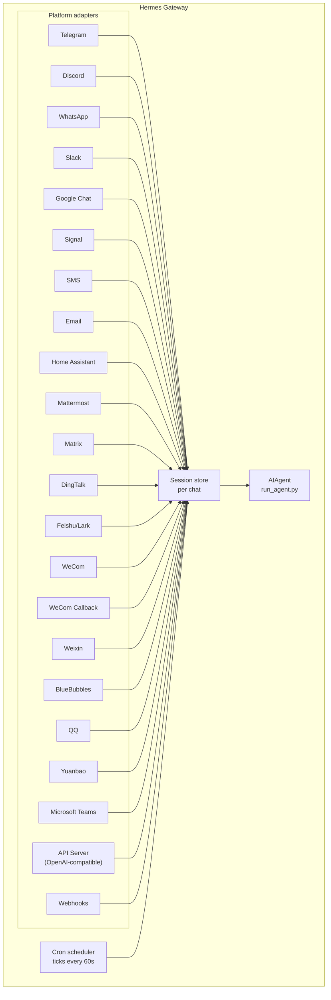

# Gateway de Mensageria {#messaging-gateway}

Converse com o Hermes pelo Telegram, Discord, Slack, WhatsApp, Signal, SMS, Email, Home Assistant, Mattermost, Matrix, DingTalk, Feishu/Lark, WeCom, Weixin, BlueBubbles (iMessage), QQ, Yuanbao, Microsoft Teams, LINE, ntfy ou seu browser. O gateway é um único processo em background que se conecta a todas as plataformas configuradas, gerencia sessões, executa cron jobs e entrega mensagens de voz.

Para o conjunto completo de recursos de voz — incluindo modo microfone no CLI, respostas faladas em mensagens e conversas em canal de voz no Discord — veja [Modo de voz](/user-guide/features/voice-mode) e [Usar modo de voz com o Hermes](/guides/use-voice-mode-with-hermes).

:::tip
Bots precisam de um provedor de modelo e de provedores de ferramentas (TTS, web). Uma assinatura do [Nous Portal](/integrations/nous-portal) agrupa todos eles.
:::

## Comparação de plataformas {#platform-comparison}

| Platform | Voice | Images | Files | Threads | Reactions | Typing | Streaming |
|----------|:-----:|:------:|:-----:|:-------:|:---------:|:------:|:---------:|
| Telegram | ✅ | ✅ | ✅ | ✅ | — | ✅ | ✅ |
| Discord | ✅ | ✅ | ✅ | ✅ | ✅ | ✅ | ✅ |
| Slack | ✅ | ✅ | ✅ | ✅ | ✅ | ✅ | ✅ |
| Google Chat | — | ✅ | ✅ | ✅ | — | ✅ | — |
| WhatsApp | — | ✅ | ✅ | — | — | ✅ | ✅ |
| WhatsApp Cloud API | ✅ | ✅ | ✅ | — | — | ✅ | — |
| Signal | — | ✅ | ✅ | — | — | ✅ | — |
| SMS | — | — | — | — | — | — | — |
| Email | — | ✅ | ✅ | ✅ | — | — | — |
| Home Assistant | — | — | — | — | — | — | — |
| Mattermost | ✅ | ✅ | ✅ | ✅ | — | ✅ | ✅ |
| Matrix | ✅ | ✅ | ✅ | ✅ | ✅ | ✅ | ✅ |
| DingTalk | — | ✅ | ✅ | — | ✅ | — | ✅ |
| Feishu/Lark | ✅ | ✅ | ✅ | ✅ | ✅ | ✅ | ✅ |
| WeCom | ✅ | ✅ | ✅ | — | — | — | — |
| WeCom Callback | — | — | — | — | — | — | — |
| Weixin | ✅ | ✅ | ✅ | — | — | ✅ | — |
| BlueBubbles | — | ✅ | ✅ | — | ✅ | ✅ | — |
| Photon (iMessage) | ✅ | ✅ | ✅ | — | ✅ | ✅ | — |
| QQ | ✅ | ✅ | ✅ | — | — | ✅ | — |
| Yuanbao | ✅ | ✅ | ✅ | — | — | ✅ | ✅ |
| Microsoft Teams | — | ✅ | — | ✅ | — | ✅ | — |
| LINE | — | ✅ | ✅ | — | — | ✅ | — |
| ntfy | — | — | — | — | — | — | — |
| Raft | — | — | — | — | — | — | — |
| IRC | — | — | — | — | — | — | — |
| Buzz | — | ✅ | — | ✅ | — | — | — |
| SimpleX | ✅ | ✅ | ✅ | — | — | ✅ | — |

**Voice** = respostas de áudio TTS e/ou transcrição de mensagens de voz. **Images** = enviar/receber imagens. **Files** = enviar/receber anexos de arquivo. **Threads** = conversas em thread. **Reactions** = reações emoji em mensagens. **Typing** = indicador de digitação durante processamento. **Streaming** = atualizações progressivas de mensagem via edição.

:::note Hermes Relay
[Hermes Relay](/user-guide/messaging/relay) (experimental) não é uma plataforma de chat em si — é um sistema conector que expõe plataformas como Discord, Telegram, Slack e WhatsApp por meio de um conector externo que detém as credenciais da plataforma. Capacidades (mídia, prompts nativos de aprovação/clarify, reações, threads, digitação, streaming) são negociadas por conector no handshake, em vez de fixas na tabela acima.
:::

## Arquitetura {#architecture}



Cada adaptador de plataforma recebe mensagens, as roteia pelo session store por chat e as despacha ao AIAgent para processamento. O gateway também executa o agendador cron, com tick a cada 60 segundos para jobs devidos.

## Tokens de silêncio intencional {#intentional-silence-tokens}

Para chats em grupo, hooks e fluxos de automação, o Hermes suporta tokens de silêncio explícitos. Se a resposta final do agente for exatamente um token suportado, o gateway suprime a entrega outbound e não envia nada ao chat.

Tokens suportados:

- `[SILENT]`
- `SILENT`
- `NO_REPLY`
- `NO REPLY`

Espaços em branco e maiúsculas/minúsculas são normalizados, mas a resposta final inteira deve ser o token. Uma frase como "Use `[SILENT]` quando nada mudou" é entregue normalmente.

Silêncio é apenas uma decisão de entrega. O Hermes mantém o turno de silêncio do assistente na transcrição da sessão, então a conversa continua alternando normalmente:

```text
user: side-channel chatter
assistant: [SILENT]   # stored, not delivered
user: next message
```

Turnos com falha ainda aparecem como erros; o Hermes não oculta falhas só porque o texto se parece com um token de silêncio.

## Setup rápido {#quick-setup}

A forma mais fácil de configurar plataformas de mensagens é o assistente interativo:

```bash
hermes gateway setup        # Interactive setup for all messaging platforms
```

Ele guia a configuração de cada plataforma com seleção por setas, mostra quais já estão configuradas e oferece iniciar/reiniciar o gateway ao terminar.

## Comandos do gateway {#gateway-commands}

```bash
hermes gateway              # Run in foreground
hermes gateway setup        # Configure messaging platforms interactively
hermes gateway install      # Install as a user service (Linux) / launchd service (macOS)
sudo hermes gateway install --system   # Linux only: install a boot-time system service
hermes gateway start        # Start the default service
hermes gateway stop         # Stop the default service
hermes gateway status       # Check default service status
hermes gateway status --system         # Linux only: inspect the system service explicitly
```

### Watchdog opcional do event loop no Linux {#optional-linux-event-loop-watchdog}

Um gateway gerenciado pelo systemd pode optar por recuperação de processo quando o event loop asyncio do Python para de receber tempo de agendamento. Isso cobre travamentos de processo inteiro que também impedem tarefas de liveness específicas da plataforma de rodar:

```yaml title="~/.hermes/config.yaml"
gateway:
  systemd_watchdog_seconds: 120
```

Regenere a unit de serviço após alterar esta configuração:

```bash
hermes gateway install --force
```

Um valor positivo faz a unit gerada usar `Type=notify`,
`NotifyAccess=main` e o `WatchdogSec` correspondente. O Hermes envia heartbeats
somente enquanto seu event loop progride a tempo; o systemd reinicia o
processo quando param. O padrão `0` mantém o comportamento existente `Type=simple`.
Esta configuração é apenas Linux/systemd e não trata uma desconexão de rede
ordinária da plataforma como falha de event loop.

## Comandos de chat (dentro de mensagens) {#chat-commands-inside-messaging}

| Comando | Descrição |
|---------|-------------|
| `/new` or `/reset` | Start a fresh conversation |
| `/model [provider:model]` | Show or change the model (supports `provider:model` syntax) |
| `/personality [name]` | Set a personality (`none` to reset) |
| `/retry` | Retry the last message |
| `/undo` | Remove the last exchange |
| `/status` | Show session info |
| `/whoami` | Show your slash command access on this scope (admin / user / unrestricted) |
| `/stop` | Stop the running agent |
| `/approve` | Approve a pending dangerous command |
| `/deny` | Reject a pending dangerous command |
| `/sethome` | Set this chat as the home channel |
| `/compress` | Manually compress conversation context |
| `/title [name]` | Set or show the session title |
| `/resume [name]` | Resume a previously named session |
| `/sessions [all] [search <query>]` | List previous sessions; `search <query>` filters by title or id |
| `/usage` | Show token usage for this session (`/usage reset [--force]` redeems a banked Codex limit reset) |
| `/insights [days]` | Show usage insights and analytics |
| `/reasoning [level\|show\|hide]` | Change reasoning effort or toggle reasoning display |
| `/voice [on\|off\|tts\|join\|leave\|status]` | Control messaging voice replies and Discord voice-channel behavior |
| `/rollback [number]` | List or restore filesystem checkpoints |
| `/bg <prompt>` | Rodar um prompt em sessão background separada |
| `/btw <question>` | Fazer pergunta lateral sobre a conversa atual sem interrompê-la |
| `/reload-mcp` | Reload MCP servers from config |
| `/update` | Update Hermes Agent to the latest version |
| `/help` | Show available commands |
| `/<skill-name>` | Invoke any installed skill |

## Gerenciamento de sessões {#session-management}

### Persistência de sessão {#session-persistence}

Sessões persistem entre mensagens até resetarem. O agente lembra o contexto da conversa.

### Encontrar sessões anteriores (`/sessions`) {#finding-past-sessions-sessions}

`/sessions` lista suas sessões anteriores do chat atual — incluindo a que você está agora, marcada `(current)` — e `/sessions <name>` retoma uma (atalho para `/resume`). Quando a lista cresce, `/sessions search <query>` (alias `find`) filtra por match de título ou session-id, ordenado pela mais recentemente ativa. Listagem cross-origin com `/sessions all` é só admin — usuários regulares recebem um aviso explicando que a lista ficou com escopo do chat, e só veem sessões da própria origem de chat.

### Overrides persistentes de `/model` {#persistent-model-overrides}

Uma troca de `/model` em um chat de gateway aplica-se à sessão e agora **sobrevive a reinícios do gateway**: a escolha de model/provider é persistida no session store e reidratada no primeiro uso após reinício (credenciais são re-resolvidas no carregamento e nunca gravadas em disco). `/new` (ou `/reset`) limpa o override, e `/model <name> --global` grava em `config.yaml`. `/model <name> --once` aplica por um único turno.

### Confiabilidade de entrega {#delivery-reliability}

Respostas finais do agente são registradas em um **delivery ledger**
durável (`state.db`) em torno de cada envio à plataforma. Se o gateway travar ou reiniciar
entre produzir uma resposta e a plataforma confirmar recebimento, o próximo
boot reentrega a resposta armazenada em vez de perdê-la — ou reexecutar o
turno inteiro.

A semântica é honestamente at-least-once:

- Uma resposta cujo envio **nunca começou** é reentregue como está.
- Uma resposta **no meio do envio** quando o gateway morreu (a plataforma pode ou
  não ter recebido) é reentregue com prefixo visível
  "♻️ Recovered reply — … may be a duplicate". Ambiguidade é rotulada,
  nunca reenviada silenciosamente.
- Reentrega é limitada: 3 tentativas, frescor de 24 horas, depois a linha é
  abandonada. Linhas entregues são podadas após 7 dias.

Desabilite com `gateway.delivery_ledger: false` em `config.yaml` (restaura o
comportamento antigo: respostas em voo se perdem no crash).

### Políticas de reset {#reset-policies}

**Por padrão sessões nunca resetam automaticamente** — o contexto vive até você `/reset`
manualmente ou a compressão de contexto entrar em ação. Se quiser resets automáticos, opte com a seção `session_reset` em `~/.hermes/config.yaml`:

```yaml
session_reset:
  mode: idle        # "idle", "daily", "both", or "none" (default)
  idle_minutes: 1440  # for idle/both: minutes of inactivity before reset
  at_hour: 4          # for daily/both: hour of day (0-23, local time)
```

| Modo | Descrição |
|------|-------------|
| `none` | Never auto-reset (default) |
| `daily` | Reset at a specific hour each day |
| `idle` | Reset after N minutes of inactivity |
| `both` | Whichever triggers first |

Um processo em background ativo (iniciado com `terminal(background=true)`) normalmente
protege sua sessão de reset para não perder saída. Para impedir que um processo
esquecido — digamos um servidor de preview — prenda uma sessão aberta para sempre, um
processo em background mais antigo que `bg_process_max_age_hours` (padrão **24**) não
bloqueia mais reset. O processo **não** é morto, só ignorado pelo guardião de reset.
Defina `0` para desabilitar o cutoff (qualquer processo vivo bloqueia reset, o
comportamento antigo), ou aumente se roda jobs legítimos de vários dias cuja liveness
deve manter a conversa aberta.

Configure overrides por plataforma em `~/.hermes/gateway.json`:

```json
{
  "reset_by_platform": {
    "telegram": { "mode": "idle", "idle_minutes": 240 },
    "discord": { "mode": "idle", "idle_minutes": 60 }
  }
}
```

## Overrides de model e system prompt por canal {#per-channel-model--system-prompt-overrides}

Canais diferentes podem rodar modelos e personas distintos de um **único gateway** — ex.: um model barato e rápido em `#daily` e um model frontier com prompt especialista em `#dev`. Configure `channel_overrides` sob a plataforma em `~/.hermes/gateway-config.yaml`:

```yaml
platforms:
  discord:
    enabled: true
    channel_overrides:
      "123456789012345678":        # channel/thread id
        model: anthropic/claude-sonnet-4.6
        provider: anthropic
        system_prompt: "You are the #dev channel code-review specialist."
      "987654321098765432":
        model: openai/gpt-5-mini
```

Detalhes:

- As três chaves são opcionais — defina só `model`, só `system_prompt`, ou qualquer combinação. Campos não definidos caem nos padrões globais.
- A ordem de lookup é id exato de canal/thread primeiro, depois o id do canal/forum **pai** — threads Discord herdam o override do canal pai automaticamente.
- Prioridade de resolução do model: override de `/model` da sessão → `channel_overrides` → config global. Um usuário rodando `/model` no chat ainda vence o padrão do canal.
- O override de `system_prompt` substitui o prompt global do gateway para aquele canal (é efêmero — injetado por turno, não armazenado no histórico).

## Segurança {#security}

**Por padrão, o gateway nega todos os usuários que não estão em uma allowlist ou pareados via DM.** Este é o padrão seguro para um bot com acesso a terminal.

```bash
# Restrict to specific users (recommended):
TELEGRAM_ALLOWED_USERS=123456789,987654321
DISCORD_ALLOWED_USERS=123456789012345678
SIGNAL_ALLOWED_USERS=+155****4567,+155****6543
SMS_ALLOWED_USERS=+155****4567,+155****6543
EMAIL_ALLOWED_USERS=trusted@example.com,colleague@work.com
MATTERMOST_ALLOWED_USERS=3uo8dkh1p7g1mfk49ear5fzs5c
MATRIX_ALLOWED_USERS=@alice:matrix.org
DINGTALK_ALLOWED_USERS=user-id-1
FEISHU_ALLOWED_USERS=ou_xxxxxxxx,ou_yyyyyyyy
WECOM_ALLOWED_USERS=user-id-1,user-id-2
WECOM_CALLBACK_ALLOWED_USERS=user-id-1,user-id-2
TEAMS_ALLOWED_USERS=aad-object-id-1,aad-object-id-2

# Or allow
GATEWAY_ALLOWED_USERS=123456789,987654321

# Or explicitly allow all users (NOT recommended for bots with terminal access):
GATEWAY_ALLOW_ALL_USERS=true
```

### Pareamento por DM (alternativa a allowlists) {#dm-pairing-alternative-to-allowlists}

Em vez de configurar IDs de usuário manualmente, usuários desconhecidos recebem um código de pareamento de uso único ao enviar DM ao bot. Email é exceção: remetentes desconhecidos são ignorados a menos que pareamento por email esteja explicitamente habilitado.

```bash
# The user sees: "Pairing code: XKGH5N7P"
# You approve them with:
hermes pairing approve telegram XKGH5N7P

# Other pairing commands:
hermes pairing list          # View pending + approved users
hermes pairing revoke telegram 123456789  # Remove access
```

Códigos de pareamento expiram após 1 hora, são rate-limited e usam aleatoriedade criptográfica.

### Admins vs usuários regulares {#admins-vs-regular-users}

Allowlists respondem "esta pessoa pode alcançar o bot?". A **divisão admin / user** responde "agora que entrou, o que pode fazer?".

Cada usuário permitido cai em um de dois níveis por escopo (DM vs grupo/canal):

- **Admin** — acesso total. Pode rodar todo comando slash registrado (built-in + plugin) e usar toda capacidade gated.
- **Usuário regular** — acesso restrito. Pode conversar com o agente normalmente, mas só pode rodar os comandos slash que você habilitar explicitamente. O piso sempre permitido é `/help` e `/whoami`.

Os níveis são configurados por plataforma e por escopo. Admin em DM não implica admin em grupo/canal — cada escopo tem sua própria lista de admin.

**O que os níveis gateiam hoje:** comandos slash. A divisão passa pelo registry de comandos ao vivo, cobrindo built-ins e comandos registrados por plugin sem wiring por feature. Chat simples não é afetado — não-admins ainda podem falar com o agente.

**O que pode ser gated no futuro:** mais superfícies de capacidade (acesso a ferramentas, troca de model, operações caras) vão se apoiar na mesma distinção admin / user conforme forem adicionadas. Configurar a divisão agora significa que restrições futuras caem limpas sem re-modelar quem é admin.

#### Configuração {#configuration}

```yaml
gateway:
  platforms:
    discord:
      extra:
        allow_from: ["111", "222", "333"]
        allow_admin_from: ["111"]                    # admins → all slash commands
        user_allowed_commands: [status, model]       # what non-admins may run
        # Optional: separate group/channel scope
        group_allow_admin_from: ["111"]
        group_user_allowed_commands: [status]
```

**Compatibilidade retroativa:** se `allow_admin_from` não estiver definido para um escopo, a divisão de níveis fica desabilitada para aquele escopo e todo usuário permitido tem acesso total. Instalações existentes continuam funcionando sem mudanças — opte quando quiser a distinção.

#### Inspecionando seu acesso {#inspecting-your-access}

Use `/whoami` de qualquer plataforma para ver o escopo ativo, seu nível (admin / user / unrestricted) e quais comandos slash pode rodar. Veja as páginas [Telegram](/user-guide/messaging/telegram#slash-command-access-control) e [Discord](/user-guide/messaging/discord#slash-command-access-control) para exemplos específicos da plataforma.

## Redirecionando o agente {#redirecting-the-agent}

Envie uma mensagem enquanto o agente trabalha para corrigir o turno ativo:

- **A geração do model reinicia com contexto** — raciocínio já mostrado e texto parcial visível são retidos como checkpoint ordinário do assistente
- **Trabalho concluído permanece disponível** — chamadas e resultados de ferramentas anteriores permanecem no turno
- **Ferramentas em execução terminam com segurança** — a correção é aplicada no próximo limite de resultado de ferramenta em vez de matar a ferramenta
- **`/stop` continua sendo parada dura** — use para cancelar o turno ativo e trabalho em foreground

### Fila vs interrupção vs steer (modo busy-input) {#queue-vs-interrupt-vs-steer-busy-input-mode}

Por padrão, mensagens a um agente ocupado redirecionam seu turno ativo. Dois outros modos estão disponíveis:

- `queue` — mensagens de follow-up esperam e rodam como o próximo turno após a tarefa atual terminar.
- `steer` — mensagens de follow-up são injetadas no run atual via `/steer`, chegando ao agente após a próxima chamada de ferramenta. Sem interrupção, sem novo turno. Cai para comportamento `queue` se o agente ainda não iniciou.

```yaml
display:
  busy_input_mode: steer   # or queue, or interrupt (default)
  busy_ack_enabled: true   # set to false to suppress the ⚡/⏳/⏩ chat reply entirely
```

Na primeira vez que você mensageia um agente ocupado em qualquer plataforma, o Hermes anexa um lembrete de uma linha ao busy-ack explicando o knob (`"💡 First-time tip — …"`). O lembrete dispara uma vez por instalação — uma flag em `onboarding.seen.busy_input_prompt` trava isso. Delete essa chave para ver a dica de novo.

Se achar o acknowledgment de busy barulhento, defina `display.busy_ack_enabled: false`. O tratamento de input não muda; só a mensagem de confirmação fica oculta.

## Perguntas clarify (multi-seleção) {#clarify-questions-multi-select}

Quando o agente usa a ferramenta `clarify` para fazer uma pergunta, o gateway renderiza as opções como prompt numerado (ou botões nativos em plataformas que suportam). Clarify também suporta perguntas **multi-seleção** — o agente pode deixar você escolher várias opções de uma vez:

- **Plataformas de mensagens** — o prompt diz "Multiple selections allowed"; responda com os números separados por vírgulas ou espaços (ex.: `1, 3`), o texto da opção ou sua própria resposta livre.
- **CLI clássico / TUI** — multi-seleção renderiza como checkboxes: **Space** alterna uma opção, **Enter** envia a seleção.

Prompts de seleção única se comportam como antes: escolha uma opção por número, botão ou texto, ou digite sua resposta via caminho "Other".

## Notificações de progresso de ferramentas {#tool-progress-notifications}

Controle quanta atividade de ferramentas é exibida em `~/.hermes/config.yaml`:

```yaml
display:
  tool_progress: all    # off | new | all | verbose | log
  tool_progress_command: false  # set to true to enable /verbose in messaging
  # How progress is grouped on platforms that support message editing:
  #   accumulate (default) — edit one bubble in place as tools run
  #   separate             — send one message per tool (pre-v0.9 style; noisier)
  # Only applies where tool_progress is already enabled.
  tool_progress_grouping: accumulate   # accumulate | separate
```

### Modo `log` — arquivo de auditoria em vez de mensagens de chat {#log-mode--audit-file-instead-of-chat-messages}

Definir `display.tool_progress: log` **não** envia bolhas de progresso ao chat. Em vez disso, cada chamada de ferramenta é anexada como linha em `~/.hermes/logs/tool_calls.log` — arquivo de auditoria rotativo (5 MB × 3 backups) passado pelo mesmo formatador redator de secrets dos logs regulares, para credenciais nunca irem ao disco. Use quando quiser trilha completa de chamadas de ferramentas sem ruído no chat.

### Frases de status configuráveis {#configurable-status-phrases}

Linhas de status longas do gateway ("still working…"-style heartbeats) vêm de um catálogo de frases. Padrões built-in vêm em `gateway/assets/status_phrases.yaml`; você pode adicionar os seus com arquivos portáveis por perfil em `HERMES_HOME`:

- `~/.hermes/status_phrases.yaml` ou qualquer `*.yaml` em `~/.hermes/status_phrases/` (caminhos convencionais, auto-carregados), ou
- aponte a config para um caminho relativo:

```yaml
display:
  status_phrases:
    path: status_phrases/whatsapp.yaml  # relative to HERMES_HOME
    mode: append                        # append (default) or replace
```

Arquivos de frases mapeiam uma superfície (`status`, `generic`) para uma lista de strings (máx. 80 frases por superfície, 160 chars cada). Caminhos absolutos e escapes `..` são ignorados para a config permanecer portável por perfil. Só suas strings de frase configuradas são usadas — argumentos brutos de ferramentas, comandos e texto de raciocínio nunca são interpolados numa frase de status.

### Timestamps de mensagem no contexto do model {#message-timestamps-in-model-context}

Desligado por padrão. Quando habilitado, o Hermes prefixa um timestamp legível
(ex.: `[Tue 2026-04-28 13:40:53 CEST]`) em cada mensagem de **usuário** *no
contexto do model* para o agente saber quando as mensagens foram enviadas — útil para
raciocínio temporal ("you asked this morning…", notando um longo intervalo). **Não**
é adicionado a mensagens do assistente nem ao system prompt.

```yaml
gateway:
  message_timestamps:
    enabled: false   # set true to show send-times to the model
```

Transcrições persistidas permanecem limpas — o timestamp é armazenado como metadata da mensagem
independentemente deste toggle, então habilitá-lo depois também expõe
horários de envio de mensagens passadas, e replay nunca acumula prefixos duplicados.

Quando habilitado, o bot envia mensagens de status enquanto trabalha:

```text
💻 `ls -la`...
🔍 web_search...
📄 web_extract...
🐍 execute_code...
```

## Sessões em background {#background-sessions}

Execute um prompt em uma sessão em background separada para o agente trabalhar independentemente enquanto seu chat principal permanece responsivo:

```
/bg Check all servers in the cluster and report any that are down
```

O Hermes confirma imediatamente:

```
🔄 Background task started: "Check all servers in the cluster..."
   Task ID: bg_143022_a1b2c3
```

### Como funciona {#how-it-works}

Cada prompt `/bg` gera uma **instância separada do agente** que roda de forma assíncrona:

- **Sessão isolada** — o agente em background tem sua própria sessão com seu próprio histórico. Não tem conhecimento do contexto do chat atual e recebe só o prompt que você fornece.
- **Mesma configuração** — herda model, provider, toolsets, configurações de raciocínio e roteamento de provider do setup atual do gateway.
- **Não bloqueante** — seu chat principal permanece totalmente interativo. Envie mensagens, rode outros comandos ou inicie mais tarefas em background enquanto trabalha.
- **Entrega de resultado** — quando a tarefa termina, o resultado é enviado de volta ao **mesmo chat ou canal** onde você emitiu o comando, prefixado com "✅ Background task complete". Se falhar, verá "❌ Background task failed" com o erro.

### Notificações de processo em background {#background-process-notifications}

Quando o agente em uma sessão em background usa `terminal(background=true)` para iniciar processos de longa duração (servidores, builds, etc.), o gateway pode enviar atualizações de status ao seu chat. Controle com `display.background_process_notifications` em `~/.hermes/config.yaml`:

```yaml
display:
  background_process_notifications: concise    # concise | all | result | error | off
```

| Modo | O que você recebe |
|------|-----------------|
| `concise` | Mensagem de status de uma linha na conclusão; falhas anexam um trecho curto da saída (padrão) |
| `all` | Atualizações de running-output **e** a mensagem final de raw-output |
| `result` | Só a mensagem final de raw-output (independentemente do exit code) |
| `error` | Só a mensagem final de raw-output quando o exit code é diferente de zero |
| `off` | Sem mensagens do process watcher |

Você também pode definir via variável de ambiente:

```bash
HERMES_BACKGROUND_NOTIFICATIONS=result
```

### Casos de uso {#use-cases}

- **Monitoramento de servidores** — "/bg Check the health of all services and alert me if anything is down"
- **Builds longos** — "/bg Build and deploy the staging environment" enquanto continua conversando
- **Tarefas de pesquisa** — "/bg Research competitor pricing and summarize in a table"
- **Operações de arquivo** — "/bg Organize the photos in ~/Downloads by date into folders"

:::tip
Tarefas em background em plataformas de mensagens são fire-and-forget — não precisa esperar ou verificar. Resultados chegam no mesmo chat automaticamente quando a tarefa termina.
:::

## Gerenciamento de serviço {#service-management}

### Linux (systemd) {#linux-systemd}

```bash
hermes gateway install               # Install as user service
hermes gateway start                 # Start the service
hermes gateway stop                  # Stop the service
hermes gateway status                # Check status
journalctl --user -u hermes-gateway -f  # View logs

# Enable lingering (keeps running after logout)
sudo loginctl enable-linger $USER

# Or install a boot-time system service that still runs as your user
sudo hermes gateway install --system
sudo hermes gateway start --system
sudo hermes gateway status --system
journalctl -u hermes-gateway -f
```

Use o serviço de usuário em laptops e dev boxes. Use o serviço system em VPS ou hosts headless que devem voltar no boot sem depender de linger do systemd.

:::danger Não adicione um drop-in customizado `ExecStopPost` kill
A unit que o Hermes instala já desliga o gateway limpo com `KillMode=mixed` + `KillSignal=SIGTERM`, e usa `Restart=always` com `RestartForceExitStatus` para updates e `/restart` respawnarem corretamente. **Não** adicione um drop-in systemd como `ExecStopPost=/bin/kill -9 $MAINPID` — `ExecStopPost` dispara em *toda* parada, incluindo restarts limpos, então dá `SIGKILL` na instância recém-spawnada antes de estabilizar e `Restart=always` respawna imediatamente. O resultado é loop infinito de restart (e, no Telegram, flood de mensagens de restart). Se adicionou tal drop-in, remova: `systemctl --user edit hermes-gateway` (ou `sudo systemctl edit hermes-gateway` para serviço system) e delete a linha `ExecStopPost`, depois `systemctl --user daemon-reload`.
:::

:::tip VMs headless: serviço de usuário + linger evita prompts root
Um serviço system precisa de root para todo restart — incluindo o restart automático do gateway no fim de `hermes update`. Quando `hermes update` roda como usuário não-root, tenta `sudo systemctl` sem senha; se indisponível, pula o restart e imprime o comando manual `sudo systemctl restart hermes-gateway` (nunca bloqueia em prompt interativo de senha).

Para uma VM headless em que você nunca faz login, um **serviço de usuário** com lingering habilitado dá o mesmo start-at-boot com zero envolvimento root:

```bash
hermes gateway install          # user service
sudo loginctl enable-linger $USER   # one-time: start at boot, survive logout
```

Depois disso, `hermes update` pode reiniciar o gateway sem privilégios. Se preferir manter o serviço system, rode updates com `sudo hermes update`, ou conceda ao service account sudo sem senha para systemctl, ex. em `sudo visudo -f /etc/sudoers.d/hermes-gateway`:

```
hermes ALL=(root) NOPASSWD: /usr/bin/systemctl --no-ask-password reset-failed hermes-gateway*, /usr/bin/systemctl --no-ask-password start hermes-gateway*, /usr/bin/systemctl --no-ask-password restart hermes-gateway*
```
:::

Evite manter as units de gateway de usuário e system instaladas ao mesmo tempo a menos que seja intencional. O Hermes avisa se detectar ambas porque start/stop/status ficam ambíguos.

:::info Múltiplas instalações
Se roda várias instalações Hermes na mesma máquina (com diretórios `HERMES_HOME` diferentes), cada uma recebe seu próprio nome de serviço systemd. O padrão `~/.hermes` usa `hermes-gateway`; outras instalações usam `hermes-gateway-<hash>`. Os comandos `hermes gateway` miram automaticamente o serviço correto para seu `HERMES_HOME` atual.
:::

### macOS (launchd) {#macos-launchd}

```bash
hermes gateway install               # Install as launchd agent
hermes gateway start                 # Start the service
hermes gateway stop                  # Stop the service
hermes gateway status                # Check status
tail -f ~/.hermes/logs/gateway.log   # View logs
```

O plist gerado fica em `~/Library/LaunchAgents/ai.hermes.gateway.plist`. Inclui três variáveis de ambiente:

- **PATH** — seu PATH shell completo no momento da instalação, com `bin/` do venv e `node_modules/.bin` prepended. Garante que ferramentas instaladas pelo usuário (Node.js, ffmpeg, etc.) estejam disponíveis a subprocessos do gateway como a ponte WhatsApp.
- **VIRTUAL_ENV** — aponta para o virtualenv Python para ferramentas resolverem pacotes corretamente.
- **HERMES_HOME** — escopa o gateway à sua instalação Hermes.

:::tip Mudanças de PATH após instalação
Plists launchd são estáticos — se instalar novas ferramentas (ex.: nova versão Node.js via nvm, ou ffmpeg via Homebrew) após configurar o gateway, rode `hermes gateway install` de novo para capturar o PATH atualizado. O gateway detectará o plist obsoleto e recarregará automaticamente.
:::

:::info Múltiplas instalações
Como o serviço systemd Linux, cada diretório `HERMES_HOME` recebe seu próprio label launchd. O padrão `~/.hermes` usa `ai.hermes.gateway`; outras instalações usam `ai.hermes.gateway-<suffix>`.
:::

## Toolsets específicos por plataforma {#platform-specific-toolsets}

Cada plataforma tem seu próprio toolset:

| Platform | Toolset | Capabilities |
|----------|---------|--------------|
| CLI | `hermes-cli` | Full access |
| Telegram | `hermes-telegram` | Full tools including terminal |
| Discord | `hermes-discord` | Full tools including terminal |
| WhatsApp | `hermes-whatsapp` | Full tools including terminal |
| WhatsApp Cloud API | `hermes-whatsapp` | Full tools including terminal (shares toolset with the Baileys bridge) |
| Slack | `hermes-slack` | Full tools including terminal |
| Google Chat | `hermes-google_chat` | Full tools including terminal |
| Signal | `hermes-signal` | Full tools including terminal |
| SMS | `hermes-sms` | Full tools including terminal |
| Email | `hermes-email` | Full tools including terminal |
| Home Assistant | `hermes-homeassistant` | Full tools + HA device control (ha_list_entities, ha_get_state, ha_call_service, ha_list_services) |
| Mattermost | `hermes-mattermost` | Full tools including terminal |
| Matrix | `hermes-matrix` | Full tools including terminal |
| DingTalk | `hermes-dingtalk` | Full tools including terminal |
| Feishu/Lark | `hermes-feishu` | Full tools including terminal |
| WeCom | `hermes-wecom` | Full tools including terminal |
| WeCom Callback | `hermes-wecom-callback` | Full tools including terminal |
| Weixin | `hermes-weixin` | Full tools including terminal |
| BlueBubbles | `hermes-bluebubbles` | Full tools including terminal |
| QQBot | `hermes-qqbot` | Full tools including terminal |
| Yuanbao | `hermes-yuanbao` | Full tools including terminal |
| Microsoft Teams | `hermes-teams` | Full tools including terminal |
| API Server | `hermes-api-server` | Full tools (drops `clarify`, `text_to_speech` — programmatic access doesn't have an interactive user) |
| Webhooks | `hermes-webhook` | Full tools including terminal |
| Raft | `hermes-raft` | Wake-only channel; agent uses Raft CLI for message I/O |

## Operando um gateway multi-plataforma {#operating-a-multi-platform-gateway}

Um gateway normalmente roda vários adaptadores ao mesmo tempo (Telegram + Discord + Slack, etc.). As seções abaixo cobrem operações day-2 que abrangem todas as plataformas.

### Comando `/platform` {#platform-command}

Com o gateway rodando, use o comando slash `/platform` de qualquer sessão CLI ou chat conectado para inspecionar e controlar adaptadores individuais sem reiniciar o gateway inteiro:

```
/platform list                  # show all adapters and their state
/platform pause <name>          # stop dispatching new messages to one adapter
/platform resume <name>         # re-enable a paused adapter
```

`/platform list` mostra se cada adaptador está `running`, `paused` (manualmente) ou `paused-by-breaker` (veja abaixo). Pausar mantém o adaptador carregado e seus loops em background vivos — mensagens recebidas são descartadas, mas a conexão permanece aberta para resume instantâneo.

Veja também o comando de resumo de status mais amplo [`/platforms`](../../reference/slash-commands.md#info).


### Desabilitando uma plataforma cujas credenciais ainda estão no `.env` {#disabling-a-platform-whose-credentials-are-still-in-env}

`platforms.<name>.enabled: false` em `~/.hermes/config.yaml` é autoritativo.
Credenciais daquela plataforma deixadas no ambiente (`TELEGRAM_BOT_TOKEN`,
`WEIXIN_TOKEN`, `HASS_TOKEN`, `EMAIL_*`, `TWILIO_ACCOUNT_SID`, ...) ainda são
ligadas à config da plataforma para tooling send-only continuar funcionando, mas
não iniciam mais o adapter:

```yaml title="~/.hermes/config.yaml"
platforms:
  weixin:
    enabled: false   # wins over WEIXIN_TOKEN in .env
```

Releases anteriores deixavam a mera presença de credenciais reabilitar doze
plataformas (Weixin, WhatsApp Cloud, Home Assistant, Email, SMS, DingTalk, Feishu,
WeCom, WeCom callback, BlueBubbles, QQ Bot, Yuanbao) independentemente dessa chave. Se
você dependia disso, o gateway agora loga um WARNING por plataforma afetada no
startup para não simplesmente apagar:

```
Platform 'weixin' is explicitly disabled by platforms.weixin.enabled: false in config.yaml,
so the credentials found in the environment (WEIXIN_TOKEN, WEIXIN_ACCOUNT_ID) will NOT start
its adapter. Environment credentials no longer override an explicit disable. Remove the key
or set platforms.weixin.enabled: true to turn it back on.
```

Omitir a chave `enabled` por completo mantém o comportamento só-env: credenciais
presentes → adapter inicia.

### Ignorando um proxy herdado (`gateway.trust_env`) {#ignoring-an-inherited-proxy-gatewaytrust_env}

Por padrão todo adapter de plataforma honra `HTTP_PROXY` / `HTTPS_PROXY` /
`NO_PROXY` (e `SSL_CERT_FILE`) do ambiente do gateway, e
auto-detecta o proxy de sistema do macOS. Um gateway iniciado por Windows Scheduled
Task ou service manager pode herdar um proxy que o shell interativo nunca
vê — um listener Clash/V2Ray local que ainda não está rodando — e logar
`Cannot connect to host 127.0.0.1:7890` em todo poll. Desligue o proxy herdado
para todos os adapters de uma vez:

```yaml title="~/.hermes/config.yaml"
gateway:
  trust_env: false
```

Variáveis explícitas de proxy por plataforma (`DISCORD_PROXY`, `TELEGRAM_PROXY`,
`MATRIX_PROXY`, ...) ainda são honradas. Reinicie o gateway depois de mudar.

### Circuit breaker automático {#automatic-circuit-breaker}

Cada adaptador é envolvido por um circuit breaker. Falhas retryable repetidas (blips de rede, respostas rate-limit, 5xx upstream, desconexões websocket) fazem o breaker disparar — o adaptador é auto-pausado, uma notificação de operador é enviada ao home channel de outra plataforma live quando configurado, e uma linha de log estruturada é emitida.

O breaker **não** auto-resume — permanece aberto até você rodar `/platform resume <name>` manualmente. Isso é intencional: se uma plataforma está em outage sustentado, você não quer o gateway batendo em reconnects.

### Onde olhar quando uma plataforma está pausada {#where-to-look-when-a-platform-is-paused}

Quando um adaptador está pausado, verifique:

1. **Log do gateway** (`~/.hermes/logs/gateway.log` ou log da unit systemd / launchd). Busque o nome da plataforma e `circuit breaker`, `paused` ou `disabled`. O evento de trip inclui contagem de falhas e último erro.
2. **Saída de `/platform list`** — mostra estado atual e último motivo.
3. **Status page do provedor** (status da Bot API Telegram, status Discord, etc.). O breaker disparou porque a plataforma estava unhealthy; não tente resume até voltar.

Quando upstream estiver healthy, `/platform resume <name>` limpa o breaker e re-arma o adaptador.

### Notificações de restart {#restart-notifications}

Quando o gateway reinicia (ou é desligado com sessões em voo), pode enviar mensagem one-shot "the agent is back" / "the agent was interrupted" ao home channel de cada plataforma. Isso é controlado por plataforma pela flag `gateway_restart_notification` em `gateway-config.yaml`, que padrão é `true`:

```yaml
gateway:
  platforms:
    telegram:
      home_chat_id: "123456789"
      gateway_restart_notification: false   # opt out for this platform
    discord:
      home_chat_id: "987654321"
      # gateway_restart_notification omitted → defaults to true
```

Desabilite em plataformas barulhentas ou de baixa prioridade enquanto deixa ligado no chat primário. A notificação é enviada uma vez por restart, independentemente de quantas sessões estavam em voo.

### Indicadores de digitação {#typing-indicators}

Enquanto o agente processa uma mensagem, o gateway mostra status de digitação live em plataformas que suportam — bolha "typing…" no Telegram/Discord/Signal, ou status "is thinking…" do assistente no Slack. Isso é controlado por plataforma pela flag `typing_indicator` em `gateway-config.yaml`, padrão `true`:

```yaml
gateway:
  platforms:
    slack:
      typing_indicator: false   # don't show "is thinking…" on Slack
    telegram:
      # typing_indicator omitted → defaults to true
```

Defina `typing_indicator: false` em qualquer plataforma onde o indicador é indesejado. Alguns usuários acham o status "is thinking…" do Slack barulhento (também desabilita brevemente a caixa de composição enquanto mostrado, pois usa a Assistant API do Slack). Desabilitar só suprime o indicador — entrega de mensagens e todo o resto permanecem iguais. A flag é genérica, então a mesma chave funciona para toda plataforma.

### Resume de sessão após reinícios do gateway {#session-resume-across-gateway-restarts}

Quando o gateway desliga com uma chamada de ferramenta ou geração em voo, as sessões afetadas são marcadas como `restart_interrupted`. No próximo startup, o gateway agenda auto-resume para cada uma — o usuário recebe um aviso curto no chat ("Send any message after restart and I'll try to resume where you left off.") e a sessão retoma do último turno commitado quando responder.

Este comportamento está ligado por padrão e é logado no start do gateway:

```
Scheduled auto-resume for N restart-interrupted session(s)
```

Nenhuma configuração é necessária. Se não quiser o aviso, defina `gateway_restart_notification: false` na plataforma.

### Padrões de progresso mobile-friendly {#mobile-friendly-progress-defaults}

Telegram costuma ser uma inbox mobile, então os padrões são ajustados para essa superfície:

- **`tool_progress`** padrão **`off`** — sem stream de breadcrumb por ferramenta enchendo o chat.
- **`busy_ack_detail`** padrão **`off`** — acknowledgments de busy e heartbeats longos permanecem concisos (sem detalhe debug `iteration 21/60`).
- **`interim_assistant_messages`** permanece **on** — comentário real mid-turn do assistente (o model literalmente dizendo o que vai fazer) é sinal, não ruído.
- **`long_running_notifications`** permanece **on** — uma única bolha edit-in-place "⏳ Working — N min" atualiza a cada poucos minutos para ter heartbeat em vez de encarar `typing…` por meia hora.

Opte out de qualquer um dos defaults ligados ou volte ao progresso verboso por plataforma:

```yaml
display:
  platforms:
    telegram:
      # Re-enable the tool-progress stream
      tool_progress: new
      # Show "iteration N/M, running: tool" in heartbeats and busy acks
      busy_ack_detail: true
      # Or quiet them entirely
      interim_assistant_messages: false
      long_running_notifications: false
```

### Limpeza de bolhas de progresso (opt-in) {#progress-bubble-cleanup-opt-in}

Mensagens de progresso de ferramentas, heartbeat "still working…" e bolhas de status-callback também podem ser auto-deletadas após a resposta final chegar. Habilite por plataforma via `display.platforms.<platform>.cleanup_progress`:

```yaml
display:
  platforms:
    telegram:
      cleanup_progress: true
    discord:
      cleanup_progress: true
```

Padrão `false`. Só plataformas cujo adaptador implementa `delete_message` honram a configuração (atualmente Telegram e Discord). Runs com falha **pulam** limpeza para as bolhas permanecerem como breadcrumbs.

## Próximos passos {#next-steps}

- [Configuração do Telegram](telegram.md)
- [Configuração do Discord](discord.md)
- [Configuração do Slack](slack.md)
- [Configuração do Google Chat](google_chat.md)
- [Configuração do WhatsApp](whatsapp.md)
- [Configuração WhatsApp Business Cloud API](whatsapp-cloud.md)
- [Configuração do Signal](signal.md)
- [Configuração SMS (Twilio)](sms.md)
- [Configuração de Email](email.md)
- [Integração Home Assistant](homeassistant.md)
- [Configuração Mattermost](mattermost.md)
- [Configuração Matrix](matrix.md)
- [Configuração DingTalk](dingtalk.md)
- [Configuração Feishu/Lark](feishu.md)
- [Configuração WeCom](wecom.md)
- [Configuração WeCom Callback](wecom-callback.md)
- [Configuração Weixin (WeChat)](weixin.md)
- [Configuração BlueBubbles (iMessage)](bluebubbles.md)
- [Configuração Photon (iMessage)](photon.md)
- [Configuração QQBot](qqbot.md)
- [Configuração Yuanbao](yuanbao.md)
- [Configuração Microsoft Teams](teams.md)
- [Pipeline Teams Meetings](teams-meetings.md)
- [Listener Webhook Microsoft Graph](msgraph-webhook.md)
- [Configuração LINE](line.md)
- [Configuração ntfy](ntfy.md)
- [Configuração SimpleX Chat](simplex.md)
- [Open WebUI + API Server](open-webui.md)
- [Configuração Raft](raft.md)
- [Configuração IRC](irc.md)
- [Configuração Buzz](buzz.md)
- [Configuração A2A (Agent-to-Agent)](a2a.md)
- [Webhooks](webhooks.md)
